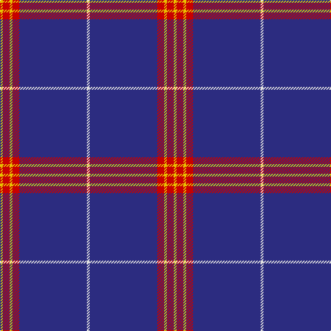

**Bands:** [YRYRBW](/stripes/yryrbw/) · **Stripes:** [LY R LY R DB W](/stripes/stripes6/) LY R LY R DB W

This was sourced from tartans-authority.  It is a [6 band tartan](/bands/bands6/).

Original link http://www.tartansauthority.com/tartan-ferret/display/7133/

## Attestations

This cloth appears in 2 source records; the oldest owns this page.

- Dec 2001 — Balmer (Personal) (tartans-authority, [record](http://www.tartansauthority.com/tartan-ferret/display/7133/))
- undated — Balmer (Personal) (register-of-tartans, [record](https://www.tartanregister.gov.uk/tartanDetails.aspx?ref=5437))

## Register references

External register numbers recorded for this tartan.

- Scottish Register of Tartans: [5437](https://www.tartanregister.gov.uk/tartanDetails.aspx?ref=5437)
- Scottish Tartans Authority (ITI): 7133
- Scottish Tartans World Register: 3040

## Thread count
Y/4 R10 Y4 R10 DB98 LN/4

## Palette
Each colour and its ΔE from the base-6 reference it is a variant of.

| Colour | Shade | Base | ΔE (OKLab) |
|---|---|---|---|
| DB | <code style="background-color:#2C2C80;">#2C2C80</code> `#2C2C80` | B <code style="background-color:#2A418A;">#2A418A</code> | 0.06 |
| LN | <code style="background-color:#E0E0E0;">#E0E0E0</code> `#E0E0E0` | W <code style="background-color:#F7F7F7;">#F7F7F7</code> | 0.07 |
| R | <code style="background-color:#C80000;">#C80000</code> `#C80000` | R <code style="background-color:#CC0000;">#CC0000</code> | 0.01 |
| Y | <code style="background-color:#E8C000;">#E8C000</code> `#E8C000` | Y <code style="background-color:#F2BF00;">#F2BF00</code> | 0.02 |

# Sample pattern

## Nearest tartans

The nearest existing variants by ΔTartan distance.

1. [United States (Corporate)](/setts/s9/b7db5w6db5r7db2b2db70w2/) — ΔT 1.26
1. [George, Stuart (Personal)](/setts/s9/db62w2db4w5db6ly2r8ly3w4~x2/) — ΔT 1.34
1. [Baker Family Tartan Tartan Number: 613. Earliest known date: pre 2003 STS notes 'Sample in trade specimens file.' See products available Copyright © Blair Urquhart, Comrie, 2015](/setts/s8/db28dr3w1dr3db4w2dp1w5~x4/) — ΔT 1.38
1. [Ottawa Fire Service (Corporate)](/setts/s11/db63lo3w3db8lo3db3w3db3r14db9lo3~x2/) — ΔT 1.38
1. [George, Stuart (Personal)](/setts/s9/db62w2db4w5db6lo2r8lo3w4~x2/) — ΔT 1.41
1. [Special Air Service](/setts/s5/db26lb6g1r1w2~x2/) — ΔT 1.41
1. [Inverness, Duke of York](/setts/s8/db122r11w4r15ly4db6ly4db30/) — ΔT 1.42
1. [Auchtermuchty Tartan Army (Corp)](/setts/s6/db80r7w1r7ly20db15~x2/) — ΔT 1.43
1. [Coogan (Personal)](/setts/s6/ly2db66r16w2r1w1~x2/) — ΔT 1.45
1. [Baker](/setts/s8/db28o3w1o3db4w2p1w5~x4/) — ΔT 1.46

## Neighbour map

Every grey dot is one of 14299 variants placed by the first two principal components of the ΔTartan feature space (44% of its variance). Red is this tartan; blue dots are its nearest — click one to open its page.

<svg viewBox="0 0 640 380" role="img" style="max-width:100%;height:auto;border:1px solid #e0e0e0;border-radius:4px;display:block" xmlns="http://www.w3.org/2000/svg"><image href="/nn/cloud.v1.png" width="640" height="380"/><a href="/setts/s9/b7db5w6db5r7db2b2db70w2/"><circle cx="525.5" cy="107.7" r="4" fill="#3465a4"><title>United States (Corporate)</title></circle></a><a href="/setts/s9/db62w2db4w5db6ly2r8ly3w4~x2/"><circle cx="482.6" cy="100.9" r="4" fill="#3465a4"><title>George, Stuart (Personal)</title></circle></a><a href="/setts/s8/db28dr3w1dr3db4w2dp1w5~x4/"><circle cx="428.3" cy="122.3" r="4" fill="#3465a4"><title>Baker Family Tartan Tartan Number: 613. Earliest known date: pre 2003 STS notes 'Sample in trade specimens file.' See products available Copyright © Blair Urquhart, Comrie, 2015</title></circle></a><a href="/setts/s11/db63lo3w3db8lo3db3w3db3r14db9lo3~x2/"><circle cx="482.7" cy="119.3" r="4" fill="#3465a4"><title>Ottawa Fire Service (Corporate)</title></circle></a><a href="/setts/s9/db62w2db4w5db6lo2r8lo3w4~x2/"><circle cx="484.3" cy="102.4" r="4" fill="#3465a4"><title>George, Stuart (Personal)</title></circle></a><a href="/setts/s5/db26lb6g1r1w2~x2/"><circle cx="439.9" cy="137.1" r="4" fill="#3465a4"><title>Special Air Service</title></circle></a><a href="/setts/s8/db122r11w4r15ly4db6ly4db30/"><circle cx="576.2" cy="137.7" r="4" fill="#3465a4"><title>Inverness, Duke of York</title></circle></a><a href="/setts/s6/db80r7w1r7ly20db15~x2/"><circle cx="487.0" cy="125.0" r="4" fill="#3465a4"><title>Auchtermuchty Tartan Army (Corp)</title></circle></a><a href="/setts/s6/ly2db66r16w2r1w1~x2/"><circle cx="542.5" cy="123.0" r="4" fill="#3465a4"><title>Coogan (Personal)</title></circle></a><a href="/setts/s8/db28o3w1o3db4w2p1w5~x4/"><circle cx="435.7" cy="125.1" r="4" fill="#3465a4"><title>Baker</title></circle></a><circle cx="508.7" cy="140.4" r="5" fill="#c00000"/></svg>

ID: /setts/s6/w2db49r5ly2r5ly2~x2/
