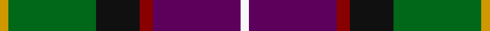
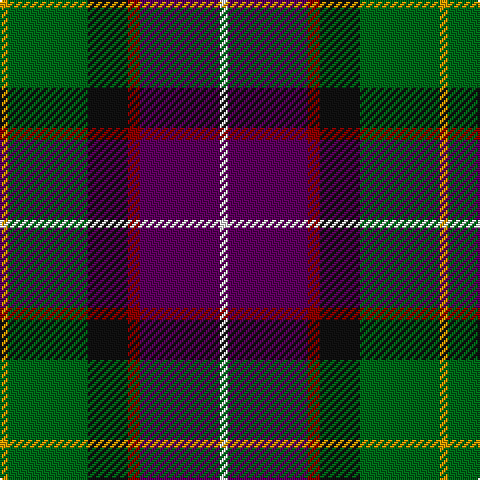

In pattern [WBRKGY](/stripes/wbrkgy/).

This was sourced from tartans-authority.  It is a [6 stripe tartan](/stripes/stripes6/).

Original link http://www.tartansauthority.com/tartan-ferret/display/2460/

## Attestations

This cloth appears in 2 source records; the oldest owns this page.

- 1989 — Morris of Balgonie (Personal) (tartans-authority, [record](http://www.tartansauthority.com/tartan-ferret/display/2460/))
- 01/01/1995 — Morris of Balgonie (Personal) (register-of-tartans, [record](https://www.tartanregister.gov.uk/tartanDetails.aspx?ref=3014))

## Register references

External register numbers recorded for this tartan.

- Scottish Register of Tartans: [3014](https://www.tartanregister.gov.uk/tartanDetails.aspx?ref=3014)
- Scottish Tartans Authority (ITI): 2460
- Scottish Tartans World Register: 2460

## Thread count
DY/4 G40 K20 DR6 P40 W/4

## Palette
Each colour and the base-6 reference it is a variant of.

| Colour | Shade | Base |
|---|---|---|
| DR | <code style="background-color:#880000;">#880000</code> `oklch(39.4% 0.162 29.2)` <small>#880000</small> | R <code style="background-color:#CC0000;">#CC0000</code> |
| DY | <code style="background-color:#D09800;">#D09800</code> `oklch(71.4% 0.147 82.1)` <small>#D09800</small> | Y <code style="background-color:#F2BF00;">#F2BF00</code> |
| G | <code style="background-color:#006818;">#006818</code> `oklch(45.0% 0.142 145.0)` <small>#006818</small> | G <code style="background-color:#006100;">#006100</code> |
| K | <code style="background-color:#101010;">#101010</code> `oklch(17.3% 0.000 89.9)` <small>#101010</small> | K <code style="background-color:#000000;">#000000</code> |
| P | <code style="background-color:#5C005C;">#5C005C</code> `oklch(33.3% 0.153 328.4)` <small>#5C005C</small> | B <code style="background-color:#2A418A;">#2A418A</code> |
| W | <code style="background-color:#F8F8F8;">#F8F8F8</code> `oklch(97.9% 0.000 89.9)` <small>#F8F8F8</small> | W <code style="background-color:#F7F7F7;">#F7F7F7</code> |

# Sample pattern

## Nearest tartans

The nearest existing variants by ΔTartan distance, with this tartan at the top so the swatches line up against it.

ΔTartan

Tartan

Sett

—

<a href="/ttd/edit/#slug=w2dp20r3k10g20lo2~x2">Morris of Balgonie (Personal)</a> <a class="nn-out" href="/setts/s6/w2dp20r3k10g20lo2~x2/" title="open its dictionary page">↗</a>

0.79

<a href="/ttd/edit/#slug=y4ly2y21do11w2k20r3~x2">Barbour Corporate Tartan Tartan Number: 2489. Earliest known date: 1998 For the linings of Barbour's famous wax jackets. Tartan designed by Kinloch Anderson of Edinburgh. See products available Copyright © Blair Urquhart, Comrie, 2015</a> <a class="nn-out" href="/setts/s7/y4ly2y21do11w2k20r3~x2/" title="open its dictionary page">↗</a>

0.80

<a href="/ttd/edit/#slug=r2ly2db9dy1dg9r1w1~x2">Unidentified (ex Tony Murray)</a> <a class="nn-out" href="/setts/s7/r2ly2db9dy1dg9r1w1~x2/" title="open its dictionary page">↗</a>

0.92

<a href="/ttd/edit/#slug=w10k52db52dg24ly10dg5r5">Harvey of Cornwall (Personal)</a> <a class="nn-out" href="/setts/s7/w10k52db52dg24ly10dg5r5/" title="open its dictionary page">↗</a>

1.00

<a href="/ttd/edit/#slug=r2k6ly1dg12ly1db6lr2~x4">James (Personal)</a> <a class="nn-out" href="/setts/s7/r2k6ly1dg12ly1db6lr2~x4/" title="open its dictionary page">↗</a>

1.01

<a href="/ttd/edit/#slug=r2k8ly1k8g13db13lo1r2~x2">Sey (Name)</a> <a class="nn-out" href="/setts/s8/r2k8ly1k8g13db13lo1r2~x2/" title="open its dictionary page">↗</a>

1.01

<a href="/ttd/edit/#slug=w2db20r3k10g20lo2~x2">Morris of Eddergoll (Personal)</a> <a class="nn-out" href="/setts/s6/w2db20r3k10g20lo2~x2/" title="open its dictionary page">↗</a>

1.02

<a href="/ttd/edit/#slug=w3db17o16db2dg17ly2~x2">Atlantic, Ancient</a> <a class="nn-out" href="/setts/s6/w3db17o16db2dg17ly2~x2/" title="open its dictionary page">↗</a>

1.08

<a href="/ttd/edit/#slug=ly2dy20k10db3dg20lb2~x2">Morris of Balgonie Htg (Personal)</a> <a class="nn-out" href="/setts/s6/ly2dy20k10db3dg20lb2~x2/" title="open its dictionary page">↗</a>

1.08

<a href="/ttd/edit/#slug=k20r6ly3db24g3r8w4~x2">Eichelberger (Perrsonal)</a> <a class="nn-out" href="/setts/s7/k20r6ly3db24g3r8w4~x2/" title="open its dictionary page">↗</a>

1.08

<a href="/ttd/edit/#slug=m3k17n11m2o20w2~x2">Commonwealth Games Council (Corp.)</a> <a class="nn-out" href="/setts/s6/m3k17n11m2o20w2~x2/" title="open its dictionary page">↗</a>

## Neighbour map

Every grey dot is one of 14299 variants placed by the first two principal components of the ΔTartan feature space (44% of its variance). Red is this tartan; blue dots are its nearest — click one to open its page.

<svg viewBox="0 0 640 380" role="img" style="max-width:100%;height:auto;border:1px solid #e0e0e0;border-radius:4px;display:block" xmlns="http://www.w3.org/2000/svg"><image href="/nn/cloud.v1.png" width="640" height="380"/><a href="/setts/s7/y4ly2y21do11w2k20r3~x2/"><circle cx="176.3" cy="168.6" r="4" fill="#3465a4"><title>Barbour Corporate Tartan Tartan Number: 2489. Earliest known date: 1998 For the linings of Barbour's famous wax jackets. Tartan designed by Kinloch Anderson of Edinburgh. See products available Copyright © Blair Urquhart, Comrie, 2015</title></circle></a><a href="/setts/s7/r2ly2db9dy1dg9r1w1~x2/"><circle cx="148.6" cy="162.0" r="4" fill="#3465a4"><title>Unidentified (ex Tony Murray)</title></circle></a><a href="/setts/s7/w10k52db52dg24ly10dg5r5/"><circle cx="123.6" cy="167.4" r="4" fill="#3465a4"><title>Harvey of Cornwall (Personal)</title></circle></a><a href="/setts/s7/r2k6ly1dg12ly1db6lr2~x4/"><circle cx="163.5" cy="169.8" r="4" fill="#3465a4"><title>James (Personal)</title></circle></a><a href="/setts/s8/r2k8ly1k8g13db13lo1r2~x2/"><circle cx="148.0" cy="169.1" r="4" fill="#3465a4"><title>Sey (Name)</title></circle></a><a href="/setts/s6/w2db20r3k10g20lo2~x2/"><circle cx="138.9" cy="181.3" r="4" fill="#3465a4"><title>Morris of Eddergoll (Personal)</title></circle></a><a href="/setts/s6/w3db17o16db2dg17ly2~x2/"><circle cx="119.6" cy="197.7" r="4" fill="#3465a4"><title>Atlantic, Ancient</title></circle></a><a href="/setts/s6/ly2dy20k10db3dg20lb2~x2/"><circle cx="157.9" cy="189.6" r="4" fill="#3465a4"><title>Morris of Balgonie Htg (Personal)</title></circle></a><a href="/setts/s7/k20r6ly3db24g3r8w4~x2/"><circle cx="117.8" cy="168.6" r="4" fill="#3465a4"><title>Eichelberger (Perrsonal)</title></circle></a><a href="/setts/s6/m3k17n11m2o20w2~x2/"><circle cx="160.2" cy="191.2" r="4" fill="#3465a4"><title>Commonwealth Games Council (Corp.)</title></circle></a><circle cx="151.6" cy="178.9" r="5" fill="#c00000"/></svg>

ID: /setts/s6/w2dp20r3k10g20lo2~x2/
