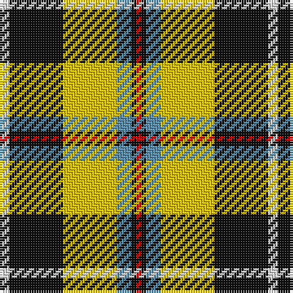

This page is one **sett** — a single exact thread-count. It belongs to the [tartan](/tartans/w2k11ly11t3k1r1/)
(the same proportion at any scale), whose colour order is pattern [RKBYKW](/stripes/rkbykw/).

Sourced from house-of-tartan.  It is a [6 stripe tartan](/stripes/stripes6/).

Original link http://www.house-of-tartan.scotland.net/house/TartanViewjs.asp?colr=Def&tnam=7651

## Thread count
LN/4 K22 Y22 B6 K2 R/2

## Palette

Palette: <strong>Tartan Register</strong>
<table><thead><tr><th>Colour</th><th>Threads</th><th>Shade</th><th>Base</th><th>OKLCh</th></tr></thead><tbody><tr><td>LN/</td><td style="text-align:right;font-variant-numeric:tabular-nums">4</td><td><code style="background-color:#E0E0E0;">#E0E0E0</code> <small style="color:#888">#E0E0E0</small></td><td>W <code style="background-color:#F7F7F7;">#F7F7F7</code></td><td><small style="color:#888">oklch(90.7% 0.000 89.9)</small></td></tr><tr><td>K</td><td style="text-align:right;font-variant-numeric:tabular-nums">22</td><td><code style="background-color:#101010;">#101010</code> <small style="color:#888">#101010</small></td><td>K <code style="background-color:#000000;">#000000</code></td><td><small style="color:#888">oklch(17.3% 0.000 89.9)</small></td></tr><tr><td>Y</td><td style="text-align:right;font-variant-numeric:tabular-nums">22</td><td><code style="background-color:#E8C000;">#E8C000</code> <small style="color:#888">#E8C000</small></td><td>Y <code style="background-color:#F2BF00;">#F2BF00</code></td><td><small style="color:#888">oklch(81.9% 0.168 93.7)</small></td></tr><tr><td>B</td><td style="text-align:right;font-variant-numeric:tabular-nums">6</td><td><code style="background-color:#5C8CA8;">#5C8CA8</code> <small style="color:#888">#5C8CA8</small></td><td>B <code style="background-color:#2A418A;">#2A418A</code></td><td><small style="color:#888">oklch(61.7% 0.067 235.0)</small></td></tr><tr><td>K</td><td style="text-align:right;font-variant-numeric:tabular-nums">2</td><td><code style="background-color:#101010;">#101010</code> <small style="color:#888">#101010</small></td><td>K <code style="background-color:#000000;">#000000</code></td><td><small style="color:#888">oklch(17.3% 0.000 89.9)</small></td></tr><tr><td>R/</td><td style="text-align:right;font-variant-numeric:tabular-nums">2</td><td><code style="background-color:#C80000;">#C80000</code> <small style="color:#888">#C80000</small></td><td>R <code style="background-color:#CC0000;">#CC0000</code></td><td><small style="color:#888">oklch(52.3% 0.215 29.2)</small></td></tr></tbody></table>

# Sample pattern

## Nearest tartans

The nearest existing variants by ΔTartan distance, with this tartan at the top so the swatches line up against it.

ΔTartan

Tartan

Sett

—

<a href="/ttd/edit/#slug=w2k11ly11t3k1r1~x2">Cornish National Small Set Tartan Tartan Number: 7651. Earliest known date: See products available Copyright © Blair Urquhart, Comrie, 2015</a> <a class="nn-out" href="/setts/s6/w2k11ly11t3k1r1~x2/" title="open its dictionary page">↗</a>

0.24

<a href="/ttd/edit/#slug=w2k11ly11db3k1r1~x2">Cornish National #2</a> <a class="nn-out" href="/setts/s6/w2k11ly11db3k1r1~x2/" title="open its dictionary page">↗</a>

0.80

<a href="/ttd/edit/#slug=w5k26ly26t7k3r3~x2">Cornish, National</a> <a class="nn-out" href="/setts/s6/w5k26ly26t7k3r3~x2/" title="open its dictionary page">↗</a>

1.12

<a href="/ttd/edit/#slug=w4k2w18k11db2y18ly2~x2">Barbour - Ancient</a> <a class="nn-out" href="/setts/s7/w4k2w18k11db2y18ly2~x2/" title="open its dictionary page">↗</a>

1.13

<a href="/ttd/edit/#slug=g36lb4g8k29r24w7~x2">Entre Rios Province (Provisional</a> <a class="nn-out" href="/setts/s6/g36lb4g8k29r24w7~x2/" title="open its dictionary page">↗</a>

1.13

<a href="/ttd/edit/#slug=lo9k32g6lb20lo3lb9k5~x2">Black &amp; White Golf (Corporate)</a> <a class="nn-out" href="/setts/s7/lo9k32g6lb20lo3lb9k5~x2/" title="open its dictionary page">↗</a>

1.16

<a href="/ttd/edit/#slug=do21r2lg18r2lg18r2dg8w6do10~x2">Red Dirt Girl</a> <a class="nn-out" href="/setts/s9/do21r2lg18r2lg18r2dg8w6do10~x2/" title="open its dictionary page">↗</a>

1.16

<a href="/ttd/edit/#slug=r36w3lo4g24w24k3lo6~x2">MacLachlan Dress</a> <a class="nn-out" href="/setts/s7/r36w3lo4g24w24k3lo6~x2/" title="open its dictionary page">↗</a>

1.17

<a href="/ttd/edit/#slug=dg8gi6dg48w31o42g6o8">Bannockbane, Green</a> <a class="nn-out" href="/setts/s7/dg8gi6dg48w31o42g6o8/" title="open its dictionary page">↗</a>

1.20

<a href="/ttd/edit/#slug=w5k26lo26t7k3r3~x2">Cornish National (District)</a> <a class="nn-out" href="/setts/s6/w5k26lo26t7k3r3~x2/" title="open its dictionary page">↗</a>

1.21

<a href="/ttd/edit/#slug=k20w4r4gi20w5gi2g2~x2">Hackett (Personal)</a> <a class="nn-out" href="/setts/s7/k20w4r4gi20w5gi2g2~x2/" title="open its dictionary page">↗</a>

## Neighbour map

Every grey dot is one of 14359 variants placed by the first two principal components of the ΔTartan feature space (44% of its variance). Red is this tartan; blue dots are its nearest — click one to open its page.

<svg viewBox="0 0 640 380" role="img" style="max-width:100%;height:auto;border:1px solid #e0e0e0;border-radius:4px;display:block" xmlns="http://www.w3.org/2000/svg"><image href="/nn/cloud.v1.png" width="640" height="380"/><a href="/setts/s6/w2k11ly11db3k1r1~x2/"><circle cx="173.7" cy="159.8" r="4" fill="#3465a4"><title>Cornish National #2</title></circle></a><a href="/setts/s6/w5k26ly26t7k3r3~x2/"><circle cx="155.3" cy="170.4" r="4" fill="#3465a4"><title>Cornish, National</title></circle></a><a href="/setts/s7/w4k2w18k11db2y18ly2~x2/"><circle cx="129.6" cy="159.4" r="4" fill="#3465a4"><title>Barbour - Ancient</title></circle></a><a href="/setts/s6/g36lb4g8k29r24w7~x2/"><circle cx="144.0" cy="194.7" r="4" fill="#3465a4"><title>Entre Rios Province (Provisional</title></circle></a><a href="/setts/s7/lo9k32g6lb20lo3lb9k5~x2/"><circle cx="189.5" cy="180.8" r="4" fill="#3465a4"><title>Black &amp; White Golf (Corporate)</title></circle></a><a href="/setts/s9/do21r2lg18r2lg18r2dg8w6do10~x2/"><circle cx="150.9" cy="164.0" r="4" fill="#3465a4"><title>Red Dirt Girl</title></circle></a><a href="/setts/s7/r36w3lo4g24w24k3lo6~x2/"><circle cx="139.4" cy="147.3" r="4" fill="#3465a4"><title>MacLachlan Dress</title></circle></a><a href="/setts/s7/dg8gi6dg48w31o42g6o8/"><circle cx="142.4" cy="185.1" r="4" fill="#3465a4"><title>Bannockbane, Green</title></circle></a><a href="/setts/s6/w5k26lo26t7k3r3~x2/"><circle cx="161.8" cy="175.4" r="4" fill="#3465a4"><title>Cornish National (District)</title></circle></a><a href="/setts/s7/k20w4r4gi20w5gi2g2~x2/"><circle cx="153.0" cy="167.0" r="4" fill="#3465a4"><title>Hackett (Personal)</title></circle></a><circle cx="172.9" cy="158.9" r="5" fill="#c00000"/></svg>

ID: /setts/s6/w2k11ly11t3k1r1~x2/
