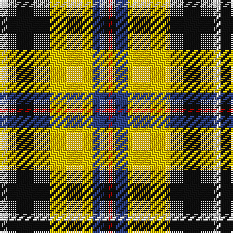

In pattern [RKBYKW](/patterns/rkbykw/).

This was sourced from register-of-tartans.  It is a [6 stripes tartan](/stripes/stripes6/).

Original link https://www.tartanregister.gov.uk/tartanDetails.aspx?ref=767

## Register references

External register numbers recorded for this tartan.

- Scottish Register of Tartans: [767](https://www.tartanregister.gov.uk/tartanDetails.aspx?ref=767)
- Scottish Tartans World Register: 1569

## Thread count
LN/4 K22 Y22 B6 K2 R/2

## Palette
Each colour and its ΔE from the base-6 reference it is a variant of.

| Colour | Shade | Base | ΔE (OKLab) |
|---|---|---|---|
| B | <code style="background-color:#2C4084;">#2C4084</code> `#2C4084` | B <code style="background-color:#2A418A;">#2A418A</code> | 0.01 |
| K | <code style="background-color:#101010;">#101010</code> `#101010` | K <code style="background-color:#000000;">#000000</code> | 0.17 |
| LN | <code style="background-color:#E0E0E0;">#E0E0E0</code> `#E0E0E0` | W <code style="background-color:#F7F7F7;">#F7F7F7</code> | 0.07 |
| R | <code style="background-color:#DC0000;">#DC0000</code> `#DC0000` | R <code style="background-color:#CC0000;">#CC0000</code> | 0.03 |
| Y | <code style="background-color:#E8C000;">#E8C000</code> `#E8C000` | Y <code style="background-color:#F2BF00;">#F2BF00</code> | 0.02 |

# Sample pattern

## Nearest tartans

The nearest existing variants by ΔTartan distance.

1. [Cornish National Small Set Tartan Tartan Number: 7651. Earliest known date: See products available Copyright © Blair Urquhart, Comrie, 2015](/setts/s6/w2k11y11b3k1r1~b5c8ca8-k101010-rc80000-we0e0e0-ye8c000~x2/) — ΔT 0.24
1. [Cornish National District Tartan Tartan Number: 1567. Earliest known date: 1963 The ancient kingdom of Cornwall is remembered in this tartan, designed by the Cornish poet, E.E. Morton-Nance. He regarded tartan as the "heritage of all Celts" and extold brave Cornishmen to wear the kilt of black and saffron, "Tints blazoned by her ancient Kings". There is also a Cornish Hunting tartan of more recent origin based on this sett. See products available Copyright © Blair Urquhart, Comrie, 2015](/setts/s6/w5k26y26b7k3r3~b5c8ca8-k101010-rc80000-we0e0e0-ye8c000~x2/) — ΔT 0.44
1. [Cornish, National](/setts/s6/w5k26y26b7k3r3~b5480b0-k000000-rc00000-we0e0e0-yf0c000~x2/) — ΔT 0.65
1. [Cornish, National](/setts/s6/w2k11y11b3k1r1~b304080-k000000-rc00000-we0e0e0-yf0c000~x2/) — ΔT 0.65
1. [Cornish National (District)](/setts/s6/w5k26y26b7k3r3~b4c809c-k000000-rc80000-wfcfcfc-ybc8c00~x2/) — ΔT 1.00
1. [Glasgow](/setts/s7/g20r3ga3r15w19g3b2~b5480b0-g003000-ga808080-rc00000-we0e0e0~x2/) — ΔT 1.02
1. [Black & White Golf (Corporate)](/setts/s7/y9k32g6w20y3w9k5~g006818-k101010-we8ccb8-ybc8c00~x2/) — ΔT 1.06
1. [Entre Rios Province (Provisional](/setts/s6/g36w4g8k29r24wa7~g44a054-k101010-rc80000-wa8ace8-wae0e0e0~x2/) — ΔT 1.12
1. [Hackett (Personal)](/setts/s7/k20w4r4g20w5g2ga2~g006818-ga289c18-k101010-rc80000-wfcfcfc~x2/) — ΔT 1.14
1. [Glasgow](/setts/s7/g20r3ga3r15w19g3b2~b3c82af-g002814-ga808080-rdc0000-we0e0e0~x2/) — ΔT 1.19

## Neighbour map

Every grey dot is one of 15726 variants placed by the first two principal components of the ΔTartan feature space (44% of its variance). Red is this tartan; blue dots are its nearest — click one to open its page.

<svg viewBox="0 0 640 380" role="img" style="max-width:100%;height:auto;border:1px solid #e0e0e0;border-radius:4px;display:block" xmlns="http://www.w3.org/2000/svg"><image href="/nn/cloud.v1.png" width="640" height="380"/><a href="/setts/s6/w2k11y11b3k1r1~b5c8ca8-k101010-rc80000-we0e0e0-ye8c000~x2/"><circle cx="171.4" cy="162.2" r="4" fill="#3465a4"><title>Cornish National Small Set Tartan Tartan Number: 7651. Earliest known date: See products available Copyright © Blair Urquhart, Comrie, 2015</title></circle></a><a href="/setts/s6/w5k26y26b7k3r3~b5c8ca8-k101010-rc80000-we0e0e0-ye8c000~x2/"><circle cx="158.3" cy="173.1" r="4" fill="#3465a4"><title>Cornish National District Tartan Tartan Number: 1567. Earliest known date: 1963 The ancient kingdom of Cornwall is remembered in this tartan, designed by the Cornish poet, E.E. Morton-Nance. He regarded tartan as the &quot;heritage of all Celts&quot; and extold brave Cornishmen to wear the kilt of black and saffron, &quot;Tints blazoned by her ancient Kings&quot;. There is also a Cornish Hunting tartan of more recent origin based on this sett. See products available Copyright © Blair Urquhart, Comrie, 2015</title></circle></a><a href="/setts/s6/w5k26y26b7k3r3~b5480b0-k000000-rc00000-we0e0e0-yf0c000~x2/"><circle cx="153.4" cy="173.9" r="4" fill="#3465a4"><title>Cornish, National</title></circle></a><a href="/setts/s6/w2k11y11b3k1r1~b304080-k000000-rc00000-we0e0e0-yf0c000~x2/"><circle cx="167.8" cy="164.0" r="4" fill="#3465a4"><title>Cornish, National</title></circle></a><a href="/setts/s6/w5k26y26b7k3r3~b4c809c-k000000-rc80000-wfcfcfc-ybc8c00~x2/"><circle cx="159.7" cy="178.3" r="4" fill="#3465a4"><title>Cornish National (District)</title></circle></a><a href="/setts/s7/g20r3ga3r15w19g3b2~b5480b0-g003000-ga808080-rc00000-we0e0e0~x2/"><circle cx="134.0" cy="163.4" r="4" fill="#3465a4"><title>Glasgow</title></circle></a><a href="/setts/s7/y9k32g6w20y3w9k5~g006818-k101010-we8ccb8-ybc8c00~x2/"><circle cx="187.8" cy="184.1" r="4" fill="#3465a4"><title>Black &amp; White Golf (Corporate)</title></circle></a><a href="/setts/s6/g36w4g8k29r24wa7~g44a054-k101010-rc80000-wa8ace8-wae0e0e0~x2/"><circle cx="142.3" cy="195.5" r="4" fill="#3465a4"><title>Entre Rios Province (Provisional</title></circle></a><a href="/setts/s7/k20w4r4g20w5g2ga2~g006818-ga289c18-k101010-rc80000-wfcfcfc~x2/"><circle cx="150.1" cy="167.4" r="4" fill="#3465a4"><title>Hackett (Personal)</title></circle></a><a href="/setts/s7/g20r3ga3r15w19g3b2~b3c82af-g002814-ga808080-rdc0000-we0e0e0~x2/"><circle cx="132.7" cy="161.1" r="4" fill="#3465a4"><title>Glasgow</title></circle></a><circle cx="172.1" cy="163.0" r="5" fill="#c00000"/></svg>

ID: /setts/s6/w2k11y11b3k1r1~b2c4084-k101010-rdc0000-we0e0e0-ye8c000~x2/
