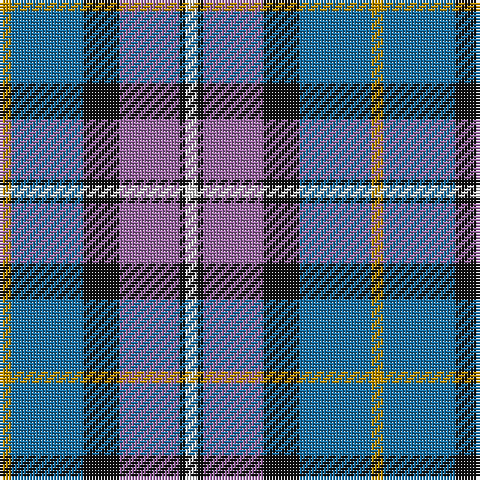

In pattern [WKRKBY](/patterns/wkrkby/).

This was sourced from tartans-authority.  It is a [6 stripes tartan](/stripes/stripes6/).

Original link http://www.tartansauthority.com/tartan-ferret/display/3097/

## Thread count
DY/4 B24 K12 LP20 K2 LN/4

## Palette
Each colour and its ΔE from the base-6 reference it is a variant of.

| Colour | Shade | Base | ΔE (OKLab) |
|---|---|---|---|
| B | <code style="background-color:#1870A4;">#1870A4</code> `#1870A4` | B <code style="background-color:#2A418A;">#2A418A</code> | 0.13 |
| DY | <code style="background-color:#BC8C00;">#BC8C00</code> `#BC8C00` | Y <code style="background-color:#F2BF00;">#F2BF00</code> | 0.16 |
| K | <code style="background-color:#101010;">#101010</code> `#101010` | K <code style="background-color:#000000;">#000000</code> | 0.17 |
| LN | <code style="background-color:#E0E0E0;">#E0E0E0</code> `#E0E0E0` | W <code style="background-color:#F7F7F7;">#F7F7F7</code> | 0.07 |
| LP | <code style="background-color:#9C68A4;">#9C68A4</code> `#9C68A4` | R <code style="background-color:#CC0000;">#CC0000</code> | 0.21 |

# Sample pattern

## Nearest tartans

The nearest existing variants by ΔTartan distance.

1. [Balfour Family Tartan Tartan Number: 683. Earliest known date: 1984 Presented by William Balfour. See products available Copyright © Blair Urquhart, Comrie, 2015](/setts/s6/b30y3g11y3r33ra6~b2c2c80-g604000-r888888-rac80000-ye8c000~x2/) — ΔT 0.93
1. [Monaghan County Crest (Fashion)](/setts/s8/y15b2ya8ba21w2b21ba6w7~b2c2c80-ba1c1c50-we0e0e0-ybc8c00-yaa0a0a0~x2/) — ΔT 0.99
1. [Ballantyne (Personal) STWR](/setts/s8/b34g9y3g9ga30r3ga11r5~b000064-g503c14-ga808080-r960028-yfadc00/) — ΔT 1.02
1. [Commonwealth Games Council (Corp.)](/setts/s6/r3k17b11r2ra20w2~b484848-k101010-rb468ac-ra888888-we0e0e0~x2/) — ΔT 1.02
1. [Afternoon Tea / Earl Grey](/setts/s6/r15b98ba72y25ba8w15~b5c8ca8-ba202060-rc80000-wfcfcfc-yfccc00/) — ΔT 1.06
1. [Afternoon Tea / Darjeeling](/setts/s6/w15g98b72r25b8y15~b202060-g406054-r880000-wfcfcfc-yfccc00/) — ΔT 1.06
1. [Highlands Country Club Corporate Tartan Tartan Number: 687. Earliest known date: 1984 Weft uses a dark green. See products available Copyright © Blair Urquhart, Comrie, 2015](/setts/s7/g5b15ba11w2ba1w1ga4~b2c2c80-ba5c8ca8-g006818-ga003820-we0e0e0~x4/) — ΔT 1.06
1. [Ritchie, Stephen James (Personal)](/setts/s7/b4ba19y2k19ba2y25w2~b2888c4-ba5c5c5c-k101010-wc4c4c4-ya0a0a0~x2/) — ΔT 1.06
1. [Edelstein (Personal)](/setts/s5/b10ba10g10w1y1~b780078-ba2c2c80-g006818-we0e0e0-ye8c000~x6/) — ΔT 1.06
1. [Inverary](/setts/s6/g10k1b13k3w9y3~b1c0070-g5c6428-k101010-wc0c0c0-yd09800~x2/) — ΔT 1.08

## Neighbour map

Every grey dot is one of 15726 variants placed by the first two principal components of the ΔTartan feature space (44% of its variance). Red is this tartan; blue dots are its nearest — click one to open its page.

<svg viewBox="0 0 640 380" role="img" style="max-width:100%;height:auto;border:1px solid #e0e0e0;border-radius:4px;display:block" xmlns="http://www.w3.org/2000/svg"><image href="/nn/cloud.v1.png" width="640" height="380"/><a href="/setts/s6/b30y3g11y3r33ra6~b2c2c80-g604000-r888888-rac80000-ye8c000~x2/"><circle cx="196.8" cy="185.0" r="4" fill="#3465a4"><title>Balfour Family Tartan Tartan Number: 683. Earliest known date: 1984 Presented by William Balfour. See products available Copyright © Blair Urquhart, Comrie, 2015</title></circle></a><a href="/setts/s8/y15b2ya8ba21w2b21ba6w7~b2c2c80-ba1c1c50-we0e0e0-ybc8c00-yaa0a0a0~x2/"><circle cx="106.8" cy="177.3" r="4" fill="#3465a4"><title>Monaghan County Crest (Fashion)</title></circle></a><a href="/setts/s8/b34g9y3g9ga30r3ga11r5~b000064-g503c14-ga808080-r960028-yfadc00/"><circle cx="184.2" cy="172.0" r="4" fill="#3465a4"><title>Ballantyne (Personal) STWR</title></circle></a><a href="/setts/s6/r3k17b11r2ra20w2~b484848-k101010-rb468ac-ra888888-we0e0e0~x2/"><circle cx="157.4" cy="190.0" r="4" fill="#3465a4"><title>Commonwealth Games Council (Corp.)</title></circle></a><a href="/setts/s6/r15b98ba72y25ba8w15~b5c8ca8-ba202060-rc80000-wfcfcfc-yfccc00/"><circle cx="183.1" cy="169.4" r="4" fill="#3465a4"><title>Afternoon Tea / Earl Grey</title></circle></a><a href="/setts/s6/w15g98b72r25b8y15~b202060-g406054-r880000-wfcfcfc-yfccc00/"><circle cx="200.4" cy="179.6" r="4" fill="#3465a4"><title>Afternoon Tea / Darjeeling</title></circle></a><a href="/setts/s7/g5b15ba11w2ba1w1ga4~b2c2c80-ba5c8ca8-g006818-ga003820-we0e0e0~x4/"><circle cx="188.2" cy="169.9" r="4" fill="#3465a4"><title>Highlands Country Club Corporate Tartan Tartan Number: 687. Earliest known date: 1984 Weft uses a dark green. See products available Copyright © Blair Urquhart, Comrie, 2015</title></circle></a><a href="/setts/s7/b4ba19y2k19ba2y25w2~b2888c4-ba5c5c5c-k101010-wc4c4c4-ya0a0a0~x2/"><circle cx="172.8" cy="166.5" r="4" fill="#3465a4"><title>Ritchie, Stephen James (Personal)</title></circle></a><a href="/setts/s5/b10ba10g10w1y1~b780078-ba2c2c80-g006818-we0e0e0-ye8c000~x6/"><circle cx="159.3" cy="217.3" r="4" fill="#3465a4"><title>Edelstein (Personal)</title></circle></a><a href="/setts/s6/g10k1b13k3w9y3~b1c0070-g5c6428-k101010-wc0c0c0-yd09800~x2/"><circle cx="114.2" cy="184.6" r="4" fill="#3465a4"><title>Inverary</title></circle></a><circle cx="161.2" cy="186.5" r="5" fill="#c00000"/></svg>

ID: /setts/s6/w2k1r10k6b12y2~b1870a4-k101010-r9c68a4-we0e0e0-ybc8c00~x2/
