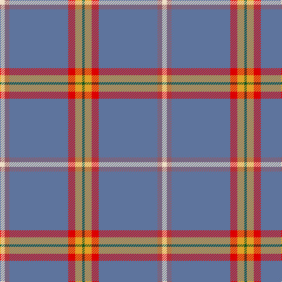

**Bands:** [GYRBRW](/stripes/gyrbrw/) · **Stripes:** [DG LO R T O W](/stripes/stripes6/) DG LO R T O W

This was sourced from register-of-tartans.  It is a [6 band tartan](/bands/bands6/).

Original link https://www.tartanregister.gov.uk/tartanDetails.aspx?ref=11486

## Register references

External register numbers recorded for this tartan.

- Scottish Register of Tartans: [11486](https://www.tartanregister.gov.uk/tartanDetails.aspx?ref=11486)

## Thread count
W/8 LT8 B100 R12 Y12 G/4

## Palette
Each colour and its ΔE from the base-6 reference it is a variant of.

| Colour | Shade | Base | ΔE (OKLab) |
|---|---|---|---|
| B | <code style="background-color:#5F749C;">#5F749C</code> `#5F749C` | B <code style="background-color:#2A418A;">#2A418A</code> | 0.17 |
| G | <code style="background-color:#005020;">#005020</code> `#005020` | G <code style="background-color:#006100;">#006100</code> | 0.07 |
| LT | <code style="background-color:#905966;">#905966</code> `#905966` | R <code style="background-color:#CC0000;">#CC0000</code> | 0.15 |
| R | <code style="background-color:#DC0000;">#DC0000</code> `#DC0000` | R <code style="background-color:#CC0000;">#CC0000</code> | 0.03 |
| W | <code style="background-color:#F0E0C8;">#F0E0C8</code> `#F0E0C8` | W <code style="background-color:#F7F7F7;">#F7F7F7</code> | 0.07 |
| Y | <code style="background-color:#E0A126;">#E0A126</code> `#E0A126` | Y <code style="background-color:#F2BF00;">#F2BF00</code> | 0.08 |

# Sample pattern

## Nearest tartans

The nearest existing variants by ΔTartan distance.

1. [Edinburgh Fire (Corporate)](/setts/s7/ly2dy4r4n21w1n1r1~x4/) — ΔT 1.16
1. [Kuehle (Personal)](/setts/s7/lp6w2lp1db6o30w1r3~x2/) — ΔT 1.33
1. [Kuehle Family (Personal)](/setts/s11/y30db6p1w2p6w2p1db6y30lb1r3~x2/) — ΔT 1.61
1. [Quigley of Knockcroghery (Hunting) (Personal)](/setts/s11/t27w2t15ly1t1ly1t15k2w2ly16r1~x2/) — ΔT 1.61
1. [Haddrell (2013)](/setts/s7/r2b4lb18n2lb2n41w2~x2/) — ΔT 1.65
1. [Norris Hunting](/setts/s6/k2w1o8r1t28r2~x2/) — ΔT 1.67
1. [Kuehle Hunting (Personal)](/setts/s11/lo30db6m1w2m6w2m1db6lo30lb1r3~x2/) — ΔT 1.69
1. [Caledonian Mist](/setts/s7/n27k5dp2o1dp1w1dp5~x4/) — ΔT 1.69
1. [Carbon (Corporate)](/setts/s9/n68k4n18o20k3w3k10lb8lo4/) — ΔT 1.78
1. [Blue Toon (Fashion)](/setts/s11/t49dt11w2dt2lr2dt2t10lg4dt2lg2ly3~x2/) — ΔT 1.85

## Neighbour map

Every grey dot is one of 14299 variants placed by the first two principal components of the ΔTartan feature space (44% of its variance). Red is this tartan; blue dots are its nearest — click one to open its page.

<svg viewBox="0 0 640 380" role="img" style="max-width:100%;height:auto;border:1px solid #e0e0e0;border-radius:4px;display:block" xmlns="http://www.w3.org/2000/svg"><image href="/nn/cloud.v1.png" width="640" height="380"/><a href="/setts/s7/ly2dy4r4n21w1n1r1~x4/"><circle cx="408.6" cy="130.6" r="4" fill="#3465a4"><title>Edinburgh Fire (Corporate)</title></circle></a><a href="/setts/s7/lp6w2lp1db6o30w1r3~x2/"><circle cx="377.8" cy="105.4" r="4" fill="#3465a4"><title>Kuehle (Personal)</title></circle></a><a href="/setts/s11/y30db6p1w2p6w2p1db6y30lb1r3~x2/"><circle cx="421.7" cy="100.0" r="4" fill="#3465a4"><title>Kuehle Family (Personal)</title></circle></a><a href="/setts/s11/t27w2t15ly1t1ly1t15k2w2ly16r1~x2/"><circle cx="423.2" cy="111.5" r="4" fill="#3465a4"><title>Quigley of Knockcroghery (Hunting) (Personal)</title></circle></a><a href="/setts/s7/r2b4lb18n2lb2n41w2~x2/"><circle cx="381.4" cy="133.9" r="4" fill="#3465a4"><title>Haddrell (2013)</title></circle></a><a href="/setts/s6/k2w1o8r1t28r2~x2/"><circle cx="454.0" cy="151.9" r="4" fill="#3465a4"><title>Norris Hunting</title></circle></a><a href="/setts/s11/lo30db6m1w2m6w2m1db6lo30lb1r3~x2/"><circle cx="412.8" cy="88.8" r="4" fill="#3465a4"><title>Kuehle Hunting (Personal)</title></circle></a><a href="/setts/s7/n27k5dp2o1dp1w1dp5~x4/"><circle cx="441.2" cy="136.2" r="4" fill="#3465a4"><title>Caledonian Mist</title></circle></a><a href="/setts/s9/n68k4n18o20k3w3k10lb8lo4/"><circle cx="363.6" cy="115.9" r="4" fill="#3465a4"><title>Carbon (Corporate)</title></circle></a><a href="/setts/s11/t49dt11w2dt2lr2dt2t10lg4dt2lg2ly3~x2/"><circle cx="424.8" cy="102.9" r="4" fill="#3465a4"><title>Blue Toon (Fashion)</title></circle></a><circle cx="454.6" cy="129.7" r="5" fill="#c00000"/></svg>

ID: /setts/s6/w2o2t25r3lo3dg1~x4/
