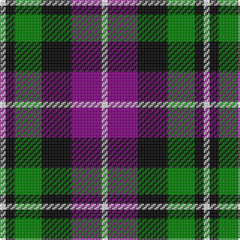

In pattern [WBKGKW](/stripes/wbkgkw/).

This was sourced from weddslist.  It is a [6 stripe tartan](/stripes/stripes6/).

Original link http://www.weddslist.com/cgi-bin/tartans/pg.pl?source=sts

## Thread count
LN/4 P20 K20 G18 K6 LN/4

## Palette
Each colour and the base-6 reference it is a variant of.

| Colour | Shade | Base |
|---|---|---|
| G | <code style="background-color:#008000;">#008000</code> `oklch(52.0% 0.177 142.5)` <small>#008000</small> | G <code style="background-color:#006100;">#006100</code> |
| K | <code style="background-color:#000000;">#000000</code> `oklch(0.0% 0.000 0.0)` <small>#000000</small> | K <code style="background-color:#000000;">#000000</code> |
| LN | <code style="background-color:#E0E0E0;">#E0E0E0</code> `oklch(90.7% 0.000 89.9)` <small>#E0E0E0</small> | W <code style="background-color:#F7F7F7;">#F7F7F7</code> |
| P | <code style="background-color:#800080;">#800080</code> `oklch(42.1% 0.193 328.4)` <small>#800080</small> | B <code style="background-color:#2A418A;">#2A418A</code> |

# Sample pattern

## Nearest tartans

The nearest existing variants by ΔTartan distance.

1. [Lennie](/setts/s6/k2g10t2k9p8g2~x2/) — ΔT 0.71
1. [Baillie](/setts/s7/p3k1p8k6g8k1w2~x2/) — ΔT 0.96
1. [Wilson's, No 217](/setts/s5/p11t2k10g10ly2~x2/) — ΔT 1.06
1. [Campbell, Sir Walter Scott](/setts/s6/k2g8db2k9p7k2~x2/) — ΔT 1.07
1. [Wellington, or Waterloo](/setts/s6/t3g12k14t11r3t3~x2/) — ΔT 1.11
1. [Wilson's, No 194](/setts/s6/k3r1g5k3w1p3~x2/) — ΔT 1.12
1. [Wilson's, No 76](/setts/s6/k3g17w2k18p17g3~x2/) — ΔT 1.13
1. [Gordon of Esslemont](/setts/s7/ly6g3ly3g22k23p23k4~x2/) — ΔT 1.13
1. [Wilson's, No 100](/setts/s6/k3g17ly2k18p17g3~x2/) — ΔT 1.17
1. [Clerk](/setts/s6/db5k1g1k1r3k1~x4/) — ΔT 1.19

## Neighbour map

Every grey dot is one of 14299 variants placed by the first two principal components of the ΔTartan feature space (44% of its variance). Red is this tartan; blue dots are its nearest — click one to open its page.

<svg viewBox="0 0 640 380" role="img" style="max-width:100%;height:auto;border:1px solid #e0e0e0;border-radius:4px;display:block" xmlns="http://www.w3.org/2000/svg"><image href="/nn/cloud.v1.png" width="640" height="380"/><a href="/setts/s6/k2g10t2k9p8g2~x2/"><circle cx="127.0" cy="244.2" r="4" fill="#3465a4"><title>Lennie</title></circle></a><a href="/setts/s7/p3k1p8k6g8k1w2~x2/"><circle cx="148.2" cy="207.3" r="4" fill="#3465a4"><title>Baillie</title></circle></a><a href="/setts/s5/p11t2k10g10ly2~x2/"><circle cx="80.0" cy="232.2" r="4" fill="#3465a4"><title>Wilson's, No 217</title></circle></a><a href="/setts/s6/k2g8db2k9p7k2~x2/"><circle cx="152.2" cy="255.5" r="4" fill="#3465a4"><title>Campbell, Sir Walter Scott</title></circle></a><a href="/setts/s6/t3g12k14t11r3t3~x2/"><circle cx="115.7" cy="248.1" r="4" fill="#3465a4"><title>Wellington, or Waterloo</title></circle></a><a href="/setts/s6/k3r1g5k3w1p3~x2/"><circle cx="85.0" cy="237.5" r="4" fill="#3465a4"><title>Wilson's, No 194</title></circle></a><a href="/setts/s6/k3g17w2k18p17g3~x2/"><circle cx="154.9" cy="212.3" r="4" fill="#3465a4"><title>Wilson's, No 76</title></circle></a><a href="/setts/s7/ly6g3ly3g22k23p23k4~x2/"><circle cx="122.3" cy="201.6" r="4" fill="#3465a4"><title>Gordon of Esslemont</title></circle></a><a href="/setts/s6/k3g17ly2k18p17g3~x2/"><circle cx="155.9" cy="212.6" r="4" fill="#3465a4"><title>Wilson's, No 100</title></circle></a><a href="/setts/s6/db5k1g1k1r3k1~x4/"><circle cx="172.4" cy="233.1" r="4" fill="#3465a4"><title>Clerk</title></circle></a><circle cx="107.0" cy="238.0" r="5" fill="#c00000"/></svg>

ID: /setts/s6/w2p10k10g9k3w2~x2/
