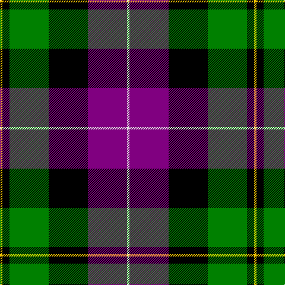

This page is one **sett** — a single exact thread-count. It belongs to the [tartan](/tartans/y2k6g33k33p33ln2/)
(the same proportion at any scale), whose colour order is pattern [WBKGKY](/stripes/wbkgky/).

Sourced from weddslist.  It is a [6 stripe tartan](/stripes/stripes6/).

Original link http://www.weddslist.com/cgi-bin/tartans/pg.pl?source=sts

## Thread count
Y/4 K12 G66 K66 P66 LN/4

## Palette
Each colour and the base-6 reference it is a variant of.

| Colour | Shade | Base |
|---|---|---|
| G | <code style="background-color:#008000;">#008000</code> `oklch(52.0% 0.177 142.5)` <small>#008000</small> | G <code style="background-color:#006100;">#006100</code> |
| K | <code style="background-color:#000000;">#000000</code> `oklch(0.0% 0.000 0.0)` <small>#000000</small> | K <code style="background-color:#000000;">#000000</code> |
| LN | <code style="background-color:#E0E0E0;">#E0E0E0</code> `oklch(90.7% 0.000 89.9)` <small>#E0E0E0</small> | W <code style="background-color:#F7F7F7;">#F7F7F7</code> |
| P | <code style="background-color:#800080;">#800080</code> `oklch(42.1% 0.193 328.4)` <small>#800080</small> | B <code style="background-color:#2A418A;">#2A418A</code> |
| Y | <code style="background-color:#F0C000;">#F0C000</code> `oklch(82.7% 0.169 90.5)` <small>#F0C000</small> | Y <code style="background-color:#F2BF00;">#F2BF00</code> |

# Sample pattern

## Nearest tartans

The nearest existing variants by ΔTartan distance, with this tartan at the top so the swatches line up against it.

ΔTartan

Tartan

Sett

—

<a href="/ttd/edit/#slug=w2p33k33g33k6ly2~x2">MacNeil 8</a> <a class="nn-out" href="/setts/s6/w2p33k33g33k6ly2~x2/" title="open its dictionary page">↗</a>

0.94

<a href="/ttd/edit/#slug=dg14k2dg4r2dg4k14p15k1w3~x2">MacRae, hunting</a> <a class="nn-out" href="/setts/s9/dg14k2dg4r2dg4k14p15k1w3~x2/" title="open its dictionary page">↗</a>

1.03

<a href="/ttd/edit/#slug=o2k14o1k14o14ly2~x2">United Distillers (Corporate)</a> <a class="nn-out" href="/setts/s6/o2k14o1k14o14ly2~x2/" title="open its dictionary page">↗</a>

1.03

<a href="/ttd/edit/#slug=r2db16r1k10g12o2~x2">MacWilliam</a> <a class="nn-out" href="/setts/s6/r2db16r1k10g12o2~x2/" title="open its dictionary page">↗</a>

1.07

<a href="/ttd/edit/#slug=r1g14k14r2db14t1~x2">Wilson's, No 221</a> <a class="nn-out" href="/setts/s6/r1g14k14r2db14t1~x2/" title="open its dictionary page">↗</a>

1.12

<a href="/ttd/edit/#slug=k2g12k12r1db12w2~x2">Russell, or Mitchell or Hunter or Galbraith</a> <a class="nn-out" href="/setts/s6/k2g12k12r1db12w2~x2/" title="open its dictionary page">↗</a>

1.13

<a href="/ttd/edit/#slug=k2r1g15k15db15ly1k2~x2">MacCaskill</a> <a class="nn-out" href="/setts/s7/k2r1g15k15db15ly1k2~x2/" title="open its dictionary page">↗</a>

1.15

<a href="/ttd/edit/#slug=r2db23k14g16k2w2~x2">MacPhail, hunting</a> <a class="nn-out" href="/setts/s6/r2db23k14g16k2w2~x2/" title="open its dictionary page">↗</a>

1.23

<a href="/ttd/edit/#slug=p6k3p21k23w3g24r3~x2">Colquhoun</a> <a class="nn-out" href="/setts/s7/p6k3p21k23w3g24r3~x2/" title="open its dictionary page">↗</a>

1.25

<a href="/ttd/edit/#slug=p18k7g5r4g7k1ly2~x2">Regent</a> <a class="nn-out" href="/setts/s7/p18k7g5r4g7k1ly2~x2/" title="open its dictionary page">↗</a>

1.25

<a href="/ttd/edit/#slug=w1db12k12g12k5ly1~x4">MacNeil 5</a> <a class="nn-out" href="/setts/s6/w1db12k12g12k5ly1~x4/" title="open its dictionary page">↗</a>

## Neighbour map

Every grey dot is one of 14299 variants placed by the first two principal components of the ΔTartan feature space (44% of its variance). Red is this tartan; blue dots are its nearest — click one to open its page.

<svg viewBox="0 0 640 380" role="img" style="max-width:100%;height:auto;border:1px solid #e0e0e0;border-radius:4px;display:block" xmlns="http://www.w3.org/2000/svg"><image href="/nn/cloud.v1.png" width="640" height="380"/><a href="/setts/s9/dg14k2dg4r2dg4k14p15k1w3~x2/"><circle cx="165.0" cy="154.1" r="4" fill="#3465a4"><title>MacRae, hunting</title></circle></a><a href="/setts/s6/o2k14o1k14o14ly2~x2/"><circle cx="179.9" cy="192.8" r="4" fill="#3465a4"><title>United Distillers (Corporate)</title></circle></a><a href="/setts/s6/r2db16r1k10g12o2~x2/"><circle cx="170.5" cy="179.4" r="4" fill="#3465a4"><title>MacWilliam</title></circle></a><a href="/setts/s6/r1g14k14r2db14t1~x2/"><circle cx="141.9" cy="181.7" r="4" fill="#3465a4"><title>Wilson's, No 221</title></circle></a><a href="/setts/s6/k2g12k12r1db12w2~x2/"><circle cx="136.7" cy="190.3" r="4" fill="#3465a4"><title>Russell, or Mitchell or Hunter or Galbraith</title></circle></a><a href="/setts/s7/k2r1g15k15db15ly1k2~x2/"><circle cx="178.3" cy="167.3" r="4" fill="#3465a4"><title>MacCaskill</title></circle></a><a href="/setts/s6/r2db23k14g16k2w2~x2/"><circle cx="167.2" cy="186.2" r="4" fill="#3465a4"><title>MacPhail, hunting</title></circle></a><a href="/setts/s7/p6k3p21k23w3g24r3~x2/"><circle cx="121.5" cy="185.5" r="4" fill="#3465a4"><title>Colquhoun</title></circle></a><a href="/setts/s7/p18k7g5r4g7k1ly2~x2/"><circle cx="186.2" cy="150.0" r="4" fill="#3465a4"><title>Regent</title></circle></a><a href="/setts/s6/w1db12k12g12k5ly1~x4/"><circle cx="157.8" cy="198.6" r="4" fill="#3465a4"><title>MacNeil 5</title></circle></a><circle cx="170.5" cy="168.0" r="5" fill="#c00000"/></svg>

ID: /setts/s6/w2p33k33g33k6ly2~x2/
