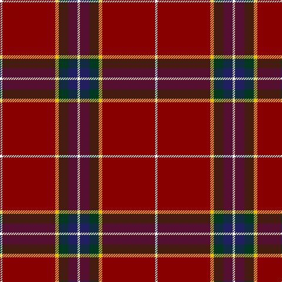

**Bands:** [WRYGBW](/stripes/wrygbw/) · **Stripes:** [W R LY DG DB W](/stripes/stripes6/) W R LY DG DB W

This was sourced from tartans-authority.  It is a [6 band tartan](/bands/bands6/).

Original link http://www.tartansauthority.com/tartan-ferret/display/10843/

## Thread count
W/4 DR90 Y6 DG16 DB16 W/4

## Palette
Each colour and its ΔE from the base-6 reference it is a variant of.

| Colour | Shade | Base | ΔE (OKLab) |
|---|---|---|---|
| DB | <code style="background-color:#202060;">#202060</code> `#202060` | B <code style="background-color:#2A418A;">#2A418A</code> | 0.11 |
| DG | <code style="background-color:#003820;">#003820</code> `#003820` | G <code style="background-color:#006100;">#006100</code> | 0.15 |
| DR | <code style="background-color:#880000;">#880000</code> `#880000` | R <code style="background-color:#CC0000;">#CC0000</code> | 0.15 |
| W | <code style="background-color:#FCFCFC;">#FCFCFC</code> `#FCFCFC` | W <code style="background-color:#F7F7F7;">#F7F7F7</code> | 0.01 |
| Y | <code style="background-color:#E8C000;">#E8C000</code> `#E8C000` | Y <code style="background-color:#F2BF00;">#F2BF00</code> | 0.02 |

# Sample pattern

## Nearest tartans

The nearest existing variants by ΔTartan distance.

1. [Solberg-Wormald (Personal)](/setts/s7/r155lb16k34db48r18ly6r9/) — ΔT 1.10
1. [Glencross (Moniaive) (Personal)](/setts/s6/w2o45lo3dt8dg8w2~x2/) — ΔT 1.12
1. [Oliver, dress](/setts/s9/r40k3r2db12r2g2r2g2ly3~x2/) — ΔT 1.30
1. [Perthshire Clayquhat District Tartan Tartan Number: 2800. Earliest known date: c.1739 Early historic plaid woven for (or by) Janet Craigie (nee Spalding) from the Braes of Clayquhat (now Cloquhat) in East Perthshire. Two pieces are now in the possession of the Scottish Tartans Authority (2014). See http://scottishtartans.co.uk/An_Unnamed_C18th_Plaid_from_Bridge_of_Cally.pdf See products available Copyright © Blair Urquhart, Comrie, 2015](/setts/s7/r23k1g9r3db1lr1r1~x4/) — ΔT 1.35
1. [Drummond of Perth](/setts/s8/r36lb1db3ly1dg16r8db3lb5/) — ΔT 1.37
1. [Stuart of Bute](/setts/s9/r12dg6k1dg2k1dg1k6r24lr2~x2/) — ΔT 1.38
1. [Chang-Miller (Personal)](/setts/s10/r23db2r1o2r1db2r4db10k2lo2~x2/) — ΔT 1.42
1. [Leach, Leech, Leitch, dress](/setts/s9/r33w1k3w1g13r7k3p3w1~x2/) — ΔT 1.43
1. [Stewart/Stuart of Rothesay (Sobieski)](/setts/s11/dg2r26db4r2k4r2dg8r4k1r1w2~x2/) — ΔT 1.43
1. [Anthony Plaid Red](/setts/s9/r18k1ly3k1lr1r3k2r2lr2~x4/) — ΔT 1.44

## Neighbour map

Every grey dot is one of 14299 variants placed by the first two principal components of the ΔTartan feature space (44% of its variance). Red is this tartan; blue dots are its nearest — click one to open its page.

<svg viewBox="0 0 640 380" role="img" style="max-width:100%;height:auto;border:1px solid #e0e0e0;border-radius:4px;display:block" xmlns="http://www.w3.org/2000/svg"><image href="/nn/cloud.v1.png" width="640" height="380"/><a href="/setts/s7/r155lb16k34db48r18ly6r9/"><circle cx="382.5" cy="110.9" r="4" fill="#3465a4"><title>Solberg-Wormald (Personal)</title></circle></a><a href="/setts/s6/w2o45lo3dt8dg8w2~x2/"><circle cx="437.2" cy="145.0" r="4" fill="#3465a4"><title>Glencross (Moniaive) (Personal)</title></circle></a><a href="/setts/s9/r40k3r2db12r2g2r2g2ly3~x2/"><circle cx="431.9" cy="98.5" r="4" fill="#3465a4"><title>Oliver, dress</title></circle></a><a href="/setts/s7/r23k1g9r3db1lr1r1~x4/"><circle cx="464.7" cy="120.9" r="4" fill="#3465a4"><title>Perthshire Clayquhat District Tartan Tartan Number: 2800. Earliest known date: c.1739 Early historic plaid woven for (or by) Janet Craigie (nee Spalding) from the Braes of Clayquhat (now Cloquhat) in East Perthshire. Two pieces are now in the possession of the Scottish Tartans Authority (2014). See http://scottishtartans.co.uk/An_Unnamed_C18th_Plaid_from_Bridge_of_Cally.pdf See products available Copyright © Blair Urquhart, Comrie, 2015</title></circle></a><a href="/setts/s8/r36lb1db3ly1dg16r8db3lb5/"><circle cx="373.1" cy="93.6" r="4" fill="#3465a4"><title>Drummond of Perth</title></circle></a><a href="/setts/s9/r12dg6k1dg2k1dg1k6r24lr2~x2/"><circle cx="414.1" cy="129.7" r="4" fill="#3465a4"><title>Stuart of Bute</title></circle></a><a href="/setts/s10/r23db2r1o2r1db2r4db10k2lo2~x2/"><circle cx="370.0" cy="106.3" r="4" fill="#3465a4"><title>Chang-Miller (Personal)</title></circle></a><a href="/setts/s9/r33w1k3w1g13r7k3p3w1~x2/"><circle cx="375.1" cy="81.7" r="4" fill="#3465a4"><title>Leach, Leech, Leitch, dress</title></circle></a><a href="/setts/s11/dg2r26db4r2k4r2dg8r4k1r1w2~x2/"><circle cx="379.6" cy="87.7" r="4" fill="#3465a4"><title>Stewart/Stuart of Rothesay (Sobieski)</title></circle></a><a href="/setts/s9/r18k1ly3k1lr1r3k2r2lr2~x4/"><circle cx="442.3" cy="126.0" r="4" fill="#3465a4"><title>Anthony Plaid Red</title></circle></a><circle cx="411.4" cy="125.4" r="5" fill="#c00000"/></svg>

ID: /setts/s6/w2r45ly3dg8db8w2~x2/
