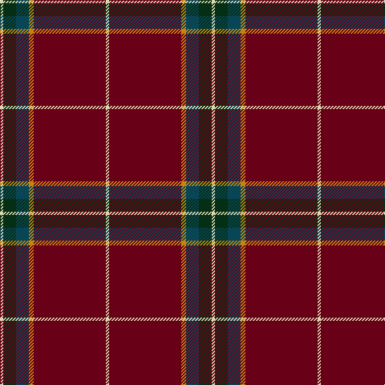

In pattern [WGBYRW](/patterns/wgbyrw/).

This was sourced from register-of-tartans.  It is a [6 stripes tartan](/stripes/stripes6/).

Original link https://www.tartanregister.gov.uk/tartanDetails.aspx?ref=10843

## Thread count
LR/4 DG16 DB16 DY6 DR90 LR/4

## Palette
Each colour and its ΔE from the base-6 reference it is a variant of.

| Colour | Shade | Base | ΔE (OKLab) |
|---|---|---|---|
| DB | <code style="background-color:#084555;">#084555</code> `#084555` | B <code style="background-color:#2A418A;">#2A418A</code> | 0.10 |
| DG | <code style="background-color:#052F14;">#052F14</code> `#052F14` | G <code style="background-color:#006100;">#006100</code> | 0.18 |
| DR | <code style="background-color:#680018;">#680018</code> `#680018` | R <code style="background-color:#CC0000;">#CC0000</code> | 0.22 |
| DY | <code style="background-color:#C58310;">#C58310</code> `#C58310` | Y <code style="background-color:#F2BF00;">#F2BF00</code> | 0.17 |
| LR | <code style="background-color:#DDD5AF;">#DDD5AF</code> `#DDD5AF` | W <code style="background-color:#F7F7F7;">#F7F7F7</code> | 0.12 |

# Sample pattern

## Nearest tartans

The nearest existing variants by ΔTartan distance.

1. [Glencross (Moniaive) (Personal)](/setts/s6/w2r45y3g8b8w2~b202060-g003820-r880000-wfcfcfc-ye8c000~x2/) — ΔT 1.12
1. [Oakhall (Corporate)](/setts/s8/k3r48g6r6g12y3g2k3~g006818-k101010-r901c38-ye8c000~x2/) — ΔT 1.24
1. [Stuart/Stewart of Bute Hunting](/setts/s9/r12g6k1g2k1g1k6r24w2~g005020-k101010-r781c38-we0e0e0~x2/) — ΔT 1.34
1. [MacGregor Hunting Glengyle Clan Tartan Tartan Number: 1285. Earliest known date: 1960 This is the usual MacGregor sett but with a darker crimson background colour. The story goes that Alasdair MacGregor of Cardney wanted to make tartan from the wool of his own sheep. His initial dyeing attempt produced a shocking pink colour, so he dyed the wool a second time to get this dark crimson colour. He liked the result so much that he had a bolt of cloth woven and the Cardney MacGregors have worn it ever since. The addition of the term 'Hunting' to the name is, apparently a commercial attribution. Notes from the STA, quoting Sir Malcolm MacGregor of MacGregor (2006) See products available Copyright © Blair Urquhart, Comrie, 2015](/setts/s6/r96g42r16g17k4w6~g006818-k101010-ra00048-wc0c0c0/) — ΔT 1.41
1. [MacGregor of Cardney](/setts/s6/r18g9r2g3k1w1~g006818-k101010-ra00048-we0e0e0~x4/) — ΔT 1.50
1. [MacGregor, Glengyle](/setts/s6/r96g42r16g17k4ga6~g008000-ga808080-k000000-r900030/) — ΔT 1.51
1. [New York Caledonian Club Dress](/setts/s11/r9b1r2b3r28k12w1r6w1b6ra1~b202060-k101010-ra00000-rac80000-w98c8e8~x2/) — ΔT 1.54
1. [Seton](/setts/s10/g6y1g12r4b4r2k4r32g1r2~b000052-g11450d-k000000-raa0000-yaaaaaa~x2/) — ΔT 1.56
1. [New York Caledonian Club Dress](/setts/s11/r9b1r2b3r28k12w1r6w1b6ra1~b1c1c50-k101010-r960028-radc0000-w98c8e8~x2/) — ΔT 1.58
1. [MacDonell of Keppoch](/setts/s10/g2r2b1r24ba1b6r3g12r4b1~b000052-ba4367ae-g11450d-raa0000~x2/) — ΔT 1.58

## Neighbour map

Every grey dot is one of 15726 variants placed by the first two principal components of the ΔTartan feature space (44% of its variance). Red is this tartan; blue dots are its nearest — click one to open its page.

<svg viewBox="0 0 640 380" role="img" style="max-width:100%;height:auto;border:1px solid #e0e0e0;border-radius:4px;display:block" xmlns="http://www.w3.org/2000/svg"><image href="/nn/cloud.v1.png" width="640" height="380"/><a href="/setts/s6/w2r45y3g8b8w2~b202060-g003820-r880000-wfcfcfc-ye8c000~x2/"><circle cx="411.2" cy="129.7" r="4" fill="#3465a4"><title>Glencross (Moniaive) (Personal)</title></circle></a><a href="/setts/s8/k3r48g6r6g12y3g2k3~g006818-k101010-r901c38-ye8c000~x2/"><circle cx="458.7" cy="142.7" r="4" fill="#3465a4"><title>Oakhall (Corporate)</title></circle></a><a href="/setts/s9/r12g6k1g2k1g1k6r24w2~g005020-k101010-r781c38-we0e0e0~x2/"><circle cx="448.2" cy="155.8" r="4" fill="#3465a4"><title>Stuart/Stewart of Bute Hunting</title></circle></a><a href="/setts/s6/r96g42r16g17k4w6~g006818-k101010-ra00048-wc0c0c0/"><circle cx="429.7" cy="169.8" r="4" fill="#3465a4"><title>MacGregor Hunting Glengyle Clan Tartan Tartan Number: 1285. Earliest known date: 1960 This is the usual MacGregor sett but with a darker crimson background colour. The story goes that Alasdair MacGregor of Cardney wanted to make tartan from the wool of his own sheep. His initial dyeing attempt produced a shocking pink colour, so he dyed the wool a second time to get this dark crimson colour. He liked the result so much that he had a bolt of cloth woven and the Cardney MacGregors have worn it ever since. The addition of the term 'Hunting' to the name is, apparently a commercial attribution. Notes from the STA, quoting Sir Malcolm MacGregor of MacGregor (2006) See products available Copyright © Blair Urquhart, Comrie, 2015</title></circle></a><a href="/setts/s6/r18g9r2g3k1w1~g006818-k101010-ra00048-we0e0e0~x4/"><circle cx="396.0" cy="175.4" r="4" fill="#3465a4"><title>MacGregor of Cardney</title></circle></a><a href="/setts/s6/r96g42r16g17k4ga6~g008000-ga808080-k000000-r900030/"><circle cx="422.4" cy="169.8" r="4" fill="#3465a4"><title>MacGregor, Glengyle</title></circle></a><a href="/setts/s11/r9b1r2b3r28k12w1r6w1b6ra1~b202060-k101010-ra00000-rac80000-w98c8e8~x2/"><circle cx="418.8" cy="112.7" r="4" fill="#3465a4"><title>New York Caledonian Club Dress</title></circle></a><a href="/setts/s10/g6y1g12r4b4r2k4r32g1r2~b000052-g11450d-k000000-raa0000-yaaaaaa~x2/"><circle cx="387.1" cy="102.8" r="4" fill="#3465a4"><title>Seton</title></circle></a><a href="/setts/s11/r9b1r2b3r28k12w1r6w1b6ra1~b1c1c50-k101010-r960028-radc0000-w98c8e8~x2/"><circle cx="426.1" cy="116.8" r="4" fill="#3465a4"><title>New York Caledonian Club Dress</title></circle></a><a href="/setts/s10/g2r2b1r24ba1b6r3g12r4b1~b000052-ba4367ae-g11450d-raa0000~x2/"><circle cx="397.9" cy="136.6" r="4" fill="#3465a4"><title>MacDonell of Keppoch</title></circle></a><circle cx="436.9" cy="145.5" r="5" fill="#c00000"/></svg>

ID: /setts/s6/w2r45y3b8g8w2~b084555-g052f14-r680018-wddd5af-yc58310~x2/
