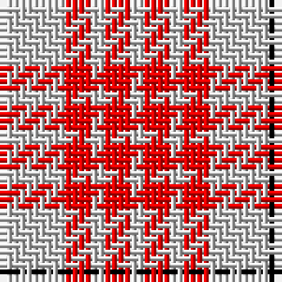

In pattern [KWRWRW](/patterns/kwrwrw/).

This was sourced from weddslist.  It is a [6 stripes tartan](/stripes/stripes6/).

Original link http://www.weddslist.com/cgi-bin/tartans/pg.pl?source=rb

## Thread count
K/1 N9 R4 N2 R4 N/2

## Palette
Each colour and its ΔE from the base-6 reference it is a variant of.

| Colour | Shade | Base | ΔE (OKLab) |
|---|---|---|---|
| K | <code style="background-color:#000000;">#000000</code> `#000000` | K <code style="background-color:#000000;">#000000</code> | 0.00 |
| N | <code style="background-color:#D0D0D0;">#D0D0D0</code> `#D0D0D0` | W <code style="background-color:#F7F7F7;">#F7F7F7</code> | 0.12 |
| R | <code style="background-color:#FF0000;">#FF0000</code> `#FF0000` | R <code style="background-color:#CC0000;">#CC0000</code> | 0.11 |

# Sample pattern

## Nearest tartans

The nearest existing variants by ΔTartan distance.

1. [Clayton Dress (Dance)](/setts/s6/w16r28w16r28w70k8-k000000-r880000-wfcfcfc/) — ΔT 1.21
1. [MacRae of Conchra #2](/setts/s4/k10w74r74w10-k101010-rdc0000-we0e0e0/) — ΔT 1.23
1. [Erskine Red & White (Dance)](/setts/s6/r12w6r54w54r6w12-rc80000-wfcfcfc/) — ΔT 1.36
1. [Milne Dress Family Tartan Tartan Number: 634. Earliest known date: pre 2003 Milnes are usually regarded as being a Sept of the Gordons or of the Ogilvys. See products available Copyright © Blair Urquhart, Comrie, 2015](/setts/s8/w18b4w18r30w18b4w9ba4-b2c2c80-ba780078-rc80000-we0e0e0/) — ΔT 1.37
1. [Milne, dress](/setts/s8/w18b4w18r30w18b4w9ba4-b304080-ba800080-rc00000-we0e0e0/) — ΔT 1.37
1. [Lewis, Magenta (Dance)](/setts/s4/w8r62w70y8-rb80478-wf0e0c8-y54b8b8/) — ΔT 1.37
1. [MacRae of Conchra](/setts/s4/k10w74r74w10-k000000-rc00000-we0e0e0/) — ΔT 1.38
1. [Buchanan #5](/setts/s6/k4w56r26w4r26w4-k101010-r960028-we0e0e0/) — ΔT 1.40
1. [MacPherson Dress Red (Dance)](/setts/s7/w10b6w52r40w6r16y6-b780078-rc80000-we0e0e0-ye8c000/) — ΔT 1.43
1. [MacPherson, Red](/setts/s7/w10b6w52r40w6r16y6-b800080-rc00000-we0e0e0-yf0c000/) — ΔT 1.43

## Neighbour map

Every grey dot is one of 15726 variants placed by the first two principal components of the ΔTartan feature space (44% of its variance). Red is this tartan; blue dots are its nearest — click one to open its page.

<svg viewBox="0 0 640 380" role="img" style="max-width:100%;height:auto;border:1px solid #e0e0e0;border-radius:4px;display:block" xmlns="http://www.w3.org/2000/svg"><image href="/nn/cloud.v1.png" width="640" height="380"/><a href="/setts/s6/w16r28w16r28w70k8-k000000-r880000-wfcfcfc/"><circle cx="305.6" cy="203.8" r="4" fill="#3465a4"><title>Clayton Dress (Dance)</title></circle></a><a href="/setts/s4/k10w74r74w10-k101010-rdc0000-we0e0e0/"><circle cx="284.1" cy="226.6" r="4" fill="#3465a4"><title>MacRae of Conchra #2</title></circle></a><a href="/setts/s6/r12w6r54w54r6w12-rc80000-wfcfcfc/"><circle cx="324.5" cy="203.8" r="4" fill="#3465a4"><title>Erskine Red &amp; White (Dance)</title></circle></a><a href="/setts/s8/w18b4w18r30w18b4w9ba4-b2c2c80-ba780078-rc80000-we0e0e0/"><circle cx="271.1" cy="192.9" r="4" fill="#3465a4"><title>Milne Dress Family Tartan Tartan Number: 634. Earliest known date: pre 2003 Milnes are usually regarded as being a Sept of the Gordons or of the Ogilvys. See products available Copyright © Blair Urquhart, Comrie, 2015</title></circle></a><a href="/setts/s8/w18b4w18r30w18b4w9ba4-b304080-ba800080-rc00000-we0e0e0/"><circle cx="272.1" cy="193.7" r="4" fill="#3465a4"><title>Milne, dress</title></circle></a><a href="/setts/s4/w8r62w70y8-rb80478-wf0e0c8-y54b8b8/"><circle cx="309.2" cy="221.8" r="4" fill="#3465a4"><title>Lewis, Magenta (Dance)</title></circle></a><a href="/setts/s4/k10w74r74w10-k000000-rc00000-we0e0e0/"><circle cx="274.5" cy="225.8" r="4" fill="#3465a4"><title>MacRae of Conchra</title></circle></a><a href="/setts/s6/k4w56r26w4r26w4-k101010-r960028-we0e0e0/"><circle cx="323.9" cy="174.9" r="4" fill="#3465a4"><title>Buchanan #5</title></circle></a><a href="/setts/s7/w10b6w52r40w6r16y6-b780078-rc80000-we0e0e0-ye8c000/"><circle cx="267.8" cy="172.6" r="4" fill="#3465a4"><title>MacPherson Dress Red (Dance)</title></circle></a><a href="/setts/s7/w10b6w52r40w6r16y6-b800080-rc00000-we0e0e0-yf0c000/"><circle cx="266.2" cy="172.5" r="4" fill="#3465a4"><title>MacPherson, Red</title></circle></a><circle cx="324.6" cy="210.1" r="5" fill="#c00000"/></svg>

ID: /setts/s6/w2r4w2r4w9k1-k000000-rff0000-wd0d0d0/
