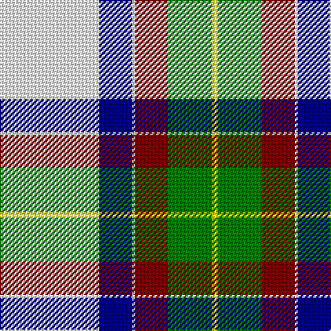

This page is one **sett** — a single exact thread-count. It belongs to the [tartan](/tartans/w36db12w1dr12g16y2/)
(the same proportion at any scale), whose colour order is pattern [WBWRGY](/stripes/wbwrgy/).

Sourced from register-of-tartans.  It is a [6 stripe tartan](/stripes/stripes6/).

Original link https://www.tartanregister.gov.uk/tartanDetails.aspx?ref=10081

## Register references

External register numbers recorded for this tartan.

- Scottish Register of Tartans: [10081](https://www.tartanregister.gov.uk/tartanDetails.aspx?ref=10081)

## Thread count
W/72 DB24 W2 DR24 G32 Y/4

## Palette
Each colour and the base-6 reference it is a variant of.

| Colour | Shade | Base |
|---|---|---|
| DB | <code style="background-color:#00008B;">#00008B</code> `oklch(28.8% 0.199 264.1)` <small>#00008B</small> | B <code style="background-color:#2A418A;">#2A418A</code> |
| DR | <code style="background-color:#800000;">#800000</code> `oklch(37.7% 0.155 29.2)` <small>#800000</small> | R <code style="background-color:#CC0000;">#CC0000</code> |
| G | <code style="background-color:#008000;">#008000</code> `oklch(52.0% 0.177 142.5)` <small>#008000</small> | G <code style="background-color:#006100;">#006100</code> |
| W | <code style="background-color:#FFFFFF;">#FFFFFF</code> `oklch(100.0% 0.000 89.9)` <small>#FFFFFF</small> | W <code style="background-color:#F7F7F7;">#F7F7F7</code> |
| Y | <code style="background-color:#FFFF00;">#FFFF00</code> `oklch(96.8% 0.211 109.8)` <small>#FFFF00</small> | Y <code style="background-color:#F2BF00;">#F2BF00</code> |

# Sample pattern

## Nearest tartans

The nearest existing variants by ΔTartan distance, with this tartan at the top so the swatches line up against it.

ΔTartan

Tartan

Sett

—

<a href="/ttd/edit/#slug=w36db12w1r12g16ly2~x2">MacNappy Tartan</a> <a class="nn-out" href="/setts/s6/w36db12w1r12g16ly2~x2/" title="open its dictionary page">↗</a>

0.89

<a href="/ttd/edit/#slug=t5k1w30dp15w8g30w8dp2~x2">Shaw, Miss Rebecca (Personal)</a> <a class="nn-out" href="/setts/s8/t5k1w30dp15w8g30w8dp2~x2/" title="open its dictionary page">↗</a>

1.33

<a href="/ttd/edit/#slug=w50g15db10r2db10g8ly3~x2">Nimah, Carissa &amp; Bassem (Personal)</a> <a class="nn-out" href="/setts/s7/w50g15db10r2db10g8ly3~x2/" title="open its dictionary page">↗</a>

1.52

<a href="/ttd/edit/#slug=dg4dr14dg14o6dr1w30dg2dr1~x2">British Columbia #2</a> <a class="nn-out" href="/setts/s8/dg4dr14dg14o6dr1w30dg2dr1~x2/" title="open its dictionary page">↗</a>

1.55

<a href="/ttd/edit/#slug=db2w14p4ly1g8db2~x2">Manx Laxey, dress green</a> <a class="nn-out" href="/setts/s6/db2w14p4ly1g8db2~x2/" title="open its dictionary page">↗</a>

1.56

<a href="/ttd/edit/#slug=y3g32y36o12k2w68g3k2~x2">Kintail Dress</a> <a class="nn-out" href="/setts/s8/y3g32y36o12k2w68g3k2~x2/" title="open its dictionary page">↗</a>

1.56

<a href="/ttd/edit/#slug=g18w55o19g20w2g20k5">Michigan State University</a> <a class="nn-out" href="/setts/s7/g18w55o19g20w2g20k5/" title="open its dictionary page">↗</a>

1.57

<a href="/ttd/edit/#slug=db4w1db2w18g3w1r9ly4~x4">Manitoba Dress (1958) (District)</a> <a class="nn-out" href="/setts/s8/db4w1db2w18g3w1r9ly4~x4/" title="open its dictionary page">↗</a>

1.59

<a href="/ttd/edit/#slug=w14dp4ly1g8db2~x2">Manx Laxey Dress Green</a> <a class="nn-out" href="/setts/s5/w14dp4ly1g8db2~x2/" title="open its dictionary page">↗</a>

1.59

<a href="/ttd/edit/#slug=w36lt12w1r12g16ly2~x2">MacNappy</a> <a class="nn-out" href="/setts/s6/w36lt12w1r12g16ly2~x2/" title="open its dictionary page">↗</a>

1.60

<a href="/ttd/edit/#slug=w8g5dp10t24w30g2lp2~x2">Shiel, Purple V2 (Dance)</a> <a class="nn-out" href="/setts/s7/w8g5dp10t24w30g2lp2~x2/" title="open its dictionary page">↗</a>

## Neighbour map

Every grey dot is one of 14299 variants placed by the first two principal components of the ΔTartan feature space (44% of its variance). Red is this tartan; blue dots are its nearest — click one to open its page.

<svg viewBox="0 0 640 380" role="img" style="max-width:100%;height:auto;border:1px solid #e0e0e0;border-radius:4px;display:block" xmlns="http://www.w3.org/2000/svg"><image href="/nn/cloud.v1.png" width="640" height="380"/><a href="/setts/s8/t5k1w30dp15w8g30w8dp2~x2/"><circle cx="213.8" cy="108.4" r="4" fill="#3465a4"><title>Shaw, Miss Rebecca (Personal)</title></circle></a><a href="/setts/s7/w50g15db10r2db10g8ly3~x2/"><circle cx="219.3" cy="89.8" r="4" fill="#3465a4"><title>Nimah, Carissa &amp; Bassem (Personal)</title></circle></a><a href="/setts/s8/dg4dr14dg14o6dr1w30dg2dr1~x2/"><circle cx="215.5" cy="111.0" r="4" fill="#3465a4"><title>British Columbia #2</title></circle></a><a href="/setts/s6/db2w14p4ly1g8db2~x2/"><circle cx="187.5" cy="152.3" r="4" fill="#3465a4"><title>Manx Laxey, dress green</title></circle></a><a href="/setts/s8/y3g32y36o12k2w68g3k2~x2/"><circle cx="227.6" cy="96.1" r="4" fill="#3465a4"><title>Kintail Dress</title></circle></a><a href="/setts/s7/g18w55o19g20w2g20k5/"><circle cx="218.9" cy="145.0" r="4" fill="#3465a4"><title>Michigan State University</title></circle></a><a href="/setts/s8/db4w1db2w18g3w1r9ly4~x4/"><circle cx="212.7" cy="114.6" r="4" fill="#3465a4"><title>Manitoba Dress (1958) (District)</title></circle></a><a href="/setts/s5/w14dp4ly1g8db2~x2/"><circle cx="204.4" cy="164.1" r="4" fill="#3465a4"><title>Manx Laxey Dress Green</title></circle></a><a href="/setts/s6/w36lt12w1r12g16ly2~x2/"><circle cx="251.3" cy="126.2" r="4" fill="#3465a4"><title>MacNappy</title></circle></a><a href="/setts/s7/w8g5dp10t24w30g2lp2~x2/"><circle cx="208.7" cy="144.4" r="4" fill="#3465a4"><title>Shiel, Purple V2 (Dance)</title></circle></a><circle cx="211.0" cy="109.8" r="5" fill="#c00000"/></svg>

ID: /setts/s6/w36db12w1r12g16ly2~x2/
