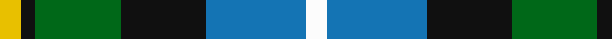
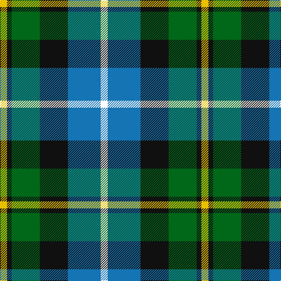

In pattern [WBKGKY](/stripes/wbkgky/).

This was sourced from tartans-authority.  It is a [6 stripe tartan](/stripes/stripes6/).

Original link http://www.tartansauthority.com/tartan-ferret/display/1767/

## Thread count
Y/12 K8 G48 K48 B56 W/12

## Palette
Each colour and its ΔE from the base-6 reference it is a variant of.

| Colour | Shade | Base | ΔE (OKLab) |
|---|---|---|---|
| B | <code style="background-color:#1474B4;">#1474B4</code> `#1474B4` | B <code style="background-color:#2A418A;">#2A418A</code> | 0.15 |
| G | <code style="background-color:#006818;">#006818</code> `#006818` | G <code style="background-color:#006100;">#006100</code> | 0.02 |
| K | <code style="background-color:#101010;">#101010</code> `#101010` | K <code style="background-color:#000000;">#000000</code> | 0.17 |
| W | <code style="background-color:#FCFCFC;">#FCFCFC</code> `#FCFCFC` | W <code style="background-color:#F7F7F7;">#F7F7F7</code> | 0.01 |
| Y | <code style="background-color:#E8C000;">#E8C000</code> `#E8C000` | Y <code style="background-color:#F2BF00;">#F2BF00</code> | 0.02 |

# Sample pattern

## Nearest tartans

The nearest existing variants by ΔTartan distance.

1. [Davidson](/setts/s5/r1db6k3g6w1~x4/) — ΔT 0.79
1. [Davidson of Tulloch](/setts/s5/r2db10k5g12w2~x2/) — ΔT 0.89
1. [MacNeil 6](/setts/s6/w3db14k12g12k2ly3~x2/) — ΔT 0.91
1. [Colquhoun #2](/setts/s7/r2g8w1k8b8k1b1~x6/) — ΔT 0.92
1. [Royal Highland](/setts/s6/lr4g17k17db17r3db3~x2/) — ΔT 1.04
1. [Scottish Odyssey Commemorative Tartan Tartan Number: 4071. Earliest known date: 01/01/2002 The Scottish Odyssey tartan from Lochcarron is a 'celebration of the wonderful experiences to be gained' from a visit to Scotland and some of the most spectacularly contrasting landscapes to be seen in Europe. See products available Copyright © Blair Urquhart, Comrie, 2015](/setts/s7/k7db11k3db11dy11g22db3~x2/) — ΔT 1.06
1. [Wellington](/setts/s6/db1r1db6k6g6w1~x2/) — ΔT 1.07
1. [Cooke](/setts/s7/k6b2db12g8r5k2g3~x4/) — ΔT 1.08
1. [Hogarth, of Firhill](/setts/s7/b2g6ly1k6db6k1db1~x2/) — ΔT 1.08
1. [MacDonald, (Flora.. )](/setts/s7/g17ly2k14r2db9r2db10~x2/) — ΔT 1.10

## Neighbour map

Every grey dot is one of 14299 variants placed by the first two principal components of the ΔTartan feature space (44% of its variance). Red is this tartan; blue dots are its nearest — click one to open its page.

<svg viewBox="0 0 640 380" role="img" style="max-width:100%;height:auto;border:1px solid #e0e0e0;border-radius:4px;display:block" xmlns="http://www.w3.org/2000/svg"><image href="/nn/cloud.v1.png" width="640" height="380"/><a href="/setts/s5/r1db6k3g6w1~x4/"><circle cx="111.2" cy="229.6" r="4" fill="#3465a4"><title>Davidson</title></circle></a><a href="/setts/s5/r2db10k5g12w2~x2/"><circle cx="119.5" cy="224.9" r="4" fill="#3465a4"><title>Davidson of Tulloch</title></circle></a><a href="/setts/s6/w3db14k12g12k2ly3~x2/"><circle cx="78.0" cy="212.1" r="4" fill="#3465a4"><title>MacNeil 6</title></circle></a><a href="/setts/s7/r2g8w1k8b8k1b1~x6/"><circle cx="125.1" cy="198.4" r="4" fill="#3465a4"><title>Colquhoun #2</title></circle></a><a href="/setts/s6/lr4g17k17db17r3db3~x2/"><circle cx="93.4" cy="223.9" r="4" fill="#3465a4"><title>Royal Highland</title></circle></a><a href="/setts/s7/k7db11k3db11dy11g22db3~x2/"><circle cx="127.9" cy="223.8" r="4" fill="#3465a4"><title>Scottish Odyssey Commemorative Tartan Tartan Number: 4071. Earliest known date: 01/01/2002 The Scottish Odyssey tartan from Lochcarron is a 'celebration of the wonderful experiences to be gained' from a visit to Scotland and some of the most spectacularly contrasting landscapes to be seen in Europe. See products available Copyright © Blair Urquhart, Comrie, 2015</title></circle></a><a href="/setts/s6/db1r1db6k6g6w1~x2/"><circle cx="101.9" cy="217.1" r="4" fill="#3465a4"><title>Wellington</title></circle></a><a href="/setts/s7/k6b2db12g8r5k2g3~x4/"><circle cx="81.8" cy="219.3" r="4" fill="#3465a4"><title>Cooke</title></circle></a><a href="/setts/s7/b2g6ly1k6db6k1db1~x2/"><circle cx="83.2" cy="209.8" r="4" fill="#3465a4"><title>Hogarth, of Firhill</title></circle></a><a href="/setts/s7/g17ly2k14r2db9r2db10~x2/"><circle cx="116.7" cy="199.0" r="4" fill="#3465a4"><title>MacDonald, (Flora.. )</title></circle></a><circle cx="86.5" cy="215.4" r="5" fill="#c00000"/></svg>

ID: /setts/s6/w3b14k12g12k2ly3~x4/
