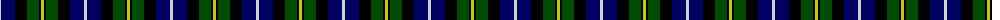

In pattern [WBKGKY](/patterns/wbkgky/).

This was sourced from weddslist.  It is a [6 stripes tartan](/stripes/stripes6/).

Original link http://www.weddslist.com/cgi-bin/tartans/pg.pl?source=rb

## Thread count
N/3 DB14 K12 G12 K2 Y/3

## Palette
Each colour and its ΔE from the base-6 reference it is a variant of.

| Colour | Shade | Base | ΔE (OKLab) |
|---|---|---|---|
| DB | <code style="background-color:#000064;">#000064</code> `#000064` | B <code style="background-color:#2A418A;">#2A418A</code> | 0.18 |
| G | <code style="background-color:#004C00;">#004C00</code> `#004C00` | G <code style="background-color:#006100;">#006100</code> | 0.07 |
| K | <code style="background-color:#000000;">#000000</code> `#000000` | K <code style="background-color:#000000;">#000000</code> | 0.00 |
| N | <code style="background-color:#D0D0D0;">#D0D0D0</code> `#D0D0D0` | W <code style="background-color:#F7F7F7;">#F7F7F7</code> | 0.12 |
| Y | <code style="background-color:#C8C800;">#C8C800</code> `#C8C800` | Y <code style="background-color:#F2BF00;">#F2BF00</code> | 0.07 |

# Sample pattern

## Nearest tartans

The nearest existing variants by ΔTartan distance.

1. [MacNiel of Barra](/setts/s6/y6k4g24k24b28ya6-b000052-g11450d-k000000-yaaaa00-yaaaaaaa/) — ΔT 0.45
1. [MacNiel of Barra](/setts/s6/y3k2g12k12b14ya3-b000052-g11450d-k000000-yaaaa00-yaaaaaaa/) — ΔT 0.45
1. [Gaines Center for the Humanities](/setts/s6/r4k4g24k24b24w4-b00008c-g007800-k000000-r8c0000-wc8c8c8/) — ΔT 0.46
1. [Leslie Hunting](/setts/s6/r4b16k16w2g16k2-b000064-g004c00-k000000-rc80000-wd0d0d0/) — ΔT 0.72
1. [Hogarth, of Firhill](/setts/s7/b8g28y4k28ba28k4ba6-b5480b0-ba304080-g008000-k000000-yf0c000/) — ΔT 0.79
1. [Leslie, hunting](/setts/s6/r4b16k16w2g16k2-b304080-g008000-k000000-rc00000-we0e0e0/) — ΔT 0.80
1. [Campbell Cawdor](/setts/s7/r2k1b8k8g8k1w2-b00004c-g004c00-k000000-rc80000-wd0d0d0/) — ΔT 0.80
1. [Davidson of Tulloch](/setts/s5/r1b6k3g6w1-b00004c-g004c00-k000000-rc80000-wd0d0d0/) — ΔT 0.81
1. [Hogarth, of Firhill](/setts/s7/b4g12y2k12ba12k2ba2-b8080d0-ba304080-g008000-k000000-yf0c000/) — ΔT 0.81
1. [Argyll / MacCorquodale](/setts/s7/b4k2g16k16ba16k2r4-b5480b0-ba304080-g008000-k000000-rc00000/) — ΔT 0.82

## Neighbour map

Every grey dot is one of 15726 variants placed by the first two principal components of the ΔTartan feature space (44% of its variance). Red is this tartan; blue dots are its nearest — click one to open its page.

<svg viewBox="0 0 640 380" role="img" style="max-width:100%;height:auto;border:1px solid #e0e0e0;border-radius:4px;display:block" xmlns="http://www.w3.org/2000/svg"><image href="/nn/cloud.v1.png" width="640" height="380"/><a href="/setts/s6/y6k4g24k24b28ya6-b000052-g11450d-k000000-yaaaa00-yaaaaaaa/"><circle cx="95.8" cy="226.2" r="4" fill="#3465a4"><title>MacNiel of Barra</title></circle></a><a href="/setts/s6/y3k2g12k12b14ya3-b000052-g11450d-k000000-yaaaa00-yaaaaaaa/"><circle cx="95.8" cy="226.2" r="4" fill="#3465a4"><title>MacNiel of Barra</title></circle></a><a href="/setts/s6/r4k4g24k24b24w4-b00008c-g007800-k000000-r8c0000-wc8c8c8/"><circle cx="98.6" cy="221.3" r="4" fill="#3465a4"><title>Gaines Center for the Humanities</title></circle></a><a href="/setts/s6/r4b16k16w2g16k2-b000064-g004c00-k000000-rc80000-wd0d0d0/"><circle cx="120.4" cy="216.7" r="4" fill="#3465a4"><title>Leslie Hunting</title></circle></a><a href="/setts/s7/b8g28y4k28ba28k4ba6-b5480b0-ba304080-g008000-k000000-yf0c000/"><circle cx="96.6" cy="204.2" r="4" fill="#3465a4"><title>Hogarth, of Firhill</title></circle></a><a href="/setts/s6/r4b16k16w2g16k2-b304080-g008000-k000000-rc00000-we0e0e0/"><circle cx="103.6" cy="205.8" r="4" fill="#3465a4"><title>Leslie, hunting</title></circle></a><a href="/setts/s7/r2k1b8k8g8k1w2-b00004c-g004c00-k000000-rc80000-wd0d0d0/"><circle cx="114.2" cy="202.9" r="4" fill="#3465a4"><title>Campbell Cawdor</title></circle></a><a href="/setts/s5/r1b6k3g6w1-b00004c-g004c00-k000000-rc80000-wd0d0d0/"><circle cx="122.3" cy="239.9" r="4" fill="#3465a4"><title>Davidson of Tulloch</title></circle></a><a href="/setts/s7/b4g12y2k12ba12k2ba2-b8080d0-ba304080-g008000-k000000-yf0c000/"><circle cx="78.8" cy="209.0" r="4" fill="#3465a4"><title>Hogarth, of Firhill</title></circle></a><a href="/setts/s7/b4k2g16k16ba16k2r4-b5480b0-ba304080-g008000-k000000-rc00000/"><circle cx="107.9" cy="198.1" r="4" fill="#3465a4"><title>Argyll / MacCorquodale</title></circle></a><circle cx="83.3" cy="220.7" r="5" fill="#c00000"/></svg>

ID: /setts/s6/w3b14k12g12k2y3-b000064-g004c00-k000000-wd0d0d0-yc8c800/
