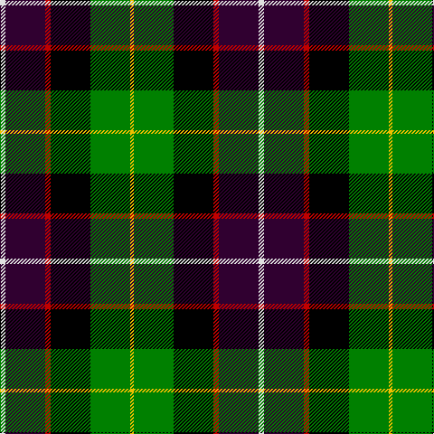

In pattern [WBRKGY](/patterns/wbrkgy/).

This was sourced from weddslist.  It is a [6 stripes tartan](/stripes/stripes6/).

Original link http://www.weddslist.com/cgi-bin/tartans/pg.pl?source=sts

## Thread count
LN/6 DP44 R6 K44 G44 Y/4

## Palette
Each colour and its ΔE from the base-6 reference it is a variant of.

| Colour | Shade | Base | ΔE (OKLab) |
|---|---|---|---|
| DP | <code style="background-color:#300030;">#300030</code> `#300030` | B <code style="background-color:#2A418A;">#2A418A</code> | 0.22 |
| G | <code style="background-color:#008000;">#008000</code> `#008000` | G <code style="background-color:#006100;">#006100</code> | 0.10 |
| K | <code style="background-color:#000000;">#000000</code> `#000000` | K <code style="background-color:#000000;">#000000</code> | 0.00 |
| LN | <code style="background-color:#E0E0E0;">#E0E0E0</code> `#E0E0E0` | W <code style="background-color:#F7F7F7;">#F7F7F7</code> | 0.07 |
| R | <code style="background-color:#C00000;">#C00000</code> `#C00000` | R <code style="background-color:#CC0000;">#CC0000</code> | 0.03 |
| Y | <code style="background-color:#F0C000;">#F0C000</code> `#F0C000` | Y <code style="background-color:#F2BF00;">#F2BF00</code> | 0.00 |

# Sample pattern

## Nearest tartans

The nearest existing variants by ΔTartan distance.

1. [Scotch House 2000, dress](/setts/s7/g22w3k2y3k19r18ga4~g004010-ga30a010-k000000-rc00000-we0e0e0-yf0c000~x2/) — ΔT 0.94
1. [Cowan, of Inveresk](/setts/s8/r4g16w2k15b15k2b2y2~b304080-g008000-k000000-rc00000-we0e0e0-yf0c000~x2/) — ΔT 1.05
1. [MacNeil 7](/setts/s7/w1r2b16k14g15k3y1~b304080-g008000-k000000-rc00000-we0e0e0-yf0c000~x2/) — ΔT 1.06
1. [Cowan of Inveresk (Personal)](/setts/s8/r4g16w2k15b15k2b2y2~b2c2c80-g004c00-k000000-rc80000-wfcfcfc-ye8c000~x2/) — ΔT 1.07
1. [James](/setts/s7/b5ba12y2g25y2k12r5~b5480b0-ba000050-g003000-k000000-rc00000-yf0c000~x2/) — ΔT 1.12
1. [MacWilliam](/setts/s6/r10b24r4k30g36ba5~b304080-ba000050-g008000-k000000-rc00000/) — ΔT 1.14
1. [Cumming LO](/setts/s9/b4k2b4k10g1ga10r4y1r4~b4367ae-g7f5200-ga11450d-k000000-raa0000-yaaaaaa~x2/) — ΔT 1.14
1. [Cumming LO](/setts/s9/b4k2b4k10g1ga10r4y1r4~b4367ae-g7f5200-ga11450d-k000000-raa0000-yaaaaaa/) — ΔT 1.14
1. [Forsyth](/setts/s6/k2g11y1k8b9r2~b304080-g008000-k000000-rc00000-yf0c000~x4/) — ΔT 1.16
1. [Leslie, hunting](/setts/s6/r2b8k8w1g8k1~b304080-g008000-k000000-rc00000-we0e0e0~x2/) — ΔT 1.18

## Neighbour map

Every grey dot is one of 15726 variants placed by the first two principal components of the ΔTartan feature space (44% of its variance). Red is this tartan; blue dots are its nearest — click one to open its page.

<svg viewBox="0 0 640 380" role="img" style="max-width:100%;height:auto;border:1px solid #e0e0e0;border-radius:4px;display:block" xmlns="http://www.w3.org/2000/svg"><image href="/nn/cloud.v1.png" width="640" height="380"/><a href="/setts/s7/g22w3k2y3k19r18ga4~g004010-ga30a010-k000000-rc00000-we0e0e0-yf0c000~x2/"><circle cx="98.1" cy="155.6" r="4" fill="#3465a4"><title>Scotch House 2000, dress</title></circle></a><a href="/setts/s8/r4g16w2k15b15k2b2y2~b304080-g008000-k000000-rc00000-we0e0e0-yf0c000~x2/"><circle cx="75.4" cy="161.6" r="4" fill="#3465a4"><title>Cowan, of Inveresk</title></circle></a><a href="/setts/s7/w1r2b16k14g15k3y1~b304080-g008000-k000000-rc00000-we0e0e0-yf0c000~x2/"><circle cx="130.9" cy="146.8" r="4" fill="#3465a4"><title>MacNeil 7</title></circle></a><a href="/setts/s8/r4g16w2k15b15k2b2y2~b2c2c80-g004c00-k000000-rc80000-wfcfcfc-ye8c000~x2/"><circle cx="84.3" cy="165.6" r="4" fill="#3465a4"><title>Cowan of Inveresk (Personal)</title></circle></a><a href="/setts/s7/b5ba12y2g25y2k12r5~b5480b0-ba000050-g003000-k000000-rc00000-yf0c000~x2/"><circle cx="139.7" cy="162.9" r="4" fill="#3465a4"><title>James</title></circle></a><a href="/setts/s6/r10b24r4k30g36ba5~b304080-ba000050-g008000-k000000-rc00000/"><circle cx="105.9" cy="205.6" r="4" fill="#3465a4"><title>MacWilliam</title></circle></a><a href="/setts/s9/b4k2b4k10g1ga10r4y1r4~b4367ae-g7f5200-ga11450d-k000000-raa0000-yaaaaaa~x2/"><circle cx="81.3" cy="164.0" r="4" fill="#3465a4"><title>Cumming LO</title></circle></a><a href="/setts/s9/b4k2b4k10g1ga10r4y1r4~b4367ae-g7f5200-ga11450d-k000000-raa0000-yaaaaaa/"><circle cx="81.3" cy="164.0" r="4" fill="#3465a4"><title>Cumming LO</title></circle></a><a href="/setts/s6/k2g11y1k8b9r2~b304080-g008000-k000000-rc00000-yf0c000~x4/"><circle cx="123.5" cy="196.7" r="4" fill="#3465a4"><title>Forsyth</title></circle></a><a href="/setts/s6/r2b8k8w1g8k1~b304080-g008000-k000000-rc00000-we0e0e0~x2/"><circle cx="103.7" cy="206.4" r="4" fill="#3465a4"><title>Leslie, hunting</title></circle></a><circle cx="97.6" cy="171.7" r="5" fill="#c00000"/></svg>

ID: /setts/s6/w3b22r3k22g22y2~b300030-g008000-k000000-rc00000-we0e0e0-yf0c000~x2/
