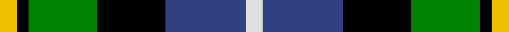
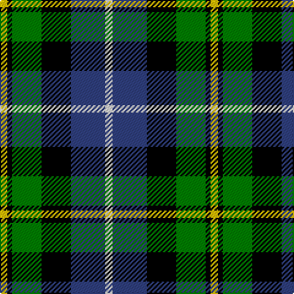

In pattern [WBKGKY](/stripes/wbkgky/).

This was sourced from weddslist.  It is a [6 stripe tartan](/stripes/stripes6/).

Original link http://www.weddslist.com/cgi-bin/tartans/pg.pl?source=sts

## Also known as

This cloth is also recorded under:

- MacNeil

## Attestations

This cloth appears in 2 source records; the oldest owns this page.

- undated — MacNeil 6 (weddslist, [record](http://www.weddslist.com/cgi-bin/tartans/pg.pl?source=sts))
- undated — MacNeil Clan Tartan Tartan Number: 1767. Earliest known date: 1886 This version shows the narrow 'tramlines' about the yellow stripe, the usual modern form that differs from Logans earlier version. The MacNeils claim descent from Niall, King of Ireland, who came to Barra in 1049. The present chief, Professor Ian Roderick MacNeil of Barra, lives in Chicago, U.S.A. There is also a tartan for the MacNeils of Colonsay. MacNeils are hereditary pipers to the MacLeans of Duart. See products available Copyright © Blair Urquhart, Comrie, 2015 (house-of-tartan, [record](http://www.house-of-tartan.scotland.net/house/TartanViewjs.asp?colr=Def&tnam=1767))

## Thread count
Y/6 K4 G24 K24 B28 LN/6

## Palette
Each colour and the base-6 reference it is a variant of.

| Colour | Shade | Base |
|---|---|---|
| B | <code style="background-color:#304080;">#304080</code> `oklch(39.4% 0.109 270.2)` <small>#304080</small> | B <code style="background-color:#2A418A;">#2A418A</code> |
| G | <code style="background-color:#008000;">#008000</code> `oklch(52.0% 0.177 142.5)` <small>#008000</small> | G <code style="background-color:#006100;">#006100</code> |
| K | <code style="background-color:#000000;">#000000</code> `oklch(0.0% 0.000 0.0)` <small>#000000</small> | K <code style="background-color:#000000;">#000000</code> |
| LN | <code style="background-color:#E0E0E0;">#E0E0E0</code> `oklch(90.7% 0.000 89.9)` <small>#E0E0E0</small> | W <code style="background-color:#F7F7F7;">#F7F7F7</code> |
| Y | <code style="background-color:#F0C000;">#F0C000</code> `oklch(82.7% 0.169 90.5)` <small>#F0C000</small> | Y <code style="background-color:#F2BF00;">#F2BF00</code> |

# Sample pattern

## Nearest tartans

The nearest existing variants by ΔTartan distance.

1. [Wellington](/setts/s6/db1r1db6k6g6w1~x2/) — ΔT 0.55
1. [Leslie, hunting](/setts/s6/r2db8k8w1g8k1~x2/) — ΔT 0.57
1. [Royal Highland](/setts/s6/lr4g17k17db17r3db3~x2/) — ΔT 0.57
1. [Hogarth, of Firhill](/setts/s7/b2g6ly1k6db6k1db1~x2/) — ΔT 0.62
1. [Birse](/setts/s6/k4g16k14ly3db16r4~x2/) — ΔT 0.64
1. [Dyce](/setts/s6/k2ly1g6k6db6w1~x4/) — ΔT 0.66
1. [Junior Chamber International](/setts/s7/r4g16k16db4g3db12ly2~x2/) — ΔT 0.66
1. [MacDonald, (Flora.. )](/setts/s7/g17ly2k14r2db9r2db10~x2/) — ΔT 0.71
1. [MacWilliam](/setts/s6/r10db24r4k30g36db5/) — ΔT 0.78
1. [Davidson](/setts/s5/r1db6k3g6w1~x4/) — ΔT 0.81

## Neighbour map

Every grey dot is one of 14299 variants placed by the first two principal components of the ΔTartan feature space (44% of its variance). Red is this tartan; blue dots are its nearest — click one to open its page.

<svg viewBox="0 0 640 380" role="img" style="max-width:100%;height:auto;border:1px solid #e0e0e0;border-radius:4px;display:block" xmlns="http://www.w3.org/2000/svg"><image href="/nn/cloud.v1.png" width="640" height="380"/><a href="/setts/s6/db1r1db6k6g6w1~x2/"><circle cx="101.9" cy="217.1" r="4" fill="#3465a4"><title>Wellington</title></circle></a><a href="/setts/s6/r2db8k8w1g8k1~x2/"><circle cx="107.6" cy="206.5" r="4" fill="#3465a4"><title>Leslie, hunting</title></circle></a><a href="/setts/s6/lr4g17k17db17r3db3~x2/"><circle cx="93.4" cy="223.9" r="4" fill="#3465a4"><title>Royal Highland</title></circle></a><a href="/setts/s7/b2g6ly1k6db6k1db1~x2/"><circle cx="83.2" cy="209.8" r="4" fill="#3465a4"><title>Hogarth, of Firhill</title></circle></a><a href="/setts/s6/k4g16k14ly3db16r4~x2/"><circle cx="77.6" cy="229.3" r="4" fill="#3465a4"><title>Birse</title></circle></a><a href="/setts/s6/k2ly1g6k6db6w1~x4/"><circle cx="100.9" cy="223.2" r="4" fill="#3465a4"><title>Dyce</title></circle></a><a href="/setts/s7/r4g16k16db4g3db12ly2~x2/"><circle cx="109.6" cy="200.9" r="4" fill="#3465a4"><title>Junior Chamber International</title></circle></a><a href="/setts/s7/g17ly2k14r2db9r2db10~x2/"><circle cx="116.7" cy="199.0" r="4" fill="#3465a4"><title>MacDonald, (Flora.. )</title></circle></a><a href="/setts/s6/r10db24r4k30g36db5/"><circle cx="109.5" cy="206.2" r="4" fill="#3465a4"><title>MacWilliam</title></circle></a><a href="/setts/s5/r1db6k3g6w1~x4/"><circle cx="111.2" cy="229.6" r="4" fill="#3465a4"><title>Davidson</title></circle></a><circle cx="78.0" cy="212.1" r="5" fill="#c00000"/></svg>

ID: /setts/s6/w3db14k12g12k2ly3~x2/
