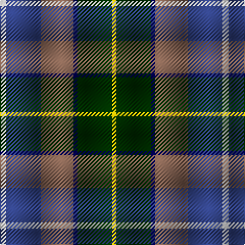

In pattern [WBRBGY](/stripes/wbrbgy/).

This was sourced from weddslist.  It is a [6 stripe tartan](/stripes/stripes6/).

Original link http://www.weddslist.com/cgi-bin/tartans/pg.pl?source=sts

## Thread count
LN/6 B34 LT32 DB4 DG34 Y/4

## Palette
Each colour and the base-6 reference it is a variant of.

| Colour | Shade | Base |
|---|---|---|
| B | <code style="background-color:#304080;">#304080</code> `oklch(39.4% 0.109 270.2)` <small>#304080</small> | B <code style="background-color:#2A418A;">#2A418A</code> |
| DB | <code style="background-color:#000050;">#000050</code> `oklch(19.5% 0.135 264.1)` <small>#000050</small> | B <code style="background-color:#2A418A;">#2A418A</code> |
| DG | <code style="background-color:#003000;">#003000</code> `oklch(26.8% 0.091 142.5)` <small>#003000</small> | G <code style="background-color:#006100;">#006100</code> |
| LN | <code style="background-color:#E0E0E0;">#E0E0E0</code> `oklch(90.7% 0.000 89.9)` <small>#E0E0E0</small> | W <code style="background-color:#F7F7F7;">#F7F7F7</code> |
| LT | <code style="background-color:#806050;">#806050</code> `oklch(51.7% 0.049 47.8)` <small>#806050</small> | R <code style="background-color:#CC0000;">#CC0000</code> |
| Y | <code style="background-color:#F0C000;">#F0C000</code> `oklch(82.7% 0.169 90.5)` <small>#F0C000</small> | Y <code style="background-color:#F2BF00;">#F2BF00</code> |

# Sample pattern

## Nearest tartans

The nearest existing variants by ΔTartan distance.

1. [Atlantic Ancient Trade Tartan Tartan Number: 1781. Earliest known date: 1968 Also known as Murray of Atholl, it has been authorized by Ian Murray, Duke of Atholl. See products available Copyright © Blair Urquhart, Comrie, 2015](/setts/s6/w3db17dy16db2dg17ly2~x2/) — ΔT 0.59
1. [Huntly Gordon 2000 (Commem)](/setts/s6/r2dt3b12k11g11ly2~x2/) — ΔT 0.97
1. [Scottish Odyssey](/setts/s7/b7db11k3db11dy11g22db3~x2/) — ΔT 0.99
1. [Jamestown Parish Church (Corporate)](/setts/s6/r3ly2g12k12db14w3~x2/) — ΔT 1.00
1. [McHale, Barry](/setts/s6/t15k10dt30o11w3lg5~x2/) — ΔT 1.00
1. [Falardeau-Murphy (Canada) (Personal)](/setts/s7/dg21t21ly3r21dt3dp5dt3~x2/) — ΔT 1.00
1. [Morris of Balgonie (Personal)](/setts/s6/w2dp20r3k10g20lo2~x2/) — ΔT 1.02
1. [Gracey (2013)](/setts/s7/r3dp8g20k20db17k3lg3~x2/) — ΔT 1.04
1. [State Seal of Michigan (Fashion)](/setts/s6/r4do27lo6n19b38lb4~x2/) — ΔT 1.08
1. [Morris of Eddergoll (Personal)](/setts/s6/w2db20r3k10g20lo2~x2/) — ΔT 1.09

## Neighbour map

Every grey dot is one of 14299 variants placed by the first two principal components of the ΔTartan feature space (44% of its variance). Red is this tartan; blue dots are its nearest — click one to open its page.

<svg viewBox="0 0 640 380" role="img" style="max-width:100%;height:auto;border:1px solid #e0e0e0;border-radius:4px;display:block" xmlns="http://www.w3.org/2000/svg"><image href="/nn/cloud.v1.png" width="640" height="380"/><a href="/setts/s6/w3db17dy16db2dg17ly2~x2/"><circle cx="132.5" cy="206.4" r="4" fill="#3465a4"><title>Atlantic Ancient Trade Tartan Tartan Number: 1781. Earliest known date: 1968 Also known as Murray of Atholl, it has been authorized by Ian Murray, Duke of Atholl. See products available Copyright © Blair Urquhart, Comrie, 2015</title></circle></a><a href="/setts/s6/r2dt3b12k11g11ly2~x2/"><circle cx="76.0" cy="217.4" r="4" fill="#3465a4"><title>Huntly Gordon 2000 (Commem)</title></circle></a><a href="/setts/s7/b7db11k3db11dy11g22db3~x2/"><circle cx="102.1" cy="215.8" r="4" fill="#3465a4"><title>Scottish Odyssey</title></circle></a><a href="/setts/s6/r3ly2g12k12db14w3~x2/"><circle cx="75.0" cy="202.7" r="4" fill="#3465a4"><title>Jamestown Parish Church (Corporate)</title></circle></a><a href="/setts/s6/t15k10dt30o11w3lg5~x2/"><circle cx="154.6" cy="192.7" r="4" fill="#3465a4"><title>McHale, Barry</title></circle></a><a href="/setts/s7/dg21t21ly3r21dt3dp5dt3~x2/"><circle cx="105.0" cy="191.6" r="4" fill="#3465a4"><title>Falardeau-Murphy (Canada) (Personal)</title></circle></a><a href="/setts/s6/w2dp20r3k10g20lo2~x2/"><circle cx="151.6" cy="178.9" r="4" fill="#3465a4"><title>Morris of Balgonie (Personal)</title></circle></a><a href="/setts/s7/r3dp8g20k20db17k3lg3~x2/"><circle cx="111.3" cy="212.4" r="4" fill="#3465a4"><title>Gracey (2013)</title></circle></a><a href="/setts/s6/r4do27lo6n19b38lb4~x2/"><circle cx="173.8" cy="195.4" r="4" fill="#3465a4"><title>State Seal of Michigan (Fashion)</title></circle></a><a href="/setts/s6/w2db20r3k10g20lo2~x2/"><circle cx="138.9" cy="181.3" r="4" fill="#3465a4"><title>Morris of Eddergoll (Personal)</title></circle></a><circle cx="119.6" cy="197.7" r="5" fill="#c00000"/></svg>

ID: /setts/s6/w3db17o16db2dg17ly2~x2/
