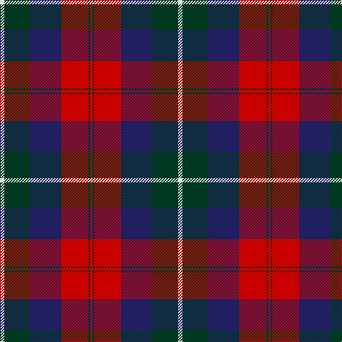

This page is one **sett** — a single exact thread-count. It belongs to the [tartan](/tartans/w3dg18db22r19dg1r2/)
(the same proportion at any scale), whose colour order is pattern [RGRBGW](/stripes/rgrbgw/).

Sourced from register-of-tartans.  It is a [6 stripe tartan](/stripes/stripes6/).

Original link https://www.tartanregister.gov.uk/tartanDetails.aspx?ref=3134

2 attestations — the source records this cloth was collapsed from (oldest owns this page)

<ul>
<li>01/01/1997 — Nibley (Personal) (register-of-tartans, <a href="https://www.tartanregister.gov.uk/tartanDetails.aspx?ref=3134">record</a>)</li>
<li>1997 Feb — Nibley (Personal) (tartans-authority, <a href="http://www.tartansauthority.com/tartan-ferret/display/2338/">record</a>)</li>
</ul>

## Register references

External register numbers recorded for this tartan.

- Scottish Register of Tartans: [3134](https://www.tartanregister.gov.uk/tartanDetails.aspx?ref=3134)
- Scottish Tartans Authority (ITI): 2338
- Scottish Tartans World Register: 2338

## Thread count
LN/6 DG36 DB44 R38 DG2 R/4

## Palette

Palette: <strong>Tartan Register</strong>
<table><thead><tr><th>Colour</th><th>Threads</th><th>Shade</th><th>Base</th><th>OKLCh</th></tr></thead><tbody><tr><td>LN/</td><td style="text-align:right;font-variant-numeric:tabular-nums">6</td><td><code style="background-color:#E0E0E0;">#E0E0E0</code> <small style="color:#888">#E0E0E0</small></td><td>W <code style="background-color:#F7F7F7;">#F7F7F7</code></td><td><small style="color:#888">oklch(90.7% 0.000 89.9)</small></td></tr><tr><td>DG</td><td style="text-align:right;font-variant-numeric:tabular-nums">36</td><td><code style="background-color:#003820;">#003820</code> <small style="color:#888">#003820</small></td><td>G <code style="background-color:#006100;">#006100</code></td><td><small style="color:#888">oklch(30.0% 0.070 158.3)</small></td></tr><tr><td>DB</td><td style="text-align:right;font-variant-numeric:tabular-nums">44</td><td><code style="background-color:#202060;">#202060</code> <small style="color:#888">#202060</small></td><td>B <code style="background-color:#2A418A;">#2A418A</code></td><td><small style="color:#888">oklch(28.9% 0.111 276.9)</small></td></tr><tr><td>R</td><td style="text-align:right;font-variant-numeric:tabular-nums">38</td><td><code style="background-color:#C80000;">#C80000</code> <small style="color:#888">#C80000</small></td><td>R <code style="background-color:#CC0000;">#CC0000</code></td><td><small style="color:#888">oklch(52.3% 0.215 29.2)</small></td></tr><tr><td>DG</td><td style="text-align:right;font-variant-numeric:tabular-nums">2</td><td><code style="background-color:#003820;">#003820</code> <small style="color:#888">#003820</small></td><td>G <code style="background-color:#006100;">#006100</code></td><td><small style="color:#888">oklch(30.0% 0.070 158.3)</small></td></tr><tr><td>R/</td><td style="text-align:right;font-variant-numeric:tabular-nums">4</td><td><code style="background-color:#C80000;">#C80000</code> <small style="color:#888">#C80000</small></td><td>R <code style="background-color:#CC0000;">#CC0000</code></td><td><small style="color:#888">oklch(52.3% 0.215 29.2)</small></td></tr></tbody></table>

# Sample pattern

## Nearest tartans

The nearest existing variants by ΔTartan distance, with this tartan at the top so the swatches line up against it.

ΔTartan

Tartan

Sett

—

<a href="/ttd/edit/#slug=w3dg18db22r19dg1r2~x2">Nibley (Personal)</a> <a class="nn-out" href="/setts/s6/w3dg18db22r19dg1r2~x2/" title="open its dictionary page">↗</a>

0.90

<a href="/ttd/edit/#slug=db18r18dp2g12db1~x4">Wyeth (Personal)</a> <a class="nn-out" href="/setts/s5/db18r18dp2g12db1~x4/" title="open its dictionary page">↗</a>

1.01

<a href="/ttd/edit/#slug=o2dr14o1k14o14ly2~x2">United Distillers</a> <a class="nn-out" href="/setts/s6/o2dr14o1k14o14ly2~x2/" title="open its dictionary page">↗</a>

1.09

<a href="/ttd/edit/#slug=r25k2n4k2r8k31db32k8">Black and Red</a> <a class="nn-out" href="/setts/s8/r25k2n4k2r8k31db32k8/" title="open its dictionary page">↗</a>

1.11

<a href="/ttd/edit/#slug=r12b18k1r4k1dg6k2~x2">Confederate</a> <a class="nn-out" href="/setts/s7/r12b18k1r4k1dg6k2~x2/" title="open its dictionary page">↗</a>

1.11

<a href="/ttd/edit/#slug=k4r37db37r2db37g37r37k4~x2">Skene of Cromar - 1950 (Clan)</a> <a class="nn-out" href="/setts/s8/k4r37db37r2db37g37r37k4~x2/" title="open its dictionary page">↗</a>

1.13

<a href="/ttd/edit/#slug=db2r20dg20k21r1~x2">Skene of Cromar (1885)</a> <a class="nn-out" href="/setts/s5/db2r20dg20k21r1~x2/" title="open its dictionary page">↗</a>

1.14

<a href="/ttd/edit/#slug=k4r37db37r2db37g37r37k4">Skene, of Cromar</a> <a class="nn-out" href="/setts/s8/k4r37db37r2db37g37r37k4/" title="open its dictionary page">↗</a>

1.17

<a href="/ttd/edit/#slug=r12b18k1r4k1g6k2~x2">Confederate (Military)</a> <a class="nn-out" href="/setts/s7/r12b18k1r4k1g6k2~x2/" title="open its dictionary page">↗</a>

1.20

<a href="/ttd/edit/#slug=db1r5dg18r4db9r10w1~x4">MacKintosh Geddes</a> <a class="nn-out" href="/setts/s7/db1r5dg18r4db9r10w1~x4/" title="open its dictionary page">↗</a>

1.22

<a href="/ttd/edit/#slug=w3g15db18r15g1r2~x2">Nibley</a> <a class="nn-out" href="/setts/s6/w3g15db18r15g1r2~x2/" title="open its dictionary page">↗</a>

## Neighbour map

Every grey dot is one of 14299 variants placed by the first two principal components of the ΔTartan feature space (44% of its variance). Red is this tartan; blue dots are its nearest — click one to open its page.

<svg viewBox="0 0 640 380" role="img" style="max-width:100%;height:auto;border:1px solid #e0e0e0;border-radius:4px;display:block" xmlns="http://www.w3.org/2000/svg"><image href="/nn/cloud.v1.png" width="640" height="380"/><a href="/setts/s5/db18r18dp2g12db1~x4/"><circle cx="242.0" cy="207.1" r="4" fill="#3465a4"><title>Wyeth (Personal)</title></circle></a><a href="/setts/s6/o2dr14o1k14o14ly2~x2/"><circle cx="204.5" cy="193.2" r="4" fill="#3465a4"><title>United Distillers</title></circle></a><a href="/setts/s8/r25k2n4k2r8k31db32k8/"><circle cx="240.4" cy="181.1" r="4" fill="#3465a4"><title>Black and Red</title></circle></a><a href="/setts/s7/r12b18k1r4k1dg6k2~x2/"><circle cx="238.6" cy="162.9" r="4" fill="#3465a4"><title>Confederate</title></circle></a><a href="/setts/s8/k4r37db37r2db37g37r37k4~x2/"><circle cx="234.9" cy="190.2" r="4" fill="#3465a4"><title>Skene of Cromar - 1950 (Clan)</title></circle></a><a href="/setts/s5/db2r20dg20k21r1~x2/"><circle cx="216.8" cy="198.2" r="4" fill="#3465a4"><title>Skene of Cromar (1885)</title></circle></a><a href="/setts/s8/k4r37db37r2db37g37r37k4/"><circle cx="228.8" cy="188.1" r="4" fill="#3465a4"><title>Skene, of Cromar</title></circle></a><a href="/setts/s7/r12b18k1r4k1g6k2~x2/"><circle cx="238.1" cy="162.6" r="4" fill="#3465a4"><title>Confederate (Military)</title></circle></a><a href="/setts/s7/db1r5dg18r4db9r10w1~x4/"><circle cx="249.9" cy="180.0" r="4" fill="#3465a4"><title>MacKintosh Geddes</title></circle></a><a href="/setts/s6/w3g15db18r15g1r2~x2/"><circle cx="205.7" cy="187.2" r="4" fill="#3465a4"><title>Nibley</title></circle></a><circle cx="224.6" cy="179.7" r="5" fill="#c00000"/></svg>

ID: /setts/s6/w3dg18db22r19dg1r2~x2/
