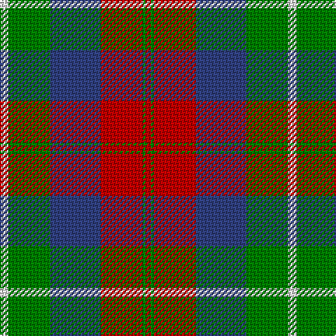

This page is one **sett** — a single exact thread-count. It belongs to the [tartan](/tartans/w3g15db18r15g1r2/)
(the same proportion at any scale), whose colour order is pattern [RGRBGW](/stripes/rgrbgw/).

Sourced from weddslist.  It is a [6 stripe tartan](/stripes/stripes6/).

Original link http://www.weddslist.com/cgi-bin/tartans/pg.pl?source=sts

## Thread count
LN/6 G30 B36 R30 G2 R/4

## Palette

Palette: <strong>Tartan Dictionary</strong> <small style="color:#888">(1 of 4 colours)</small>
<table><thead><tr><th>Colour</th><th>Threads</th><th>Shade</th><th>Base</th><th>OKLCh</th></tr></thead><tbody><tr><td>LN/</td><td style="text-align:right;font-variant-numeric:tabular-nums">6</td><td><code style="background-color:#E0E0E0;">#E0E0E0</code> <small style="color:#888">#E0E0E0</small></td><td>W <code style="background-color:#F7F7F7;">#F7F7F7</code></td><td><small style="color:#888">oklch(90.7% 0.000 89.9)</small></td></tr><tr><td>G</td><td style="text-align:right;font-variant-numeric:tabular-nums">30</td><td><code style="background-color:#008000;">#008000</code> <small style="color:#888">#008000</small></td><td>G <code style="background-color:#006100;">#006100</code></td><td><small style="color:#888">oklch(52.0% 0.177 142.5)</small></td></tr><tr><td>B</td><td style="text-align:right;font-variant-numeric:tabular-nums">36</td><td><code style="background-color:#304080;">#304080</code> <small style="color:#888">#304080</small></td><td>B <code style="background-color:#2A418A;">#2A418A</code></td><td><small style="color:#888">oklch(39.4% 0.109 270.2)</small></td></tr><tr><td>R</td><td style="text-align:right;font-variant-numeric:tabular-nums">30</td><td><code style="background-color:#C00000;">#C00000</code> <small style="color:#888">#C00000</small></td><td>R <code style="background-color:#CC0000;">#CC0000</code></td><td><small style="color:#888">oklch(50.7% 0.208 29.2)</small></td></tr><tr><td>G</td><td style="text-align:right;font-variant-numeric:tabular-nums">2</td><td><code style="background-color:#008000;">#008000</code> <small style="color:#888">#008000</small></td><td>G <code style="background-color:#006100;">#006100</code></td><td><small style="color:#888">oklch(52.0% 0.177 142.5)</small></td></tr><tr><td>R/</td><td style="text-align:right;font-variant-numeric:tabular-nums">4</td><td><code style="background-color:#C00000;">#C00000</code> <small style="color:#888">#C00000</small></td><td>R <code style="background-color:#CC0000;">#CC0000</code></td><td><small style="color:#888">oklch(50.7% 0.208 29.2)</small></td></tr></tbody></table>

# Sample pattern

## Nearest tartans

The nearest existing variants by ΔTartan distance, with this tartan at the top so the swatches line up against it.

ΔTartan

Tartan

Sett

—

<a href="/ttd/edit/#slug=w3g15db18r15g1r2~x2">Nibley</a> <a class="nn-out" href="/setts/s6/w3g15db18r15g1r2~x2/" title="open its dictionary page">↗</a>

0.79

<a href="/ttd/edit/#slug=dp9lr4dp1lr4g15r4dp1~x4">Logan #3</a> <a class="nn-out" href="/setts/s7/dp9lr4dp1lr4g15r4dp1~x4/" title="open its dictionary page">↗</a>

0.86

<a href="/ttd/edit/#slug=dp9r4dp1r4g15r4dp1~x2">Logan Light</a> <a class="nn-out" href="/setts/s7/dp9r4dp1r4g15r4dp1~x2/" title="open its dictionary page">↗</a>

0.98

<a href="/ttd/edit/#slug=db1r5g18r4db9r10w1~x4">MacKintosh, Geddes</a> <a class="nn-out" href="/setts/s7/db1r5g18r4db9r10w1~x4/" title="open its dictionary page">↗</a>

1.02

<a href="/ttd/edit/#slug=db1r5dg18r4db9r10w1~x4">MacKintosh Geddes</a> <a class="nn-out" href="/setts/s7/db1r5dg18r4db9r10w1~x4/" title="open its dictionary page">↗</a>

1.04

<a href="/ttd/edit/#slug=o2dr14o1k14o14ly2~x2">United Distillers</a> <a class="nn-out" href="/setts/s6/o2dr14o1k14o14ly2~x2/" title="open its dictionary page">↗</a>

1.08

<a href="/ttd/edit/#slug=p9r4p1r4g15r4p1~x2">Logan, Light</a> <a class="nn-out" href="/setts/s7/p9r4p1r4g15r4p1~x2/" title="open its dictionary page">↗</a>

1.11

<a href="/ttd/edit/#slug=g12t6g6r15k1r1k2~x4">McCook/Cook (Name)</a> <a class="nn-out" href="/setts/s7/g12t6g6r15k1r1k2~x4/" title="open its dictionary page">↗</a>

1.12

<a href="/ttd/edit/#slug=r15db2r1db2r3db7g13g3~x2">Cranston Dress</a> <a class="nn-out" href="/setts/s8/r15db2r1db2r3db7g13g3~x2/" title="open its dictionary page">↗</a>

1.15

<a href="/ttd/edit/#slug=db9r3ly1r3g9r3ly1~x2">Logan</a> <a class="nn-out" href="/setts/s7/db9r3ly1r3g9r3ly1~x2/" title="open its dictionary page">↗</a>

1.17

<a href="/ttd/edit/#slug=r12b18k1r4k1g6k2~x2">Confederate (Military)</a> <a class="nn-out" href="/setts/s7/r12b18k1r4k1g6k2~x2/" title="open its dictionary page">↗</a>

## Neighbour map

Every grey dot is one of 14299 variants placed by the first two principal components of the ΔTartan feature space (44% of its variance). Red is this tartan; blue dots are its nearest — click one to open its page.

<svg viewBox="0 0 640 380" role="img" style="max-width:100%;height:auto;border:1px solid #e0e0e0;border-radius:4px;display:block" xmlns="http://www.w3.org/2000/svg"><image href="/nn/cloud.v1.png" width="640" height="380"/><a href="/setts/s7/dp9lr4dp1lr4g15r4dp1~x4/"><circle cx="211.1" cy="176.5" r="4" fill="#3465a4"><title>Logan #3</title></circle></a><a href="/setts/s7/dp9r4dp1r4g15r4dp1~x2/"><circle cx="210.7" cy="172.9" r="4" fill="#3465a4"><title>Logan Light</title></circle></a><a href="/setts/s7/db1r5g18r4db9r10w1~x4/"><circle cx="249.2" cy="182.2" r="4" fill="#3465a4"><title>MacKintosh, Geddes</title></circle></a><a href="/setts/s7/db1r5dg18r4db9r10w1~x4/"><circle cx="249.9" cy="180.0" r="4" fill="#3465a4"><title>MacKintosh Geddes</title></circle></a><a href="/setts/s6/o2dr14o1k14o14ly2~x2/"><circle cx="204.5" cy="193.2" r="4" fill="#3465a4"><title>United Distillers</title></circle></a><a href="/setts/s7/p9r4p1r4g15r4p1~x2/"><circle cx="218.8" cy="173.5" r="4" fill="#3465a4"><title>Logan, Light</title></circle></a><a href="/setts/s7/g12t6g6r15k1r1k2~x4/"><circle cx="249.3" cy="188.7" r="4" fill="#3465a4"><title>McCook/Cook (Name)</title></circle></a><a href="/setts/s8/r15db2r1db2r3db7g13g3~x2/"><circle cx="229.4" cy="169.2" r="4" fill="#3465a4"><title>Cranston Dress</title></circle></a><a href="/setts/s7/db9r3ly1r3g9r3ly1~x2/"><circle cx="166.9" cy="207.0" r="4" fill="#3465a4"><title>Logan</title></circle></a><a href="/setts/s7/r12b18k1r4k1g6k2~x2/"><circle cx="238.1" cy="162.6" r="4" fill="#3465a4"><title>Confederate (Military)</title></circle></a><circle cx="205.7" cy="187.2" r="5" fill="#c00000"/></svg>

ID: /setts/s6/w3g15db18r15g1r2~x2/
