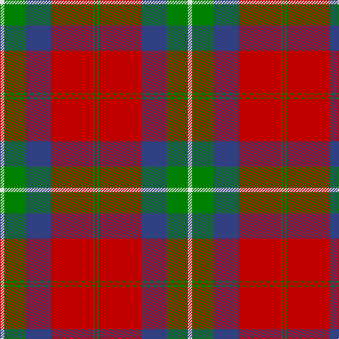

This page is one **sett** — a single exact thread-count. It belongs to the [tartan](/tartans/w3g15db18r30g1r2/)
(the same proportion at any scale), whose colour order is pattern [RGRBGW](/stripes/rgrbgw/).

Sourced from weddslist.  It is a [6 stripe tartan](/stripes/stripes6/).

Original link http://www.weddslist.com/cgi-bin/tartans/pg.pl?source=sts

2 attestations — the source records this cloth was collapsed from (oldest owns this page)

<ul>
<li>undated — Ruthven (weddslist, <a href="http://www.weddslist.com/cgi-bin/tartans/pg.pl?source=sts">record</a>)</li>
<li>undated — Ruthven Clan Tartan Tartan Number: 1521. Earliest known date: 1842 The name Ruthven comes from the old Barony of Ruthven in Angus. Ruthvens were Earls of Gowrie at the time of James VI of Scotland. More recently Sir Alexander Hore- Ruthven of Freeland, Governor General of Australia, was created Earl of Gowrie in 1945. The Ruthven tartan was not named until the publication of the romantic fiction known as the Vestiarium Scoticum in 1842. See products available Copyright © Blair Urquhart, Comrie, 2015 (house-of-tartan, <a href="http://www.house-of-tartan.scotland.net/house/TartanViewjs.asp?colr=Def&tnam=1521">record</a>)</li>
</ul>

## Thread count
LN/6 G30 B36 R60 G2 R/4

## Palette

Palette: <strong>Tartan Dictionary</strong> <small style="color:#888">(1 of 4 colours)</small>
<table><thead><tr><th>Colour</th><th>Threads</th><th>Shade</th><th>Base</th><th>OKLCh</th></tr></thead><tbody><tr><td>LN/</td><td style="text-align:right;font-variant-numeric:tabular-nums">6</td><td><code style="background-color:#E0E0E0;">#E0E0E0</code> <small style="color:#888">#E0E0E0</small></td><td>W <code style="background-color:#F7F7F7;">#F7F7F7</code></td><td><small style="color:#888">oklch(90.7% 0.000 89.9)</small></td></tr><tr><td>G</td><td style="text-align:right;font-variant-numeric:tabular-nums">30</td><td><code style="background-color:#008000;">#008000</code> <small style="color:#888">#008000</small></td><td>G <code style="background-color:#006100;">#006100</code></td><td><small style="color:#888">oklch(52.0% 0.177 142.5)</small></td></tr><tr><td>B</td><td style="text-align:right;font-variant-numeric:tabular-nums">36</td><td><code style="background-color:#304080;">#304080</code> <small style="color:#888">#304080</small></td><td>B <code style="background-color:#2A418A;">#2A418A</code></td><td><small style="color:#888">oklch(39.4% 0.109 270.2)</small></td></tr><tr><td>R</td><td style="text-align:right;font-variant-numeric:tabular-nums">60</td><td><code style="background-color:#C00000;">#C00000</code> <small style="color:#888">#C00000</small></td><td>R <code style="background-color:#CC0000;">#CC0000</code></td><td><small style="color:#888">oklch(50.7% 0.208 29.2)</small></td></tr><tr><td>G</td><td style="text-align:right;font-variant-numeric:tabular-nums">2</td><td><code style="background-color:#008000;">#008000</code> <small style="color:#888">#008000</small></td><td>G <code style="background-color:#006100;">#006100</code></td><td><small style="color:#888">oklch(52.0% 0.177 142.5)</small></td></tr><tr><td>R/</td><td style="text-align:right;font-variant-numeric:tabular-nums">4</td><td><code style="background-color:#C00000;">#C00000</code> <small style="color:#888">#C00000</small></td><td>R <code style="background-color:#CC0000;">#CC0000</code></td><td><small style="color:#888">oklch(50.7% 0.208 29.2)</small></td></tr></tbody></table>

# Sample pattern

## Nearest tartans

The nearest existing variants by ΔTartan distance, with this tartan at the top so the swatches line up against it.

ΔTartan

Tartan

Sett

—

<a href="/ttd/edit/#slug=w3g15db18r30g1r2~x2">Ruthven</a> <a class="nn-out" href="/setts/s6/w3g15db18r30g1r2~x2/" title="open its dictionary page">↗</a>

0.82

<a href="/ttd/edit/#slug=lo1db14r28g14r1g14lo1~x2">Abernethy (Colerain USA) (Personal)</a> <a class="nn-out" href="/setts/s7/lo1db14r28g14r1g14lo1~x2/" title="open its dictionary page">↗</a>

0.92

<a href="/ttd/edit/#slug=r2db12r2g12r24w1~x2">Fraser (1745)</a> <a class="nn-out" href="/setts/s6/r2db12r2g12r24w1~x2/" title="open its dictionary page">↗</a>

1.09

<a href="/ttd/edit/#slug=db1r5dg18r4db9r10w1~x4">MacKintosh Geddes</a> <a class="nn-out" href="/setts/s7/db1r5dg18r4db9r10w1~x4/" title="open its dictionary page">↗</a>

1.11

<a href="/ttd/edit/#slug=lr3dg15db18r30dg1r2~x2">Ruthven</a> <a class="nn-out" href="/setts/s6/lr3dg15db18r30dg1r2~x2/" title="open its dictionary page">↗</a>

1.11

<a href="/ttd/edit/#slug=lb3dg15db18r30db1r2~x2">Ruthven</a> <a class="nn-out" href="/setts/s6/lb3dg15db18r30db1r2~x2/" title="open its dictionary page">↗</a>

1.13

<a href="/ttd/edit/#slug=db2r49db51r9w2r9g51r49db2~x2">Unidentified 20</a> <a class="nn-out" href="/setts/s9/db2r49db51r9w2r9g51r49db2~x2/" title="open its dictionary page">↗</a>

1.14

<a href="/ttd/edit/#slug=lb5k1r30dp15r8dg30r8dp2">Shaw</a> <a class="nn-out" href="/setts/s8/lb5k1r30dp15r8dg30r8dp2/" title="open its dictionary page">↗</a>

1.17

<a href="/ttd/edit/#slug=t5k1r30p15r8g30r8p2~x2">Shaw of Tordarroch</a> <a class="nn-out" href="/setts/s8/t5k1r30p15r8g30r8p2~x2/" title="open its dictionary page">↗</a>

1.20

<a href="/ttd/edit/#slug=r28db12r3g20dp1g2dp1g2r7~x2">Carrick (Clan)</a> <a class="nn-out" href="/setts/s9/r28db12r3g20dp1g2dp1g2r7~x2/" title="open its dictionary page">↗</a>

1.21

<a href="/ttd/edit/#slug=r28db12r3g20m1g2m1g2r7~x2">Carrick</a> <a class="nn-out" href="/setts/s9/r28db12r3g20m1g2m1g2r7~x2/" title="open its dictionary page">↗</a>

## Neighbour map

Every grey dot is one of 14359 variants placed by the first two principal components of the ΔTartan feature space (44% of its variance). Red is this tartan; blue dots are its nearest — click one to open its page.

<svg viewBox="0 0 640 380" role="img" style="max-width:100%;height:auto;border:1px solid #e0e0e0;border-radius:4px;display:block" xmlns="http://www.w3.org/2000/svg"><image href="/nn/cloud.v1.png" width="640" height="380"/><a href="/setts/s7/lo1db14r28g14r1g14lo1~x2/"><circle cx="278.2" cy="162.4" r="4" fill="#3465a4"><title>Abernethy (Colerain USA) (Personal)</title></circle></a><a href="/setts/s6/r2db12r2g12r24w1~x2/"><circle cx="332.4" cy="163.9" r="4" fill="#3465a4"><title>Fraser (1745)</title></circle></a><a href="/setts/s7/db1r5dg18r4db9r10w1~x4/"><circle cx="249.2" cy="180.8" r="4" fill="#3465a4"><title>MacKintosh Geddes</title></circle></a><a href="/setts/s6/lr3dg15db18r30dg1r2~x2/"><circle cx="300.3" cy="163.6" r="4" fill="#3465a4"><title>Ruthven</title></circle></a><a href="/setts/s6/lb3dg15db18r30db1r2~x2/"><circle cx="282.2" cy="151.2" r="4" fill="#3465a4"><title>Ruthven</title></circle></a><a href="/setts/s9/db2r49db51r9w2r9g51r49db2~x2/"><circle cx="328.9" cy="152.3" r="4" fill="#3465a4"><title>Unidentified 20</title></circle></a><a href="/setts/s8/lb5k1r30dp15r8dg30r8dp2/"><circle cx="274.6" cy="130.5" r="4" fill="#3465a4"><title>Shaw</title></circle></a><a href="/setts/s8/t5k1r30p15r8g30r8p2~x2/"><circle cx="284.2" cy="134.1" r="4" fill="#3465a4"><title>Shaw of Tordarroch</title></circle></a><a href="/setts/s9/r28db12r3g20dp1g2dp1g2r7~x2/"><circle cx="334.9" cy="136.2" r="4" fill="#3465a4"><title>Carrick (Clan)</title></circle></a><a href="/setts/s9/r28db12r3g20m1g2m1g2r7~x2/"><circle cx="336.7" cy="136.6" r="4" fill="#3465a4"><title>Carrick</title></circle></a><circle cx="298.5" cy="157.0" r="5" fill="#c00000"/></svg>

ID: /setts/s6/w3g15db18r30g1r2~x2/
