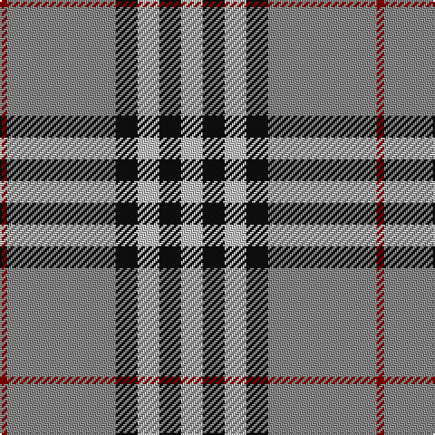

In pattern [RRKWKW](/patterns/rrkwkw/).

This was sourced from register-of-tartans.  It is a [6 stripes tartan](/stripes/stripes6/).

Original link https://www.tartanregister.gov.uk/tartanDetails.aspx?ref=4130

## Attestations

This cloth appears in 2 source records; the oldest owns this page.

- 01/01/2002 — Tiree Grey (register-of-tartans, [record](https://www.tartanregister.gov.uk/tartanDetails.aspx?ref=4130))
- pre 2002 — Tiree Grey (Fashion) (tartans-authority, [record](http://www.tartansauthority.com/tartan-ferret/display/5110/))

## Thread count
DR/4 Na60 K12 N12 K12 N/12

## Palette
Each colour and its ΔE from the base-6 reference it is a variant of.

| Colour | Shade | Base | ΔE (OKLab) |
|---|---|---|---|
| DR | <code style="background-color:#880000;">#880000</code> `#880000` | R <code style="background-color:#CC0000;">#CC0000</code> | 0.15 |
| K | <code style="background-color:#101010;">#101010</code> `#101010` | K <code style="background-color:#000000;">#000000</code> | 0.17 |
| LN | <code style="background-color:#E0E0E0;">#E0E0E0</code> `#E0E0E0` | W <code style="background-color:#F7F7F7;">#F7F7F7</code> | 0.07 |
| N | <code style="background-color:#C0C0C0;">#C0C0C0</code> `#C0C0C0` | W <code style="background-color:#F7F7F7;">#F7F7F7</code> | 0.17 |
| Na | <code style="background-color:#888888;">#888888</code> `#888888` | R <code style="background-color:#CC0000;">#CC0000</code> | 0.24 |

# Sample pattern

## Nearest tartans

The nearest existing variants by ΔTartan distance.

1. [Kansai Highland Games Corporate Tartan Tartan Number: 2708. Earliest known date: 1999 Designed for the first Highland Games in Japan, started by Maud Robertson and heavy weight husband, Masonori Nomiyam. See products available Copyright © Blair Urquhart, Comrie, 2015](/setts/s5/b2k1b16g16w2x4~b780078-g289c18-k101010-we0e0e0/) — ΔT 0.89
1. [Burberry Grey (Original)](/setts/s5/k5w7k5g20b1x4~b2c2c80-g7c7c7c-k101010-we0e0e0/) — ΔT 0.90
1. [Perkins 2015](/setts/s7/k3b10y5b29k10r6k2x2~b5c8ca8-k101010-rc80000-ye8c000/) — ΔT 0.94
1. [Kansai Highland Games](/setts/s5/b2k1b16g17w2x4~b780078-g289c18-k101010-wfcfcfc/) — ΔT 0.95
1. [Merrick, Camel](/setts/s7/r1w5k8ra18w1k1w1x4~k101010-rc80000-raa07c58-wc0c0c0/) — ΔT 1.00
1. [Downside (Corporate)](/setts/s6/r4ra41k5w14k18r4x2~k101010-rc80000-ra888888-we0e0e0/) — ΔT 1.06
1. [Stutterheim](/setts/s6/k4y18b44k3y10k4~b565c76-k101010-yecdc8e/) — ΔT 1.06
1. [Kyle](/setts/s7/g19k2w2k2b5k2b5x4~b505050-g808080-k000000-we0e0e0/) — ΔT 1.11
1. [Kyle Tartan Tartan Number: 1288. Earliest known date: pre 1984 Seen in Service Station at Gretna Green in 1984 by Angela Nisbett MSTS . Berars no relation to the other two Kyles (3615 & 3616). See products available Copyright © Blair Urquhart, Comrie, 2015](/setts/s7/r19k2w4k2b5k2b5x2~b5c5c5c-k101010-r888888-we0e0e0/) — ΔT 1.12
1. [Yusra (Malay) (Personal)](/setts/s7/r12y3w14b10y2b24r2x2~b003c64-rc80000-we0e0e0-ye8c000/) — ΔT 1.15

## Neighbour map

Every grey dot is one of 15726 variants placed by the first two principal components of the ΔTartan feature space (44% of its variance). Red is this tartan; blue dots are its nearest — click one to open its page.

<svg viewBox="0 0 640 380" role="img" style="max-width:100%;height:auto;border:1px solid #e0e0e0;border-radius:4px;display:block" xmlns="http://www.w3.org/2000/svg"><image href="/nn/cloud.v1.png" width="640" height="380"/><a href="/setts/s5/b2k1b16g16w2x4~b780078-g289c18-k101010-we0e0e0/"><circle cx="290.9" cy="184.0" r="4" fill="#3465a4"><title>Kansai Highland Games Corporate Tartan Tartan Number: 2708. Earliest known date: 1999 Designed for the first Highland Games in Japan, started by Maud Robertson and heavy weight husband, Masonori Nomiyam. See products available Copyright © Blair Urquhart, Comrie, 2015</title></circle></a><a href="/setts/s5/k5w7k5g20b1x4~b2c2c80-g7c7c7c-k101010-we0e0e0/"><circle cx="278.4" cy="179.8" r="4" fill="#3465a4"><title>Burberry Grey (Original)</title></circle></a><a href="/setts/s7/k3b10y5b29k10r6k2x2~b5c8ca8-k101010-rc80000-ye8c000/"><circle cx="315.1" cy="179.1" r="4" fill="#3465a4"><title>Perkins 2015</title></circle></a><a href="/setts/s5/b2k1b16g17w2x4~b780078-g289c18-k101010-wfcfcfc/"><circle cx="286.2" cy="180.1" r="4" fill="#3465a4"><title>Kansai Highland Games</title></circle></a><a href="/setts/s7/r1w5k8ra18w1k1w1x4~k101010-rc80000-raa07c58-wc0c0c0/"><circle cx="293.7" cy="146.0" r="4" fill="#3465a4"><title>Merrick, Camel</title></circle></a><a href="/setts/s6/r4ra41k5w14k18r4x2~k101010-rc80000-ra888888-we0e0e0/"><circle cx="222.1" cy="185.3" r="4" fill="#3465a4"><title>Downside (Corporate)</title></circle></a><a href="/setts/s6/k4y18b44k3y10k4~b565c76-k101010-yecdc8e/"><circle cx="303.8" cy="182.6" r="4" fill="#3465a4"><title>Stutterheim</title></circle></a><a href="/setts/s7/g19k2w2k2b5k2b5x4~b505050-g808080-k000000-we0e0e0/"><circle cx="261.1" cy="180.5" r="4" fill="#3465a4"><title>Kyle</title></circle></a><a href="/setts/s7/r19k2w4k2b5k2b5x2~b5c5c5c-k101010-r888888-we0e0e0/"><circle cx="253.6" cy="187.9" r="4" fill="#3465a4"><title>Kyle Tartan Tartan Number: 1288. Earliest known date: pre 1984 Seen in Service Station at Gretna Green in 1984 by Angela Nisbett MSTS . Berars no relation to the other two Kyles (3615 &amp; 3616). See products available Copyright © Blair Urquhart, Comrie, 2015</title></circle></a><a href="/setts/s7/r12y3w14b10y2b24r2x2~b003c64-rc80000-we0e0e0-ye8c000/"><circle cx="227.9" cy="184.4" r="4" fill="#3465a4"><title>Yusra (Malay) (Personal)</title></circle></a><circle cx="289.5" cy="173.4" r="5" fill="#c00000"/></svg>

ID: /setts/s6/w3k3w3k3r15ra1x4~k101010-r888888-ra880000-wc0c0c0/
