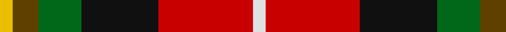
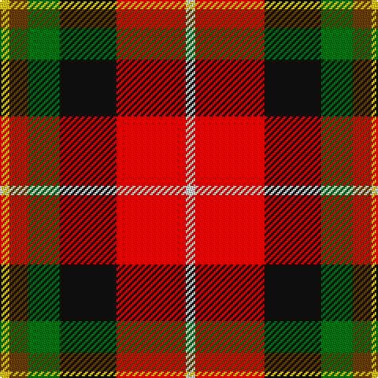

**Bands:** [YGGKRW](/stripes/yggkrw/) · **Stripes:** [LY DY G K R W](/stripes/stripes6/) LY DY G K R W

This was sourced from tartans-authority.  It is a [6 band tartan](/bands/bands6/).

Original link http://www.tartansauthority.com/tartan-ferret/display/6463/

## Thread count
Y/6 T12 G20 K36 R44 LN/6

## Palette
Each colour and its ΔE from the base-6 reference it is a variant of.

| Colour | Shade | Base | ΔE (OKLab) |
|---|---|---|---|
| G | <code style="background-color:#006818;">#006818</code> `#006818` | G <code style="background-color:#006100;">#006100</code> | 0.02 |
| K | <code style="background-color:#101010;">#101010</code> `#101010` | K <code style="background-color:#000000;">#000000</code> | 0.17 |
| LN | <code style="background-color:#E0E0E0;">#E0E0E0</code> `#E0E0E0` | W <code style="background-color:#F7F7F7;">#F7F7F7</code> | 0.07 |
| R | <code style="background-color:#C80000;">#C80000</code> `#C80000` | R <code style="background-color:#CC0000;">#CC0000</code> | 0.01 |
| T | <code style="background-color:#604000;">#604000</code> `#604000` | G <code style="background-color:#006100;">#006100</code> | 0.14 |
| Y | <code style="background-color:#E8C000;">#E8C000</code> `#E8C000` | Y <code style="background-color:#F2BF00;">#F2BF00</code> | 0.02 |

# Sample pattern

## Nearest tartans

The nearest existing variants by ΔTartan distance.

1. [Wolves Wod Kindred](/setts/s6/o2dg2r9k9g2ly2~x4/) — ΔT 0.84
1. [Craigmoor](/setts/s9/k2r8db2k2r2k6dy2dg6ly1~x2/) — ΔT 1.06
1. [Craigmoor Tartan Tartan Number: 1147. Earliest known date: pre 2003 MacGregor Hastie wrote, "This tartan was designed by me to meet a long felt want. Many people have asked if there was a Craig family tartan, and as the name is not connected with any Highland clan, yet the the family name is numerous, it seemed a good idea to design one. The design is based on the general colour of craigs and rocks." The Craig tartan is now in general production. See products available Copyright © Blair Urquhart, Comrie, 2015](/setts/s9/k2r8db2k2r2k6dy2g6ly1~x2/) — ΔT 1.09
1. [Barbour - Classic](/setts/s7/o4ly2o21dy11w2k20r3~x2/) — ΔT 1.13
1. [Thirkill](/setts/s9/w4k2r15k2r5y7dg7k2ly4~x2/) — ΔT 1.16
1. [Barbour](/setts/s7/r3k20w2dy11o21ly2o2~x2/) — ΔT 1.17
1. [Nicolson of Lewis (Clan?)](/setts/s6/dt3dt5n2dg5r11w3~x4/) — ΔT 1.21
1. [Douglas of Roxburgh](/setts/s5/k6db3dg20r20ly3~x2/) — ΔT 1.25
1. [Scotch House 2000 Dress](/setts/s7/g22w3k2ly3k19r18db4~x2/) — ΔT 1.25
1. [Nicolson of Taransay (Personal)](/setts/s7/w6g10r22db16g2k4k5~x2/) — ΔT 1.26

## Neighbour map

Every grey dot is one of 14299 variants placed by the first two principal components of the ΔTartan feature space (44% of its variance). Red is this tartan; blue dots are its nearest — click one to open its page.

<svg viewBox="0 0 640 380" role="img" style="max-width:100%;height:auto;border:1px solid #e0e0e0;border-radius:4px;display:block" xmlns="http://www.w3.org/2000/svg"><image href="/nn/cloud.v1.png" width="640" height="380"/><a href="/setts/s6/o2dg2r9k9g2ly2~x4/"><circle cx="89.5" cy="192.1" r="4" fill="#3465a4"><title>Wolves Wod Kindred</title></circle></a><a href="/setts/s9/k2r8db2k2r2k6dy2dg6ly1~x2/"><circle cx="103.8" cy="174.1" r="4" fill="#3465a4"><title>Craigmoor</title></circle></a><a href="/setts/s9/k2r8db2k2r2k6dy2g6ly1~x2/"><circle cx="105.5" cy="176.2" r="4" fill="#3465a4"><title>Craigmoor Tartan Tartan Number: 1147. Earliest known date: pre 2003 MacGregor Hastie wrote, &quot;This tartan was designed by me to meet a long felt want. Many people have asked if there was a Craig family tartan, and as the name is not connected with any Highland clan, yet the the family name is numerous, it seemed a good idea to design one. The design is based on the general colour of craigs and rocks.&quot; The Craig tartan is now in general production. See products available Copyright © Blair Urquhart, Comrie, 2015</title></circle></a><a href="/setts/s7/o4ly2o21dy11w2k20r3~x2/"><circle cx="172.6" cy="160.6" r="4" fill="#3465a4"><title>Barbour - Classic</title></circle></a><a href="/setts/s9/w4k2r15k2r5y7dg7k2ly4~x2/"><circle cx="121.0" cy="157.4" r="4" fill="#3465a4"><title>Thirkill</title></circle></a><a href="/setts/s7/r3k20w2dy11o21ly2o2~x2/"><circle cx="167.3" cy="156.1" r="4" fill="#3465a4"><title>Barbour</title></circle></a><a href="/setts/s6/dt3dt5n2dg5r11w3~x4/"><circle cx="99.5" cy="207.4" r="4" fill="#3465a4"><title>Nicolson of Lewis (Clan?)</title></circle></a><a href="/setts/s5/k6db3dg20r20ly3~x2/"><circle cx="164.6" cy="209.5" r="4" fill="#3465a4"><title>Douglas of Roxburgh</title></circle></a><a href="/setts/s7/g22w3k2ly3k19r18db4~x2/"><circle cx="112.8" cy="158.2" r="4" fill="#3465a4"><title>Scotch House 2000 Dress</title></circle></a><a href="/setts/s7/w6g10r22db16g2k4k5~x2/"><circle cx="104.8" cy="160.2" r="4" fill="#3465a4"><title>Nicolson of Taransay (Personal)</title></circle></a><circle cx="109.7" cy="183.4" r="5" fill="#c00000"/></svg>

ID: /setts/s6/w3r22k18g10dy6ly3~x2/
