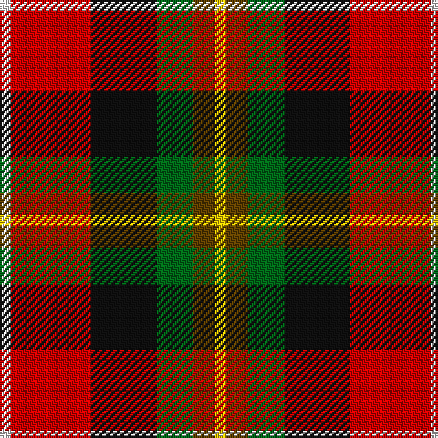

In pattern [WRKGGY](/patterns/wrkggy/).

This was sourced from tartans-authority.  It is a [6 stripes tartan](/stripes/stripes6/).

Original link http://www.tartansauthority.com/tartan-ferret/display/6463/

## Thread count
LN/6 R44 K36 G20 T12 Y/6

## Palette
Each colour and its ΔE from the base-6 reference it is a variant of.

| Colour | Shade | Base | ΔE (OKLab) |
|---|---|---|---|
| G | <code style="background-color:#006818;">#006818</code> `#006818` | G <code style="background-color:#006100;">#006100</code> | 0.02 |
| K | <code style="background-color:#101010;">#101010</code> `#101010` | K <code style="background-color:#000000;">#000000</code> | 0.17 |
| LN | <code style="background-color:#E0E0E0;">#E0E0E0</code> `#E0E0E0` | W <code style="background-color:#F7F7F7;">#F7F7F7</code> | 0.07 |
| R | <code style="background-color:#C80000;">#C80000</code> `#C80000` | R <code style="background-color:#CC0000;">#CC0000</code> | 0.01 |
| T | <code style="background-color:#604000;">#604000</code> `#604000` | G <code style="background-color:#006100;">#006100</code> | 0.14 |
| Y | <code style="background-color:#E8C000;">#E8C000</code> `#E8C000` | Y <code style="background-color:#F2BF00;">#F2BF00</code> | 0.02 |

# Sample pattern

## Nearest tartans

The nearest existing variants by ΔTartan distance.

1. [Wolves Wod Kindred](/setts/s6/r2g2ra9k9ga2y2~g003c14-ga289c18-k101010-r888888-rac80000-yffe600~x4/) — ΔT 0.84
1. [Craigmoor](/setts/s9/k2r8b2k2r2k6g2ga6y1~b2c4084-g503c14-ga005020-k101010-rdc0000-ye8c000~x2/) — ΔT 1.07
1. [Craigmoor Tartan Tartan Number: 1147. Earliest known date: pre 2003 MacGregor Hastie wrote, "This tartan was designed by me to meet a long felt want. Many people have asked if there was a Craig family tartan, and as the name is not connected with any Highland clan, yet the the family name is numerous, it seemed a good idea to design one. The design is based on the general colour of craigs and rocks." The Craig tartan is now in general production. See products available Copyright © Blair Urquhart, Comrie, 2015](/setts/s9/k2r8b2k2r2k6g2ga6y1~b2c2c80-g604000-ga006818-k101010-rc80000-ye8c000~x2/) — ΔT 1.09
1. [Barbour - Classic](/setts/s7/r4y2r21g11w2k20ra3~g642400-k101010-r946434-rac80000-wfcfcfc-ye8c000~x2/) — ΔT 1.13
1. [Thirkill](/setts/s9/w4k2r15k2r5g7ga7k2y4~g5c6428-ga003820-k101010-rc80000-we0e0e0-ye8c000~x2/) — ΔT 1.16
1. [Barbour](/setts/s7/r3k20w2g11ra21y2ra2~g642400-k101010-rc80000-ra946434-wfcfcfc-ye8c000~x2/) — ΔT 1.17
1. [Nicolson of Lewis (Clan?)](/setts/s6/b3ba5bb2g5r11w3~b344054-ba003c64-bb5c5c5c-g003820-rc80000-we0e0e0~x4/) — ΔT 1.21
1. [Scotch House 2000 Dress](/setts/s7/g22w3k2y3k19r18b4~b1c0070-g006818-k101010-rc80000-we0e0e0-ye8c000~x2/) — ΔT 1.24
1. [Douglas of Roxburgh](/setts/s5/k6b3g20r20y3~b2c2c80-g003800-k000000-rc80000-ye8c000~x2/) — ΔT 1.24
1. [Nicolson of Taransay (Personal)](/setts/s7/w6g10r22b16ga2k4k5~b2c2c80-g006818-ga289c18-k101010-rc80000-we0e0e0~x2/) — ΔT 1.26

## Neighbour map

Every grey dot is one of 15726 variants placed by the first two principal components of the ΔTartan feature space (44% of its variance). Red is this tartan; blue dots are its nearest — click one to open its page.

<svg viewBox="0 0 640 380" role="img" style="max-width:100%;height:auto;border:1px solid #e0e0e0;border-radius:4px;display:block" xmlns="http://www.w3.org/2000/svg"><image href="/nn/cloud.v1.png" width="640" height="380"/><a href="/setts/s6/r2g2ra9k9ga2y2~g003c14-ga289c18-k101010-r888888-rac80000-yffe600~x4/"><circle cx="87.5" cy="193.6" r="4" fill="#3465a4"><title>Wolves Wod Kindred</title></circle></a><a href="/setts/s9/k2r8b2k2r2k6g2ga6y1~b2c4084-g503c14-ga005020-k101010-rdc0000-ye8c000~x2/"><circle cx="101.8" cy="172.5" r="4" fill="#3465a4"><title>Craigmoor</title></circle></a><a href="/setts/s9/k2r8b2k2r2k6g2ga6y1~b2c2c80-g604000-ga006818-k101010-rc80000-ye8c000~x2/"><circle cx="103.5" cy="174.1" r="4" fill="#3465a4"><title>Craigmoor Tartan Tartan Number: 1147. Earliest known date: pre 2003 MacGregor Hastie wrote, &quot;This tartan was designed by me to meet a long felt want. Many people have asked if there was a Craig family tartan, and as the name is not connected with any Highland clan, yet the the family name is numerous, it seemed a good idea to design one. The design is based on the general colour of craigs and rocks.&quot; The Craig tartan is now in general production. See products available Copyright © Blair Urquhart, Comrie, 2015</title></circle></a><a href="/setts/s7/r4y2r21g11w2k20ra3~g642400-k101010-r946434-rac80000-wfcfcfc-ye8c000~x2/"><circle cx="170.8" cy="159.8" r="4" fill="#3465a4"><title>Barbour - Classic</title></circle></a><a href="/setts/s9/w4k2r15k2r5g7ga7k2y4~g5c6428-ga003820-k101010-rc80000-we0e0e0-ye8c000~x2/"><circle cx="119.9" cy="158.3" r="4" fill="#3465a4"><title>Thirkill</title></circle></a><a href="/setts/s7/r3k20w2g11ra21y2ra2~g642400-k101010-rc80000-ra946434-wfcfcfc-ye8c000~x2/"><circle cx="165.4" cy="155.2" r="4" fill="#3465a4"><title>Barbour</title></circle></a><a href="/setts/s6/b3ba5bb2g5r11w3~b344054-ba003c64-bb5c5c5c-g003820-rc80000-we0e0e0~x4/"><circle cx="97.9" cy="206.2" r="4" fill="#3465a4"><title>Nicolson of Lewis (Clan?)</title></circle></a><a href="/setts/s7/g22w3k2y3k19r18b4~b1c0070-g006818-k101010-rc80000-we0e0e0-ye8c000~x2/"><circle cx="110.1" cy="157.3" r="4" fill="#3465a4"><title>Scotch House 2000 Dress</title></circle></a><a href="/setts/s5/k6b3g20r20y3~b2c2c80-g003800-k000000-rc80000-ye8c000~x2/"><circle cx="162.8" cy="211.7" r="4" fill="#3465a4"><title>Douglas of Roxburgh</title></circle></a><a href="/setts/s7/w6g10r22b16ga2k4k5~b2c2c80-g006818-ga289c18-k101010-rc80000-we0e0e0~x2/"><circle cx="102.6" cy="159.8" r="4" fill="#3465a4"><title>Nicolson of Taransay (Personal)</title></circle></a><circle cx="108.1" cy="183.9" r="5" fill="#c00000"/></svg>

ID: /setts/s6/w3r22k18g10ga6y3~g006818-ga604000-k101010-rc80000-we0e0e0-ye8c000~x2/
