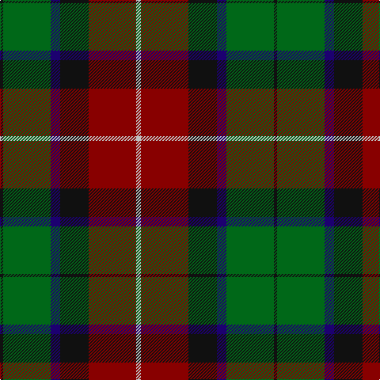

In pattern [KGBKRW](/patterns/kgbkrw/).

This was sourced from register-of-tartans.  It is a [6 stripes tartan](/stripes/stripes6/).

Original link https://www.tartanregister.gov.uk/tartanDetails.aspx?ref=407

## Attestations

This cloth appears in 2 source records; the oldest owns this page.

- 01/01/2002 — Bryant (Dalgleish) (Personal) (register-of-tartans, [record](https://www.tartanregister.gov.uk/tartanDetails.aspx?ref=407))
- pre 2002 — Bryant (Dalgleish) (Personal) (tartans-authority, [record](http://www.tartansauthority.com/tartan-ferret/display/4146/))

## Thread count
K/4 G60 DB12 K36 DR60 N/6

## Palette
Each colour and its ΔE from the base-6 reference it is a variant of.

| Colour | Shade | Base | ΔE (OKLab) |
|---|---|---|---|
| DB | <code style="background-color:#1C0070;">#1C0070</code> `#1C0070` | B <code style="background-color:#2A418A;">#2A418A</code> | 0.14 |
| DR | <code style="background-color:#880000;">#880000</code> `#880000` | R <code style="background-color:#CC0000;">#CC0000</code> | 0.15 |
| G | <code style="background-color:#006818;">#006818</code> `#006818` | G <code style="background-color:#006100;">#006100</code> | 0.02 |
| K | <code style="background-color:#101010;">#101010</code> `#101010` | K <code style="background-color:#000000;">#000000</code> | 0.17 |
| N | <code style="background-color:#C0C0C0;">#C0C0C0</code> `#C0C0C0` | W <code style="background-color:#F7F7F7;">#F7F7F7</code> | 0.17 |

# Sample pattern

## Nearest tartans

The nearest existing variants by ΔTartan distance.

1. [Patterson, John](/setts/s6/g3b12w1ga12r12ga2~b304080-g008000-ga003000-rc00000-we0e0e0~x2/) — ΔT 0.72
1. [Bennett, J P. (Personal)](/setts/s7/r2g18k2g3k20ga30w2~g74787c-ga604000-k101010-rc80000-we0e0e0~x2/) — ΔT 0.87
1. [Craik of Assington (Personal)](/setts/s8/b4r11b1g8r2g4k1y2~b1c0070-g006818-k101010-r880000-yd09800~x4/) — ΔT 1.00
1. [Patterson, John (Personal)](/setts/s6/g3b12w1ga12r12ga2~b2c2c80-g006818-ga003820-rc80000-wfcfcfc~x2/) — ΔT 1.06
1. [Patterson, John (Personal)](/setts/s6/g3b12w1ga12r12ga2~b2c4084-g005020-ga002814-rdc0000-we0e0e0~x2/) — ΔT 1.08
1. [St. Clement of Rome (Corporate)](/setts/s8/b18k5r26k5g25k5b18y2~b202060-g006818-k101010-rc80000-ye8c000~x2/) — ΔT 1.10
1. [Kilgour (Asymmetrical)](/setts/s8/b6k3r14k3g14k3b6y1~b2c2c80-g006818-k101010-rc80000-ye8c000~x4/) — ΔT 1.11
1. [Kilgour (Cant)](/setts/s8/b6y1b6k3r14k3g14k3~b2c2c80-g006818-k101010-rc80000-ye8c000~x4/) — ΔT 1.11
1. [Kilgour (Symmetrical)](/setts/s8/b6k3g14k3r14k3b6y1~b2c2c80-g006818-k101010-rc80000-ye8c000~x4/) — ΔT 1.11
1. [Regent](/setts/s7/b18k7g5r4g7k1y2~b480048-g006818-k101010-rc80000-ye8c000~x2/) — ΔT 1.12

## Neighbour map

Every grey dot is one of 15726 variants placed by the first two principal components of the ΔTartan feature space (44% of its variance). Red is this tartan; blue dots are its nearest — click one to open its page.

<svg viewBox="0 0 640 380" role="img" style="max-width:100%;height:auto;border:1px solid #e0e0e0;border-radius:4px;display:block" xmlns="http://www.w3.org/2000/svg"><image href="/nn/cloud.v1.png" width="640" height="380"/><a href="/setts/s6/g3b12w1ga12r12ga2~b304080-g008000-ga003000-rc00000-we0e0e0~x2/"><circle cx="167.4" cy="198.1" r="4" fill="#3465a4"><title>Patterson, John</title></circle></a><a href="/setts/s7/r2g18k2g3k20ga30w2~g74787c-ga604000-k101010-rc80000-we0e0e0~x2/"><circle cx="230.1" cy="168.9" r="4" fill="#3465a4"><title>Bennett, J P. (Personal)</title></circle></a><a href="/setts/s8/b4r11b1g8r2g4k1y2~b1c0070-g006818-k101010-r880000-yd09800~x4/"><circle cx="207.4" cy="183.9" r="4" fill="#3465a4"><title>Craik of Assington (Personal)</title></circle></a><a href="/setts/s6/g3b12w1ga12r12ga2~b2c2c80-g006818-ga003820-rc80000-wfcfcfc~x2/"><circle cx="166.8" cy="197.2" r="4" fill="#3465a4"><title>Patterson, John (Personal)</title></circle></a><a href="/setts/s6/g3b12w1ga12r12ga2~b2c4084-g005020-ga002814-rdc0000-we0e0e0~x2/"><circle cx="161.0" cy="194.0" r="4" fill="#3465a4"><title>Patterson, John (Personal)</title></circle></a><a href="/setts/s8/b18k5r26k5g25k5b18y2~b202060-g006818-k101010-rc80000-ye8c000~x2/"><circle cx="156.4" cy="182.5" r="4" fill="#3465a4"><title>St. Clement of Rome (Corporate)</title></circle></a><a href="/setts/s8/b6k3r14k3g14k3b6y1~b2c2c80-g006818-k101010-rc80000-ye8c000~x4/"><circle cx="134.4" cy="171.3" r="4" fill="#3465a4"><title>Kilgour (Asymmetrical)</title></circle></a><a href="/setts/s8/b6y1b6k3r14k3g14k3~b2c2c80-g006818-k101010-rc80000-ye8c000~x4/"><circle cx="134.4" cy="171.3" r="4" fill="#3465a4"><title>Kilgour (Cant)</title></circle></a><a href="/setts/s8/b6k3g14k3r14k3b6y1~b2c2c80-g006818-k101010-rc80000-ye8c000~x4/"><circle cx="134.4" cy="171.3" r="4" fill="#3465a4"><title>Kilgour (Symmetrical)</title></circle></a><a href="/setts/s7/b18k7g5r4g7k1y2~b480048-g006818-k101010-rc80000-ye8c000~x2/"><circle cx="213.2" cy="167.8" r="4" fill="#3465a4"><title>Regent</title></circle></a><circle cx="191.1" cy="187.1" r="5" fill="#c00000"/></svg>

ID: /setts/s6/w3r30k18b6g30k2~b1c0070-g006818-k101010-r880000-wc0c0c0~x2/
