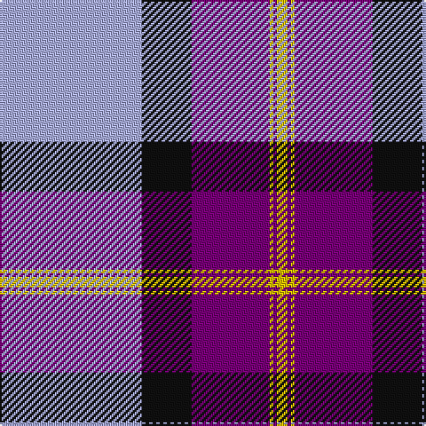

In pattern [WKBYBY](/patterns/wkbyby/).

This was sourced from house-of-tartan.  It is a [6 stripes tartan](/stripes/stripes6/).

Original link http://www.house-of-tartan.scotland.net/house/TartanViewjs.asp?colr=Def&tnam=2324

## Thread count
LP/80 K28 P44 Y2 P2 Y/6

## Palette
Each colour and its ΔE from the base-6 reference it is a variant of.

| Colour | Shade | Base | ΔE (OKLab) |
|---|---|---|---|
| K | <code style="background-color:#101010;">#101010</code> `#101010` | K <code style="background-color:#000000;">#000000</code> | 0.17 |
| LP | <code style="background-color:#A8ACE8;">#A8ACE8</code> `#A8ACE8` | W <code style="background-color:#F7F7F7;">#F7F7F7</code> | 0.23 |
| P | <code style="background-color:#780078;">#780078</code> `#780078` | B <code style="background-color:#2A418A;">#2A418A</code> | 0.17 |
| Y | <code style="background-color:#E8C000;">#E8C000</code> `#E8C000` | Y <code style="background-color:#F2BF00;">#F2BF00</code> | 0.02 |

# Sample pattern

## Nearest tartans

The nearest existing variants by ΔTartan distance.

1. [Longniddry Dress District Tartan Tartan Number: 88. Earliest known date: pre 2003 A dancers tartan from D.C. Dalgleish weavers of Selkirk See products available Copyright © Blair Urquhart, Comrie, 2015](/setts/s8/b42ba2w2ba2b5bb12w32b4~b780078-ba2c2c80-bb2888c4-we0e0e0~x2/) — ΔT 1.31
1. [Longniddry Dress (Dance)](/setts/s8/b42w2wa2w2b5ba12wa32b4~b780078-ba2888c4-wa8ace8-wae0e0e0~x2/) — ΔT 1.34
1. [Longniddry Purple](/setts/s8/b42w2wa2w2b5ba12wa32b4~b780078-ba2888c4-wa8ace8-waf8f8f8~x2/) — ΔT 1.44
1. [Longniddry, dress](/setts/s8/b42ba2w2ba2b5bb12w32b4~b800080-ba304080-bb8080d0-we0e0e0~x2/) — ΔT 1.48
1. [Bannockbane Navy](/setts/s8/b3r2b30r1w18ra30r2ra3~b1c0070-r980044-raa07c58-we0e0e0~x2/) — ΔT 1.48
1. [Philippine Heritage (Corporate)](/setts/s5/b30w4y1w4r30~b2c2c80-rc80000-wfcfcfc-yfccc00~x4/) — ΔT 1.60
1. [Gothenburg/Goteborg](/setts/s7/b26w28b14y3k1y2k1~b2c4084-k101010-we0e0e0-ye8c000~x2/) — ΔT 1.60
1. [Iberia Dress, Blue (Fashion)](/setts/s7/b60w2r10g6w4r15y10~b2c2c80-g003820-rc80000-we0e0e0-ye8c000~x2/) — ΔT 1.61
1. [Longniddry Lavender (Dance)](/setts/s8/b42r2w2r2b5ba12w32b4~b481ca4-baa468c4-rd87478-wc0c0c0~x2/) — ΔT 1.61
1. [British Energy](/setts/s6/b40k14ba22y1ba1y3~b0060b0-ba800080-k000000-yf0c000~x2/) — ΔT 1.62

## Neighbour map

Every grey dot is one of 15726 variants placed by the first two principal components of the ΔTartan feature space (44% of its variance). Red is this tartan; blue dots are its nearest — click one to open its page.

<svg viewBox="0 0 640 380" role="img" style="max-width:100%;height:auto;border:1px solid #e0e0e0;border-radius:4px;display:block" xmlns="http://www.w3.org/2000/svg"><image href="/nn/cloud.v1.png" width="640" height="380"/><a href="/setts/s8/b42ba2w2ba2b5bb12w32b4~b780078-ba2c2c80-bb2888c4-we0e0e0~x2/"><circle cx="290.9" cy="126.9" r="4" fill="#3465a4"><title>Longniddry Dress District Tartan Tartan Number: 88. Earliest known date: pre 2003 A dancers tartan from D.C. Dalgleish weavers of Selkirk See products available Copyright © Blair Urquhart, Comrie, 2015</title></circle></a><a href="/setts/s8/b42w2wa2w2b5ba12wa32b4~b780078-ba2888c4-wa8ace8-wae0e0e0~x2/"><circle cx="291.3" cy="126.2" r="4" fill="#3465a4"><title>Longniddry Dress (Dance)</title></circle></a><a href="/setts/s8/b42w2wa2w2b5ba12wa32b4~b780078-ba2888c4-wa8ace8-waf8f8f8~x2/"><circle cx="281.9" cy="121.6" r="4" fill="#3465a4"><title>Longniddry Purple</title></circle></a><a href="/setts/s8/b42ba2w2ba2b5bb12w32b4~b800080-ba304080-bb8080d0-we0e0e0~x2/"><circle cx="296.2" cy="126.2" r="4" fill="#3465a4"><title>Longniddry, dress</title></circle></a><a href="/setts/s8/b3r2b30r1w18ra30r2ra3~b1c0070-r980044-raa07c58-we0e0e0~x2/"><circle cx="226.1" cy="121.9" r="4" fill="#3465a4"><title>Bannockbane Navy</title></circle></a><a href="/setts/s5/b30w4y1w4r30~b2c2c80-rc80000-wfcfcfc-yfccc00~x4/"><circle cx="291.5" cy="150.7" r="4" fill="#3465a4"><title>Philippine Heritage (Corporate)</title></circle></a><a href="/setts/s7/b26w28b14y3k1y2k1~b2c4084-k101010-we0e0e0-ye8c000~x2/"><circle cx="306.4" cy="136.7" r="4" fill="#3465a4"><title>Gothenburg/Goteborg</title></circle></a><a href="/setts/s7/b60w2r10g6w4r15y10~b2c2c80-g003820-rc80000-we0e0e0-ye8c000~x2/"><circle cx="322.4" cy="113.4" r="4" fill="#3465a4"><title>Iberia Dress, Blue (Fashion)</title></circle></a><a href="/setts/s8/b42r2w2r2b5ba12w32b4~b481ca4-baa468c4-rd87478-wc0c0c0~x2/"><circle cx="303.0" cy="138.2" r="4" fill="#3465a4"><title>Longniddry Lavender (Dance)</title></circle></a><a href="/setts/s6/b40k14ba22y1ba1y3~b0060b0-ba800080-k000000-yf0c000~x2/"><circle cx="307.3" cy="142.6" r="4" fill="#3465a4"><title>British Energy</title></circle></a><circle cx="297.6" cy="126.1" r="5" fill="#c00000"/></svg>

ID: /setts/s6/w40k14b22y1b1y3~b780078-k101010-wa8ace8-ye8c000~x2/
