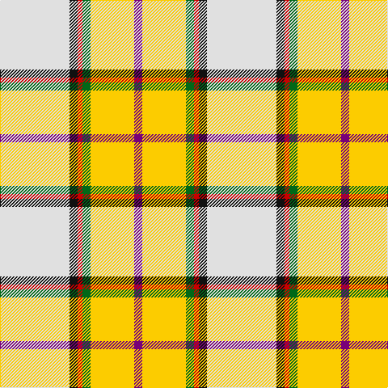

In pattern [BYGRKW](/stripes/bygrkw/).

This was sourced from tartans-authority.  It is a [6 stripe tartan](/stripes/stripes6/).

Original link http://www.tartansauthority.com/tartan-ferret/display/10701/

## Thread count
LN/86 K10 R6 G10 Y54 P/10

## Palette
Each colour and the base-6 reference it is a variant of.

| Colour | Shade | Base |
|---|---|---|
| G | <code style="background-color:#006818;">#006818</code> `oklch(45.0% 0.142 145.0)` <small>#006818</small> | G <code style="background-color:#006100;">#006100</code> |
| K | <code style="background-color:#101010;">#101010</code> `oklch(17.3% 0.000 89.9)` <small>#101010</small> | K <code style="background-color:#000000;">#000000</code> |
| LN | <code style="background-color:#E0E0E0;">#E0E0E0</code> `oklch(90.7% 0.000 89.9)` <small>#E0E0E0</small> | W <code style="background-color:#F7F7F7;">#F7F7F7</code> |
| P | <code style="background-color:#780078;">#780078</code> `oklch(40.2% 0.185 328.4)` <small>#780078</small> | B <code style="background-color:#2A418A;">#2A418A</code> |
| R | <code style="background-color:#C80000;">#C80000</code> `oklch(52.3% 0.215 29.2)` <small>#C80000</small> | R <code style="background-color:#CC0000;">#CC0000</code> |
| Y | <code style="background-color:#FCCC00;">#FCCC00</code> `oklch(86.2% 0.176 91.5)` <small>#FCCC00</small> | Y <code style="background-color:#F2BF00;">#F2BF00</code> |

# Sample pattern

## Nearest tartans

The nearest existing variants by ΔTartan distance.

1. [Reekie, Charlene](/setts/s6/w43k5r3dg5ly27m5~x2/) — ΔT 0.33
1. [Aguilar Pardo, Luis Alejandro (Personal)](/setts/s8/g4ly3r2ly22lb22w2lb3k2~x2/) — ΔT 1.34
1. [Los Angeles (District)](/setts/s8/t4t24ly5g2t3db5ly33db2~x2/) — ΔT 1.55
1. [Banff, White (Fashion)](/setts/s7/w8ly3w22o22dr3r2w4~x2/) — ΔT 1.59
1. [Ch. Supt. Everett and Mrs Julene Sum](/setts/s7/r9w27k7w45lb60dg4lo5/) — ΔT 1.60
1. [Christie (London)](/setts/s6/w5r25lt18g4k2ly5~x2/) — ΔT 1.62
1. [Shepherd, Derek (Piping)](/setts/s6/k5ly2dy7ly18dy2w2~x4/) — ΔT 1.63
1. [Saskatchewan Dress (Dance)](/setts/s8/w2k1g6dy11w26r2w1ly2~x2/) — ΔT 1.64
1. [Canadian Shield (Personal)](/setts/s7/r5dg8do13o21y34w55dg3/) — ΔT 1.68
1. [Nimah, Carissa & Bassem (Personal)](/setts/s7/w50g15db10r2db10g8ly3~x2/) — ΔT 1.68

## Neighbour map

Every grey dot is one of 14299 variants placed by the first two principal components of the ΔTartan feature space (44% of its variance). Red is this tartan; blue dots are its nearest — click one to open its page.

<svg viewBox="0 0 640 380" role="img" style="max-width:100%;height:auto;border:1px solid #e0e0e0;border-radius:4px;display:block" xmlns="http://www.w3.org/2000/svg"><image href="/nn/cloud.v1.png" width="640" height="380"/><a href="/setts/s6/w43k5r3dg5ly27m5~x2/"><circle cx="209.0" cy="113.9" r="4" fill="#3465a4"><title>Reekie, Charlene</title></circle></a><a href="/setts/s8/g4ly3r2ly22lb22w2lb3k2~x2/"><circle cx="193.6" cy="121.4" r="4" fill="#3465a4"><title>Aguilar Pardo, Luis Alejandro (Personal)</title></circle></a><a href="/setts/s8/t4t24ly5g2t3db5ly33db2~x2/"><circle cx="255.4" cy="119.4" r="4" fill="#3465a4"><title>Los Angeles (District)</title></circle></a><a href="/setts/s7/w8ly3w22o22dr3r2w4~x2/"><circle cx="250.5" cy="149.8" r="4" fill="#3465a4"><title>Banff, White (Fashion)</title></circle></a><a href="/setts/s7/r9w27k7w45lb60dg4lo5/"><circle cx="207.3" cy="125.2" r="4" fill="#3465a4"><title>Ch. Supt. Everett and Mrs Julene Sum</title></circle></a><a href="/setts/s6/w5r25lt18g4k2ly5~x2/"><circle cx="166.6" cy="129.5" r="4" fill="#3465a4"><title>Christie (London)</title></circle></a><a href="/setts/s6/k5ly2dy7ly18dy2w2~x4/"><circle cx="192.6" cy="150.7" r="4" fill="#3465a4"><title>Shepherd, Derek (Piping)</title></circle></a><a href="/setts/s8/w2k1g6dy11w26r2w1ly2~x2/"><circle cx="281.9" cy="76.3" r="4" fill="#3465a4"><title>Saskatchewan Dress (Dance)</title></circle></a><a href="/setts/s7/r5dg8do13o21y34w55dg3/"><circle cx="153.4" cy="120.8" r="4" fill="#3465a4"><title>Canadian Shield (Personal)</title></circle></a><a href="/setts/s7/w50g15db10r2db10g8ly3~x2/"><circle cx="219.3" cy="89.8" r="4" fill="#3465a4"><title>Nimah, Carissa &amp; Bassem (Personal)</title></circle></a><circle cx="214.7" cy="119.0" r="5" fill="#c00000"/></svg>

ID: /setts/s6/w43k5r3g5ly27dp5~x2/
