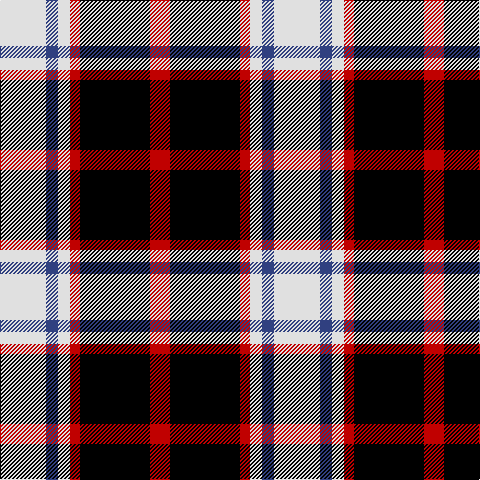

In pattern [RKRWBW](/patterns/rkrwbw/).

This was sourced from weddslist.  It is a [6 stripes tartan](/stripes/stripes6/).

Original link http://www.weddslist.com/cgi-bin/tartans/pg.pl?source=sts

## Thread count
LN/46 B12 LN12 R10 K70 R/20

## Palette
Each colour and its ΔE from the base-6 reference it is a variant of.

| Colour | Shade | Base | ΔE (OKLab) |
|---|---|---|---|
| B | <code style="background-color:#304080;">#304080</code> `#304080` | B <code style="background-color:#2C4084;">#2C4084</code> | 0.01 |
| K | <code style="background-color:#000000;">#000000</code> `#000000` | K <code style="background-color:#000000;">#000000</code> | 0.00 |
| LN | <code style="background-color:#E0E0E0;">#E0E0E0</code> `#E0E0E0` | W <code style="background-color:#F4F4F0;">#F4F4F0</code> | 0.06 |
| R | <code style="background-color:#C00000;">#C00000</code> `#C00000` | R <code style="background-color:#C80000;">#C80000</code> | 0.02 |

# Sample pattern

## Nearest tartans

The nearest existing variants by ΔTartan distance.

1. [Meg Merrilees Fancy Tartan Tartan Number: 1602. Earliest known date: 1831 Miss McDougall, Inverness library, says in her notes:The first mention I had of this tartan was in an advertisment by D MacDougall, Draper, 27 High St., Inverness in 1831 . . . Meg Merrilees and other winter shawls. From Dalgety Archives. STS notes that it was sold by Forsyth's in Glasgow in 1840. Meg Merrilees was a character in one of Scotts novels, Guy Mannering. BU See products available Copyright © Blair Urquhart, Comrie, 2015](/setts/s6/w46b12w12r10k70r20-b2c2c80-k101010-rc80000-we0e0e0/) — ΔT 0.64
1. [Wcwm 759-3](/setts/s6/w10r68k48r8ra48r8-k000000-r8c8c8c-ra8c0000-wc8c8c8/) — ΔT 0.71
1. [Thom(p)son camel](/setts/s6/r8ra60k12w26k26w6-k000000-rc00000-ra806050-we0e0e0/) — ΔT 0.75
1. [Thom(p)son, Grey](/setts/s6/r4g40k10w20k20r4-g808080-k000000-rc00000-we0e0e0/) — ΔT 0.79
1. [Merrilees](/setts/s6/w46b12w12r10k70r20-b5c8ca8-k101010-rc80000-wf8f8f8/) — ΔT 0.97
1. [Baillie](/setts/s7/b6k2b16k12g16k2w4-b800080-g008000-k000000-we0e0e0/) — ΔT 1.00
1. [Oban, Grey](/setts/s5/k16w12k16g36r4-g808080-k000000-rc00000-we0e0e0/) — ΔT 1.04
1. [Dutch](/setts/s6/w4b24y2k24y24k2-b304080-k000000-we0e0e0-yff8500/) — ΔT 1.11
1. [Eglinton](/setts/s7/k3g3k3w16k3r3k3-g004c00-k000000-rc80000-wd0d0d0/) — ΔT 1.16
1. [Dunbog Primary (School)](/setts/s6/r24b6g10b32y4g4-b000048-g447438-rc80000-ye8c000/) — ΔT 1.21

## Neighbour map

Every grey dot is one of 15726 variants placed by the first two principal components of the ΔTartan feature space (44% of its variance). Red is this tartan; blue dots are its nearest — click one to open its page.

<svg viewBox="0 0 640 380" role="img" style="max-width:100%;height:auto;border:1px solid #e0e0e0;border-radius:4px;display:block" xmlns="http://www.w3.org/2000/svg"><image href="/nn/cloud.v1.png" width="640" height="380"/><a href="/setts/s6/w46b12w12r10k70r20-b2c2c80-k101010-rc80000-we0e0e0/"><circle cx="161.4" cy="200.3" r="4" fill="#3465a4"><title>Meg Merrilees Fancy Tartan Tartan Number: 1602. Earliest known date: 1831 Miss McDougall, Inverness library, says in her notes:The first mention I had of this tartan was in an advertisment by D MacDougall, Draper, 27 High St., Inverness in 1831 . . . Meg Merrilees and other winter shawls. From Dalgety Archives. STS notes that it was sold by Forsyth's in Glasgow in 1840. Meg Merrilees was a character in one of Scotts novels, Guy Mannering. BU See products available Copyright © Blair Urquhart, Comrie, 2015</title></circle></a><a href="/setts/s6/w10r68k48r8ra48r8-k000000-r8c8c8c-ra8c0000-wc8c8c8/"><circle cx="189.6" cy="203.8" r="4" fill="#3465a4"><title>Wcwm 759-3</title></circle></a><a href="/setts/s6/r8ra60k12w26k26w6-k000000-rc00000-ra806050-we0e0e0/"><circle cx="183.4" cy="189.7" r="4" fill="#3465a4"><title>Thom(p)son camel</title></circle></a><a href="/setts/s6/r4g40k10w20k20r4-g808080-k000000-rc00000-we0e0e0/"><circle cx="162.9" cy="192.7" r="4" fill="#3465a4"><title>Thom(p)son, Grey</title></circle></a><a href="/setts/s6/w46b12w12r10k70r20-b5c8ca8-k101010-rc80000-wf8f8f8/"><circle cx="156.1" cy="196.8" r="4" fill="#3465a4"><title>Merrilees</title></circle></a><a href="/setts/s7/b6k2b16k12g16k2w4-b800080-g008000-k000000-we0e0e0/"><circle cx="145.7" cy="208.2" r="4" fill="#3465a4"><title>Baillie</title></circle></a><a href="/setts/s5/k16w12k16g36r4-g808080-k000000-rc00000-we0e0e0/"><circle cx="174.6" cy="223.3" r="4" fill="#3465a4"><title>Oban, Grey</title></circle></a><a href="/setts/s6/w4b24y2k24y24k2-b304080-k000000-we0e0e0-yff8500/"><circle cx="150.2" cy="184.3" r="4" fill="#3465a4"><title>Dutch</title></circle></a><a href="/setts/s7/k3g3k3w16k3r3k3-g004c00-k000000-rc80000-wd0d0d0/"><circle cx="184.7" cy="193.9" r="4" fill="#3465a4"><title>Eglinton</title></circle></a><a href="/setts/s6/r24b6g10b32y4g4-b000048-g447438-rc80000-ye8c000/"><circle cx="222.1" cy="210.0" r="4" fill="#3465a4"><title>Dunbog Primary (School)</title></circle></a><circle cx="157.2" cy="202.0" r="5" fill="#c00000"/></svg>

ID: /setts/s6/w46b12w12r10k70r20-b304080-k000000-rc00000-we0e0e0/
