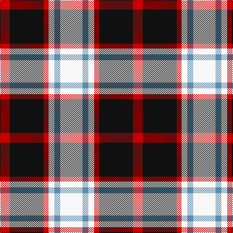

In pattern [RKRWBW](/patterns/rkrwbw/).

This was sourced from register-of-tartans.  It is a [6 stripes tartan](/stripes/stripes6/).

Original link https://www.tartanregister.gov.uk/tartanDetails.aspx?ref=2938

## Attestations

This cloth appears in 2 source records; the oldest owns this page.

- 01/01/1829 — Merrilees (register-of-tartans, [record](https://www.tartanregister.gov.uk/tartanDetails.aspx?ref=2938))
- 1829 — Meg Merrilees, Old (1828) (tartans-authority, [record](http://www.tartansauthority.com/tartan-ferret/display/1602/))

## Thread count
R/20 K70 R10 W12 B12 W/46

## Palette
Each colour and its ΔE from the base-6 reference it is a variant of.

| Colour | Shade | Base | ΔE (OKLab) |
|---|---|---|---|
| B | <code style="background-color:#5C8CA8;">#5C8CA8</code> `#5C8CA8` | B <code style="background-color:#2C4084;">#2C4084</code> | 0.23 |
| K | <code style="background-color:#101010;">#101010</code> `#101010` | K <code style="background-color:#000000;">#000000</code> | 0.17 |
| R | <code style="background-color:#C80000;">#C80000</code> `#C80000` | R <code style="background-color:#C80000;">#C80000</code> | 0.00 |
| W | <code style="background-color:#F8F8F8;">#F8F8F8</code> `#F8F8F8` | W <code style="background-color:#F4F4F0;">#F4F4F0</code> | 0.01 |

# Sample pattern

ID: /setts/s6/w46b12w12r10k70r20-b5c8ca8-k101010-rc80000-wf8f8f8/
