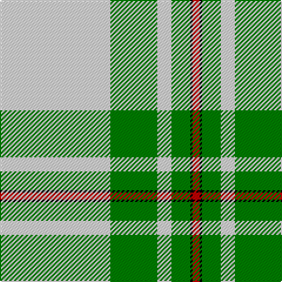

This page is one **sett** — a single exact thread-count. It belongs to the [tartan](/tartans/w47g20w6g8k1r3/)
(the same proportion at any scale), whose colour order is pattern [RKGWGW](/stripes/rkgwgw/).

Sourced from weddslist.  It is a [6 stripe tartan](/stripes/stripes6/).

Original link http://www.weddslist.com/cgi-bin/tartans/pg.pl?source=sts

## Also known as

This cloth is also recorded under:

- MacGregor, Green

2 attestations — the source records this cloth was collapsed from (oldest owns this page)

<ul>
<li>undated — MacGregor, Green (weddslist, <a href="http://www.weddslist.com/cgi-bin/tartans/pg.pl?source=sts">record</a>)</li>
<li>undated — MacGregor Dress Green Clan Tartan Tartan Number: 1577. Earliest known date: pre 1992 A dancers tartan. See products available Copyright © Blair Urquhart, Comrie, 2015 (house-of-tartan, <a href="http://www.house-of-tartan.scotland.net/house/TartanViewjs.asp?colr=Def&tnam=1577">record</a>)</li>
</ul>

## Thread count
LN/94 G40 LN12 G16 K2 R/6

## Palette

Palette: <strong>Tartan Register</strong> <small style="color:#888">(2 of 4 colours)</small>
<table><thead><tr><th>Colour</th><th>Threads</th><th>Shade</th><th>Base</th><th>OKLCh</th></tr></thead><tbody><tr><td>LN/</td><td style="text-align:right;font-variant-numeric:tabular-nums">94</td><td><code style="background-color:#E0E0E0;">#E0E0E0</code> <small style="color:#888">#E0E0E0</small></td><td>W <code style="background-color:#F7F7F7;">#F7F7F7</code></td><td><small style="color:#888">oklch(90.7% 0.000 89.9)</small></td></tr><tr><td>G</td><td style="text-align:right;font-variant-numeric:tabular-nums">40</td><td><code style="background-color:#008000;">#008000</code> <small style="color:#888">#008000</small></td><td>G <code style="background-color:#006100;">#006100</code></td><td><small style="color:#888">oklch(52.0% 0.177 142.5)</small></td></tr><tr><td>LN</td><td style="text-align:right;font-variant-numeric:tabular-nums">12</td><td><code style="background-color:#E0E0E0;">#E0E0E0</code> <small style="color:#888">#E0E0E0</small></td><td>W <code style="background-color:#F7F7F7;">#F7F7F7</code></td><td><small style="color:#888">oklch(90.7% 0.000 89.9)</small></td></tr><tr><td>G</td><td style="text-align:right;font-variant-numeric:tabular-nums">16</td><td><code style="background-color:#008000;">#008000</code> <small style="color:#888">#008000</small></td><td>G <code style="background-color:#006100;">#006100</code></td><td><small style="color:#888">oklch(52.0% 0.177 142.5)</small></td></tr><tr><td>K</td><td style="text-align:right;font-variant-numeric:tabular-nums">2</td><td><code style="background-color:#000000;">#000000</code> <small style="color:#888">#000000</small></td><td>K <code style="background-color:#000000;">#000000</code></td><td><small style="color:#888">oklch(0.0% 0.000 0.0)</small></td></tr><tr><td>R/</td><td style="text-align:right;font-variant-numeric:tabular-nums">6</td><td><code style="background-color:#C00000;">#C00000</code> <small style="color:#888">#C00000</small></td><td>R <code style="background-color:#CC0000;">#CC0000</code></td><td><small style="color:#888">oklch(50.7% 0.208 29.2)</small></td></tr></tbody></table>

# Sample pattern

## Nearest tartans

The nearest existing variants by ΔTartan distance, with this tartan at the top so the swatches line up against it.

ΔTartan

Tartan

Sett

—

<a href="/ttd/edit/#slug=w47g20w6g8k1r3~x2">MacGregor, Green</a> <a class="nn-out" href="/setts/s6/w47g20w6g8k1r3~x2/" title="open its dictionary page">↗</a>

0.66

<a href="/ttd/edit/#slug=w52g22w6g8k1r3~x2">MacGregor - 1975 (Dance, Green)</a> <a class="nn-out" href="/setts/s6/w52g22w6g8k1r3~x2/" title="open its dictionary page">↗</a>

0.72

<a href="/ttd/edit/#slug=w44dg18w6dg11dt1o4~x2">Westfalia Dress (Corporate)</a> <a class="nn-out" href="/setts/s6/w44dg18w6dg11dt1o4~x2/" title="open its dictionary page">↗</a>

0.86

<a href="/ttd/edit/#slug=w52dg22w6dg8k1r3~x2">MacGregor Dress Green (Dance)</a> <a class="nn-out" href="/setts/s6/w52dg22w6dg8k1r3~x2/" title="open its dictionary page">↗</a>

1.05

<a href="/ttd/edit/#slug=n4w2n1w36g21ly4~x2">Skye, Green (Dance)</a> <a class="nn-out" href="/setts/s6/n4w2n1w36g21ly4~x2/" title="open its dictionary page">↗</a>

1.35

<a href="/ttd/edit/#slug=dg44w18dg6w11dt1o4~x2">Westfalia (Corporate)</a> <a class="nn-out" href="/setts/s6/dg44w18dg6w11dt1o4~x2/" title="open its dictionary page">↗</a>

1.83

<a href="/ttd/edit/#slug=w54k7r7lo6ly4r1~x2">Young, Christina</a> <a class="nn-out" href="/setts/s6/w54k7r7lo6ly4r1~x2/" title="open its dictionary page">↗</a>

1.98

<a href="/ttd/edit/#slug=w40ly4o10w8db4o4db4o4g1~x2">Boucherville Formal District Tartan Tartan Number: 2118. Earliest known date: 1990 Three designers from La Navette d'Art ENR, Jeanette Blanchette, Pauline Bastien and Jacqueline Provost, based their design on symbolic colours. Le bleu azur represente la loyaute, le gris argent la serenite, le jaune (l'or) la generosite, le vert represente l'esperance, et le blanc symbole de purete et d'innocence &quot;nous rappelle notre appartenance au Quebec.&quot; &quot;Les tisserands, c'est nous tous...!&quot; See products available Copyright © Blair Urquhart, Comrie, 2015</a> <a class="nn-out" href="/setts/s9/w40ly4o10w8db4o4db4o4g1~x2/" title="open its dictionary page">↗</a>

1.98

<a href="/ttd/edit/#slug=r2w2k2w28k8w9k1ly2~x2">Summer Spirit (Fashion)</a> <a class="nn-out" href="/setts/s8/r2w2k2w28k8w9k1ly2~x2/" title="open its dictionary page">↗</a>

1.99

<a href="/ttd/edit/#slug=g42ly1w2ly1g5dg12w32g4~x2">Longniddry Green Error (Dance)</a> <a class="nn-out" href="/setts/s8/g42ly1w2ly1g5dg12w32g4~x2/" title="open its dictionary page">↗</a>

2.01

<a href="/ttd/edit/#slug=w35n12r2n2~x2">Triplett, Jack Arnold</a> <a class="nn-out" href="/setts/s4/w35n12r2n2~x2/" title="open its dictionary page">↗</a>

## Neighbour map

Every grey dot is one of 14299 variants placed by the first two principal components of the ΔTartan feature space (44% of its variance). Red is this tartan; blue dots are its nearest — click one to open its page.

<svg viewBox="0 0 640 380" role="img" style="max-width:100%;height:auto;border:1px solid #e0e0e0;border-radius:4px;display:block" xmlns="http://www.w3.org/2000/svg"><image href="/nn/cloud.v1.png" width="640" height="380"/><a href="/setts/s6/w52g22w6g8k1r3~x2/"><circle cx="388.7" cy="102.3" r="4" fill="#3465a4"><title>MacGregor - 1975 (Dance, Green)</title></circle></a><a href="/setts/s6/w44dg18w6dg11dt1o4~x2/"><circle cx="359.3" cy="115.6" r="4" fill="#3465a4"><title>Westfalia Dress (Corporate)</title></circle></a><a href="/setts/s6/w52dg22w6dg8k1r3~x2/"><circle cx="384.9" cy="100.6" r="4" fill="#3465a4"><title>MacGregor Dress Green (Dance)</title></circle></a><a href="/setts/s6/n4w2n1w36g21ly4~x2/"><circle cx="336.9" cy="121.0" r="4" fill="#3465a4"><title>Skye, Green (Dance)</title></circle></a><a href="/setts/s6/dg44w18dg6w11dt1o4~x2/"><circle cx="362.7" cy="127.4" r="4" fill="#3465a4"><title>Westfalia (Corporate)</title></circle></a><a href="/setts/s6/w54k7r7lo6ly4r1~x2/"><circle cx="416.1" cy="72.1" r="4" fill="#3465a4"><title>Young, Christina</title></circle></a><a href="/setts/s9/w40ly4o10w8db4o4db4o4g1~x2/"><circle cx="364.6" cy="81.6" r="4" fill="#3465a4"><title>Boucherville Formal District Tartan Tartan Number: 2118. Earliest known date: 1990 Three designers from La Navette d'Art ENR, Jeanette Blanchette, Pauline Bastien and Jacqueline Provost, based their design on symbolic colours. Le bleu azur represente la loyaute, le gris argent la serenite, le jaune (l'or) la generosite, le vert represente l'esperance, et le blanc symbole de purete et d'innocence &quot;nous rappelle notre appartenance au Quebec.&quot; &quot;Les tisserands, c'est nous tous...!&quot; See products available Copyright © Blair Urquhart, Comrie, 2015</title></circle></a><a href="/setts/s8/r2w2k2w28k8w9k1ly2~x2/"><circle cx="414.3" cy="97.1" r="4" fill="#3465a4"><title>Summer Spirit (Fashion)</title></circle></a><a href="/setts/s8/g42ly1w2ly1g5dg12w32g4~x2/"><circle cx="303.8" cy="103.7" r="4" fill="#3465a4"><title>Longniddry Green Error (Dance)</title></circle></a><a href="/setts/s4/w35n12r2n2~x2/"><circle cx="393.5" cy="163.0" r="4" fill="#3465a4"><title>Triplett, Jack Arnold</title></circle></a><circle cx="396.5" cy="116.2" r="5" fill="#c00000"/></svg>

ID: /setts/s6/w47g20w6g8k1r3~x2/
