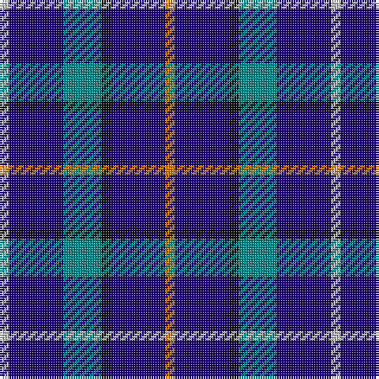

In pattern [WBGKBY](/patterns/wbgkby/).

This was sourced from register-of-tartans.  It is a [6 stripes tartan](/stripes/stripes6/).

Original link https://www.tartanregister.gov.uk/tartanDetails.aspx?ref=207

## Attestations

This cloth appears in 2 source records; the oldest owns this page.

- 05/07/2001 — Baptist Union of Scotland (register-of-tartans, [record](https://www.tartanregister.gov.uk/tartanDetails.aspx?ref=207))
- July 2001 — Baptist Union of Scotland (Corp) (tartans-authority, [record](http://www.tartansauthority.com/tartan-ferret/display/4104/))

## Register references

External register numbers recorded for this tartan.

- Scottish Register of Tartans: [207](https://www.tartanregister.gov.uk/tartanDetails.aspx?ref=207)
- Scottish Tartans Authority (ITI): 4104
- Scottish Tartans World Register: 2821

## Thread count
N/4 DB23 B16 K4 DB23 O/4

## Palette
Each colour and its ΔE from the base-6 reference it is a variant of.

| Colour | Shade | Base | ΔE (OKLab) |
|---|---|---|---|
| B | <code style="background-color:#048888;">#048888</code> `#048888` | G <code style="background-color:#006100;">#006100</code> | 0.18 |
| DB | <code style="background-color:#1C0070;">#1C0070</code> `#1C0070` | B <code style="background-color:#2A418A;">#2A418A</code> | 0.14 |
| K | <code style="background-color:#101010;">#101010</code> `#101010` | K <code style="background-color:#000000;">#000000</code> | 0.17 |
| N | <code style="background-color:#C0C0C0;">#C0C0C0</code> `#C0C0C0` | W <code style="background-color:#F7F7F7;">#F7F7F7</code> | 0.17 |
| O | <code style="background-color:#D87C00;">#D87C00</code> `#D87C00` | Y <code style="background-color:#F2BF00;">#F2BF00</code> | 0.17 |

# Sample pattern

## Nearest tartans

The nearest existing variants by ΔTartan distance.

1. [Ancient Atlantic](/setts/s6/w1b6g5k1b6y1~b2c2c80-g604000-k101010-wfcfcfc-ye8c000~x4/) — ΔT 1.08
1. [H.M.S. DUNCAN](/setts/s6/b3ba15k15r2k15ra3~baa00ff-ba656879-k000033-rff0000-raa07c40~x2/) — ΔT 1.13
1. [Ayrshire Tourist Board](/setts/s9/b10r3ba4r3b7ba3g7b17y2~b1c0070-ba2474e8-g006818-r9c68a4-ye8c000~x2/) — ΔT 1.13
1. [Jethart (District)](/setts/s9/k22b16r3b16k2b16g3b3w5~b3850c8-g289c18-k101010-r880000-w98c8e8~x2/) — ΔT 1.39
1. [Bank of Scotland (1995)](/setts/s5/w1b6k5b6y1~b2c2c80-k000000-wc8c8c8-yc88c00~x6/) — ΔT 1.39
1. [Grainger (Name)](/setts/s7/b36r4b6g18b15k18w4~b2c2c80-g006818-k101010-rc80000-wfcfcfc~x2/) — ΔT 1.39
1. [Davidson of Tulloch Clan Tartan Tartan Number: 1360. Earliest known date: 1984 The Davidsons or Clan Dhai maintained a constant battle for precedence within Clan Chattan. The Davidsons of Tulloch in Ross-shire are one of the main branches of the Davidson family. See products available Copyright © Blair Urquhart, Comrie, 2015](/setts/s5/r6b35k36b36w6~b2c2c80-k101010-rc80000-we0e0e0/) — ΔT 1.40
1. [Massachusetts (Unofficial)](/setts/s6/r1b12k5y3b5w1~b1c0070-k101010-rc80000-wc0c0c0-ybc8c00~x4/) — ΔT 1.43
1. [Woodcock (2014)](/setts/s7/b30ba9g6ba9r4b17w5~b141e46-ba780078-g005020-rff0000-wfcfcfc~x2/) — ΔT 1.46
1. [Jethart](/setts/s9/k22b16r3b16k3b16g3b3ba5~b304080-ba8080d0-g30a010-k000030-rc00000~x2/) — ΔT 1.47

## Neighbour map

Every grey dot is one of 15726 variants placed by the first two principal components of the ΔTartan feature space (44% of its variance). Red is this tartan; blue dots are its nearest — click one to open its page.

<svg viewBox="0 0 640 380" role="img" style="max-width:100%;height:auto;border:1px solid #e0e0e0;border-radius:4px;display:block" xmlns="http://www.w3.org/2000/svg"><image href="/nn/cloud.v1.png" width="640" height="380"/><a href="/setts/s6/w1b6g5k1b6y1~b2c2c80-g604000-k101010-wfcfcfc-ye8c000~x4/"><circle cx="269.5" cy="230.0" r="4" fill="#3465a4"><title>Ancient Atlantic</title></circle></a><a href="/setts/s6/b3ba15k15r2k15ra3~baa00ff-ba656879-k000033-rff0000-raa07c40~x2/"><circle cx="249.0" cy="222.2" r="4" fill="#3465a4"><title>H.M.S. DUNCAN</title></circle></a><a href="/setts/s9/b10r3ba4r3b7ba3g7b17y2~b1c0070-ba2474e8-g006818-r9c68a4-ye8c000~x2/"><circle cx="271.6" cy="202.5" r="4" fill="#3465a4"><title>Ayrshire Tourist Board</title></circle></a><a href="/setts/s9/k22b16r3b16k2b16g3b3w5~b3850c8-g289c18-k101010-r880000-w98c8e8~x2/"><circle cx="281.0" cy="186.6" r="4" fill="#3465a4"><title>Jethart (District)</title></circle></a><a href="/setts/s5/w1b6k5b6y1~b2c2c80-k000000-wc8c8c8-yc88c00~x6/"><circle cx="293.2" cy="266.1" r="4" fill="#3465a4"><title>Bank of Scotland (1995)</title></circle></a><a href="/setts/s7/b36r4b6g18b15k18w4~b2c2c80-g006818-k101010-rc80000-wfcfcfc~x2/"><circle cx="261.1" cy="211.9" r="4" fill="#3465a4"><title>Grainger (Name)</title></circle></a><a href="/setts/s5/r6b35k36b36w6~b2c2c80-k101010-rc80000-we0e0e0/"><circle cx="303.2" cy="273.9" r="4" fill="#3465a4"><title>Davidson of Tulloch Clan Tartan Tartan Number: 1360. Earliest known date: 1984 The Davidsons or Clan Dhai maintained a constant battle for precedence within Clan Chattan. The Davidsons of Tulloch in Ross-shire are one of the main branches of the Davidson family. See products available Copyright © Blair Urquhart, Comrie, 2015</title></circle></a><a href="/setts/s6/r1b12k5y3b5w1~b1c0070-k101010-rc80000-wc0c0c0-ybc8c00~x4/"><circle cx="321.8" cy="199.5" r="4" fill="#3465a4"><title>Massachusetts (Unofficial)</title></circle></a><a href="/setts/s7/b30ba9g6ba9r4b17w5~b141e46-ba780078-g005020-rff0000-wfcfcfc~x2/"><circle cx="266.8" cy="209.0" r="4" fill="#3465a4"><title>Woodcock (2014)</title></circle></a><a href="/setts/s9/k22b16r3b16k3b16g3b3ba5~b304080-ba8080d0-g30a010-k000030-rc00000~x2/"><circle cx="294.2" cy="217.9" r="4" fill="#3465a4"><title>Jethart</title></circle></a><circle cx="271.6" cy="235.4" r="5" fill="#c00000"/></svg>

ID: /setts/s6/w4b23g16k4b23y4~b1c0070-g048888-k101010-wc0c0c0-yd87c00/
