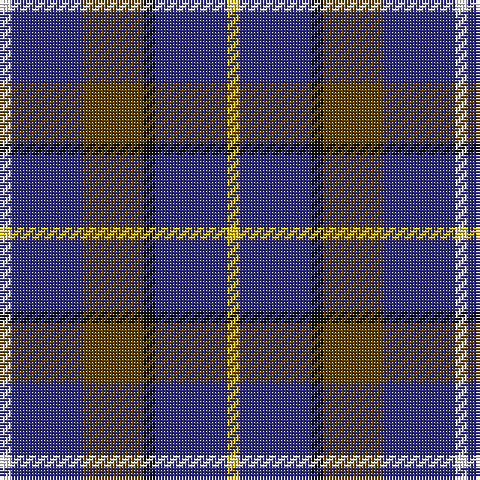

In pattern [WBGKBY](/patterns/wbgkby/).

This was sourced from register-of-tartans.  It is a [6 stripes tartan](/stripes/stripes6/).

Original link https://www.tartanregister.gov.uk/tartanDetails.aspx?ref=5228

## Attestations

This cloth appears in 2 source records; the oldest owns this page.

- 01/01/1964 — Ancient Atlantic (register-of-tartans, [record](https://www.tartanregister.gov.uk/tartanDetails.aspx?ref=5228))
- 1968 — Atlantic, Ancient (Fashion) (tartans-authority, [record](http://www.tartansauthority.com/tartan-ferret/display/3530/))

## Thread count
W/4 DBa24 T20 K4 DBa24 Ya/4

## Palette
Each colour and its ΔE from the base-6 reference it is a variant of.

| Colour | Shade | Base | ΔE (OKLab) |
|---|---|---|---|
| DB | <code style="background-color:#1C0070;">#1C0070</code> `#1C0070` | B <code style="background-color:#2C4084;">#2C4084</code> | 0.14 |
| DBa | <code style="background-color:#2C2C80;">#2C2C80</code> `#2C2C80` | B <code style="background-color:#2C4084;">#2C4084</code> | 0.05 |
| DR | <code style="background-color:#441800;">#441800</code> `#441800` | B <code style="background-color:#2C4084;">#2C4084</code> | 0.22 |
| DY | <code style="background-color:#D09800;">#D09800</code> `#D09800` | Y <code style="background-color:#E8C000;">#E8C000</code> | 0.11 |
| K | <code style="background-color:#101010;">#101010</code> `#101010` | K <code style="background-color:#000000;">#000000</code> | 0.17 |
| N | <code style="background-color:#C0C0C0;">#C0C0C0</code> `#C0C0C0` | W <code style="background-color:#F4F4F0;">#F4F4F0</code> | 0.16 |
| T | <code style="background-color:#604000;">#604000</code> `#604000` | G <code style="background-color:#006400;">#006400</code> | 0.14 |
| W | <code style="background-color:#FCFCFC;">#FCFCFC</code> `#FCFCFC` | W <code style="background-color:#F4F4F0;">#F4F4F0</code> | 0.03 |
| Y | <code style="background-color:#E8C000;">#E8C000</code> `#E8C000` | Y <code style="background-color:#E8C000;">#E8C000</code> | 0.00 |
| Ya | <code style="background-color:#E8C000;">#E8C000</code> `#E8C000` | Y <code style="background-color:#E8C000;">#E8C000</code> | 0.00 |

# Sample pattern

## Nearest tartans

The nearest existing variants by ΔTartan distance.

1. [Woodcock (2014)](/setts/s7/b60ba18g12ba18r8b34w10-b141e46-ba780078-g005020-rff0000-wfcfcfc/) — ΔT 0.89
1. [H.M.S. DUNCAN](/setts/s6/b6ba30k30r4k30ra6-baa00ff-ba656879-k000033-rff0000-raa07c40/) — ΔT 1.02
1. [Grainger (Name)](/setts/s7/b72r8b12g36b30k36w8-b2c2c80-g006818-k101010-rc80000-wfcfcfc/) — ΔT 1.04
1. [Baptist Union of Scotland](/setts/s6/w4b23g16k4b23y4-b1c0070-g048888-k101010-wc0c0c0-yd87c00/) — ΔT 1.08
1. [HMS Duncan (Military)](/setts/s6/b6r30ba30ra4ba30y6-b780078-ba003c64-r888888-rac80000-ycca800/) — ΔT 1.13
1. [Woodcock (2014)](/setts/s7/b60ba18g12ba18r8b34w10-b2c2c80-ba780078-g006818-rc80000-wfcfcfc/) — ΔT 1.24
1. [Massachusetts](/setts/s6/r4b48k20ra12b20w4-b304080-k000000-rc00020-ra906030-we0e0e0/) — ΔT 1.28
1. [United Services Planning Assoc Corporate Tartan Tartan Number: 2097. Earliest known date: 1991 The company for which the tartan is being made serves the U. S. Military Community and as such the tartan uses the colours of the Services. Navy blue for the Navy, red for the Marines, green for Army, and light blue for the Air Force and USPA. See products available Copyright © Blair Urquhart, Comrie, 2015](/setts/s8/b8g4w4g8ba20r4ba24y6-b2c2c80-ba202060-g003820-rc80000-we0e0e0-ye8c000/) — ΔT 1.29
1. [Davidson of Tulloch Clan Tartan Tartan Number: 1360. Earliest known date: 1984 The Davidsons or Clan Dhai maintained a constant battle for precedence within Clan Chattan. The Davidsons of Tulloch in Ross-shire are one of the main branches of the Davidson family. See products available Copyright © Blair Urquhart, Comrie, 2015](/setts/s5/r6b35k36b36w6-b2c2c80-k101010-rc80000-we0e0e0/) — ΔT 1.36
1. [MacHardy, Blue](/setts/s8/b12r6g52b52w8b52r10g10-b2c2c80-g006818-rc80000-wfcfcfc/) — ΔT 1.41

## Neighbour map

Every grey dot is one of 15726 variants placed by the first two principal components of the ΔTartan feature space (44% of its variance). Red is this tartan; blue dots are its nearest — click one to open its page.

<svg viewBox="0 0 640 380" role="img" style="max-width:100%;height:auto;border:1px solid #e0e0e0;border-radius:4px;display:block" xmlns="http://www.w3.org/2000/svg"><image href="/nn/cloud.v1.png" width="640" height="380"/><a href="/setts/s7/b60ba18g12ba18r8b34w10-b141e46-ba780078-g005020-rff0000-wfcfcfc/"><circle cx="267.1" cy="206.9" r="4" fill="#3465a4"><title>Woodcock (2014)</title></circle></a><a href="/setts/s6/b6ba30k30r4k30ra6-baa00ff-ba656879-k000033-rff0000-raa07c40/"><circle cx="249.6" cy="219.8" r="4" fill="#3465a4"><title>H.M.S. DUNCAN</title></circle></a><a href="/setts/s7/b72r8b12g36b30k36w8-b2c2c80-g006818-k101010-rc80000-wfcfcfc/"><circle cx="261.0" cy="210.6" r="4" fill="#3465a4"><title>Grainger (Name)</title></circle></a><a href="/setts/s6/w4b23g16k4b23y4-b1c0070-g048888-k101010-wc0c0c0-yd87c00/"><circle cx="272.4" cy="233.0" r="4" fill="#3465a4"><title>Baptist Union of Scotland</title></circle></a><a href="/setts/s6/b6r30ba30ra4ba30y6-b780078-ba003c64-r888888-rac80000-ycca800/"><circle cx="277.3" cy="228.6" r="4" fill="#3465a4"><title>HMS Duncan (Military)</title></circle></a><a href="/setts/s7/b60ba18g12ba18r8b34w10-b2c2c80-ba780078-g006818-rc80000-wfcfcfc/"><circle cx="280.0" cy="211.0" r="4" fill="#3465a4"><title>Woodcock (2014)</title></circle></a><a href="/setts/s6/r4b48k20ra12b20w4-b304080-k000000-rc00020-ra906030-we0e0e0/"><circle cx="314.7" cy="192.3" r="4" fill="#3465a4"><title>Massachusetts</title></circle></a><a href="/setts/s8/b8g4w4g8ba20r4ba24y6-b2c2c80-ba202060-g003820-rc80000-we0e0e0-ye8c000/"><circle cx="210.7" cy="195.5" r="4" fill="#3465a4"><title>United Services Planning Assoc Corporate Tartan Tartan Number: 2097. Earliest known date: 1991 The company for which the tartan is being made serves the U. S. Military Community and as such the tartan uses the colours of the Services. Navy blue for the Navy, red for the Marines, green for Army, and light blue for the Air Force and USPA. See products available Copyright © Blair Urquhart, Comrie, 2015</title></circle></a><a href="/setts/s5/r6b35k36b36w6-b2c2c80-k101010-rc80000-we0e0e0/"><circle cx="304.6" cy="271.4" r="4" fill="#3465a4"><title>Davidson of Tulloch Clan Tartan Tartan Number: 1360. Earliest known date: 1984 The Davidsons or Clan Dhai maintained a constant battle for precedence within Clan Chattan. The Davidsons of Tulloch in Ross-shire are one of the main branches of the Davidson family. See products available Copyright © Blair Urquhart, Comrie, 2015</title></circle></a><a href="/setts/s8/b12r6g52b52w8b52r10g10-b2c2c80-g006818-rc80000-wfcfcfc/"><circle cx="301.1" cy="212.6" r="4" fill="#3465a4"><title>MacHardy, Blue</title></circle></a><circle cx="270.2" cy="228.0" r="5" fill="#c00000"/></svg>

ID: /setts/s6/w4b24g20k4b24y4-b2c2c80-g604000-k101010-wfcfcfc-ye8c000/
