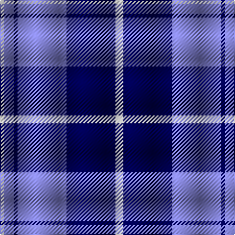

In pattern [WBBBBW](/patterns/wbbbbw/).

This was sourced from weddslist.  It is a [6 stripes tartan](/stripes/stripes6/).

Original link http://www.weddslist.com/cgi-bin/tartans/pg.pl?source=sts

## Thread count
LN/4 B10 DB4 B50 DB50 LN/8

## Palette
Each colour and its ΔE from the base-6 reference it is a variant of.

| Colour | Shade | Base | ΔE (OKLab) |
|---|---|---|---|
| B | <code style="background-color:#8080D0;">#8080D0</code> `#8080D0` | B <code style="background-color:#2A418A;">#2A418A</code> | 0.24 |
| DB | <code style="background-color:#000050;">#000050</code> `#000050` | B <code style="background-color:#2A418A;">#2A418A</code> | 0.21 |
| LN | <code style="background-color:#E0E0E0;">#E0E0E0</code> `#E0E0E0` | W <code style="background-color:#F7F7F7;">#F7F7F7</code> | 0.07 |

# Sample pattern

## Nearest tartans

The nearest existing variants by ΔTartan distance.

1. [Douglas Variation](/setts/s6/w4b25ba25b2ba5w2~b080848-ba0596fa-we0e0e0~x2/) — ΔT 0.87
1. [Int. Police Association (Official)](/setts/s7/b7r3b26ba2b2ba26y4~b1c0070-ba5c8ca8-rc80000-ye8c000~x2/) — ΔT 1.18
1. [Bannockbane Light Blue](/setts/s8/b2ba2b15w10b1ba15b2ba2~b2888c4-ba2c2c80-wfcfcfc~x2/) — ΔT 1.53
1. [Bannockbane Trade Tartan Tartan Number: 27. Earliest known date: 1984 A fashion pattern originating the early 1970s. Other variants of the design including this one appeared up to 1984. No place or family of the name is known and the pattern has no association with Bannockburn, or famous battle of 1314. Donald Broun may have been a designer with Edinburgh Woollen Mills. See products available Copyright © Blair Urquhart, Comrie, 2015](/setts/s8/b2ba2b15w10b1ba15b2ba2~b2888c4-ba2c2c80-we0e0e0~x2/) — ΔT 1.56
1. [Lytley alias Parsons Hunting (Personal)](/setts/s5/b10r1y1ba3y2~b0000cd-ba000080-rff0000-yffe600~x5/) — ΔT 1.58
1. [Lauder Primary School](/setts/s6/y2b9r2ba6y1r1~b003beb-ba000080-rff0000-yffe600~x4/) — ΔT 1.59
1. [St. Andrews, Earl of (District)](/setts/s6/b52ba28w5ba3w2ba10~b1870a4-ba1c0070-wf8f8f8~x2/) — ΔT 1.60
1. [Ikelman No 1](/setts/s6/w8k16w2b2w1k1~b304080-k000030-we0e0e0~x4/) — ΔT 1.61
1. [Eildon (1980)](/setts/s8/b42w2wa2w2b5ba12wa32b4~b000050-ba003478-w94acfc-wac8c8c8~x2/) — ΔT 1.62
1. [Queen Margaret University (Corporate](/setts/s7/b1w1b8w4b2w3k1~b2c2c80-k101010-we0e0e0~x6/) — ΔT 1.62

## Neighbour map

Every grey dot is one of 15726 variants placed by the first two principal components of the ΔTartan feature space (44% of its variance). Red is this tartan; blue dots are its nearest — click one to open its page.

<svg viewBox="0 0 640 380" role="img" style="max-width:100%;height:auto;border:1px solid #e0e0e0;border-radius:4px;display:block" xmlns="http://www.w3.org/2000/svg"><image href="/nn/cloud.v1.png" width="640" height="380"/><a href="/setts/s6/w4b25ba25b2ba5w2~b080848-ba0596fa-we0e0e0~x2/"><circle cx="270.4" cy="203.2" r="4" fill="#3465a4"><title>Douglas Variation</title></circle></a><a href="/setts/s7/b7r3b26ba2b2ba26y4~b1c0070-ba5c8ca8-rc80000-ye8c000~x2/"><circle cx="285.3" cy="180.8" r="4" fill="#3465a4"><title>Int. Police Association (Official)</title></circle></a><a href="/setts/s8/b2ba2b15w10b1ba15b2ba2~b2888c4-ba2c2c80-wfcfcfc~x2/"><circle cx="230.7" cy="179.7" r="4" fill="#3465a4"><title>Bannockbane Light Blue</title></circle></a><a href="/setts/s8/b2ba2b15w10b1ba15b2ba2~b2888c4-ba2c2c80-we0e0e0~x2/"><circle cx="243.6" cy="185.5" r="4" fill="#3465a4"><title>Bannockbane Trade Tartan Tartan Number: 27. Earliest known date: 1984 A fashion pattern originating the early 1970s. Other variants of the design including this one appeared up to 1984. No place or family of the name is known and the pattern has no association with Bannockburn, or famous battle of 1314. Donald Broun may have been a designer with Edinburgh Woollen Mills. See products available Copyright © Blair Urquhart, Comrie, 2015</title></circle></a><a href="/setts/s5/b10r1y1ba3y2~b0000cd-ba000080-rff0000-yffe600~x5/"><circle cx="279.7" cy="200.1" r="4" fill="#3465a4"><title>Lytley alias Parsons Hunting (Personal)</title></circle></a><a href="/setts/s6/y2b9r2ba6y1r1~b003beb-ba000080-rff0000-yffe600~x4/"><circle cx="174.5" cy="196.7" r="4" fill="#3465a4"><title>Lauder Primary School</title></circle></a><a href="/setts/s6/b52ba28w5ba3w2ba10~b1870a4-ba1c0070-wf8f8f8~x2/"><circle cx="358.2" cy="183.7" r="4" fill="#3465a4"><title>St. Andrews, Earl of (District)</title></circle></a><a href="/setts/s6/w8k16w2b2w1k1~b304080-k000030-we0e0e0~x4/"><circle cx="322.5" cy="181.7" r="4" fill="#3465a4"><title>Ikelman No 1</title></circle></a><a href="/setts/s8/b42w2wa2w2b5ba12wa32b4~b000050-ba003478-w94acfc-wac8c8c8~x2/"><circle cx="271.5" cy="139.9" r="4" fill="#3465a4"><title>Eildon (1980)</title></circle></a><a href="/setts/s7/b1w1b8w4b2w3k1~b2c2c80-k101010-we0e0e0~x6/"><circle cx="277.7" cy="214.5" r="4" fill="#3465a4"><title>Queen Margaret University (Corporate</title></circle></a><circle cx="279.5" cy="201.0" r="5" fill="#c00000"/></svg>

ID: /setts/s6/w4b25ba25b2ba5w2~b000050-ba8080d0-we0e0e0~x2/
