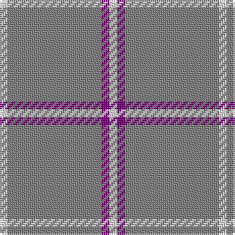

In pattern [WBGGGW](/patterns/wbgggw/).

This was sourced from weddslist.  It is a [6 stripes tartan](/stripes/stripes6/).

Original link http://www.weddslist.com/cgi-bin/tartans/pg.pl?source=sts

## Thread count
LN/4 N4 N16 N28 P4 LN/4

## Palette
Each colour and its ΔE from the base-6 reference it is a variant of.

| Colour | Shade | Base | ΔE (OKLab) |
|---|---|---|---|
| LN | <code style="background-color:#E0E0E0;">#E0E0E0</code> `#E0E0E0` | W <code style="background-color:#F4F4F0;">#F4F4F0</code> | 0.06 |
| N | <code style="background-color:#808080;">#808080</code> `#808080` | G <code style="background-color:#006400;">#006400</code> | 0.22 |
| P | <code style="background-color:#800080;">#800080</code> `#800080` | B <code style="background-color:#2C4084;">#2C4084</code> | 0.17 |

# Sample pattern

## Nearest tartans

The nearest existing variants by ΔTartan distance.

1. [Brooks Brothers Tattersall Camel](/setts/s5/b4y36b8y36r4-b202060-r880000-ya08858/) — ΔT 1.50
1. [Ballantyne Personal Tartan Tartan Number: 7563. Earliest known date: 2007 Andrew Ballantyne said, l finally decided to purchase a tartan of my own design. The first kilt was made for my father and he was very pleased with it. The fabric was designed online at House of Tartan and woven by Edgars, Perth. See products available Copyright © Blair Urquhart, Comrie, 2015](/setts/s5/r120g26r18ra16y8-g245024-r8c8c8c-ra701820-yc8a438/) — ΔT 2.06
1. [Oman, Sultanate of..](/setts/s6/g18b6g12b6g40y4-b5480b0-g604000-yf0c000/) — ΔT 2.19
1. [Oman RAF, Sultanate of (Military)](/setts/s6/g18b6g12b6g40y4-b5c8ca8-g604000-ye8c000/) — ΔT 2.23
1. [The Poulain League](/setts/s5/y12b76k6b76y12-b8080d0-k000000-yf0c000/) — ΔT 2.24
1. [Tokharian](/setts/s6/b4r20b4r20b8w4-b304080-r906030-we0e0e0/) — ΔT 2.31
1. [GulfMark](/setts/s5/b144ba12b24ba34w12-b3c4266-ba6675a0-wffffff/) — ΔT 2.32
1. [Ceredigion (Personal)](/setts/s5/y40b8y8b96r8-b5c5c5c-rb44440-yc0c4a0/) — ΔT 2.34
1. [Tokharion](/setts/s6/b4y20b4y20b8w4-b2c2c80-we0e0e0-ya08858/) — ΔT 2.43
1. [Sephardim (Corporate)](/setts/s5/w100b14w14ba14w36-b2c2c80-ba2888c4-we0e0e0/) — ΔT 2.44

## Neighbour map

Every grey dot is one of 15726 variants placed by the first two principal components of the ΔTartan feature space (44% of its variance). Red is this tartan; blue dots are its nearest — click one to open its page.

<svg viewBox="0 0 640 380" role="img" style="max-width:100%;height:auto;border:1px solid #e0e0e0;border-radius:4px;display:block" xmlns="http://www.w3.org/2000/svg"><image href="/nn/cloud.v1.png" width="640" height="380"/><a href="/setts/s5/b4y36b8y36r4-b202060-r880000-ya08858/"><circle cx="537.7" cy="248.8" r="4" fill="#3465a4"><title>Brooks Brothers Tattersall Camel</title></circle></a><a href="/setts/s5/r120g26r18ra16y8-g245024-r8c8c8c-ra701820-yc8a438/"><circle cx="506.7" cy="208.5" r="4" fill="#3465a4"><title>Ballantyne Personal Tartan Tartan Number: 7563. Earliest known date: 2007 Andrew Ballantyne said, l finally decided to purchase a tartan of my own design. The first kilt was made for my father and he was very pleased with it. The fabric was designed online at House of Tartan and woven by Edgars, Perth. See products available Copyright © Blair Urquhart, Comrie, 2015</title></circle></a><a href="/setts/s6/g18b6g12b6g40y4-b5480b0-g604000-yf0c000/"><circle cx="561.7" cy="253.8" r="4" fill="#3465a4"><title>Oman, Sultanate of..</title></circle></a><a href="/setts/s6/g18b6g12b6g40y4-b5c8ca8-g604000-ye8c000/"><circle cx="561.2" cy="253.5" r="4" fill="#3465a4"><title>Oman RAF, Sultanate of (Military)</title></circle></a><a href="/setts/s5/y12b76k6b76y12-b8080d0-k000000-yf0c000/"><circle cx="542.6" cy="226.1" r="4" fill="#3465a4"><title>The Poulain League</title></circle></a><a href="/setts/s6/b4r20b4r20b8w4-b304080-r906030-we0e0e0/"><circle cx="395.9" cy="274.1" r="4" fill="#3465a4"><title>Tokharian</title></circle></a><a href="/setts/s5/b144ba12b24ba34w12-b3c4266-ba6675a0-wffffff/"><circle cx="511.5" cy="233.0" r="4" fill="#3465a4"><title>GulfMark</title></circle></a><a href="/setts/s5/y40b8y8b96r8-b5c5c5c-rb44440-yc0c4a0/"><circle cx="433.7" cy="217.4" r="4" fill="#3465a4"><title>Ceredigion (Personal)</title></circle></a><a href="/setts/s6/b4y20b4y20b8w4-b2c2c80-we0e0e0-ya08858/"><circle cx="362.0" cy="260.0" r="4" fill="#3465a4"><title>Tokharion</title></circle></a><a href="/setts/s5/w100b14w14ba14w36-b2c2c80-ba2888c4-we0e0e0/"><circle cx="516.5" cy="230.8" r="4" fill="#3465a4"><title>Sephardim (Corporate)</title></circle></a><circle cx="527.1" cy="251.5" r="5" fill="#c00000"/></svg>

ID: /setts/s6/w4b4g28g16g4w4-b800080-g808080-we0e0e0/
