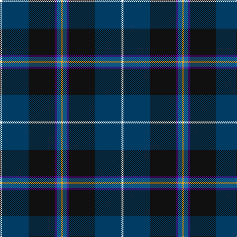

In pattern [WBKBBY](/patterns/wbkbby/).

This was sourced from register-of-tartans.  It is a [6 stripes tartan](/stripes/stripes6/).

Original link https://www.tartanregister.gov.uk/tartanDetails.aspx?ref=11049

## Register references

External register numbers recorded for this tartan.

- Scottish Register of Tartans: [11049](https://www.tartanregister.gov.uk/tartanDetails.aspx?ref=11049)

## Thread count
W/4 DB54 K53 P4 B8 Y/4

## Palette
Each colour and its ΔE from the base-6 reference it is a variant of.

| Colour | Shade | Base | ΔE (OKLab) |
|---|---|---|---|
| B | <code style="background-color:#1870A4;">#1870A4</code> `#1870A4` | B <code style="background-color:#2A418A;">#2A418A</code> | 0.13 |
| DB | <code style="background-color:#003C64;">#003C64</code> `#003C64` | B <code style="background-color:#2A418A;">#2A418A</code> | 0.08 |
| K | <code style="background-color:#101010;">#101010</code> `#101010` | K <code style="background-color:#000000;">#000000</code> | 0.17 |
| P | <code style="background-color:#5A008C;">#5A008C</code> `#5A008C` | B <code style="background-color:#2A418A;">#2A418A</code> | 0.13 |
| W | <code style="background-color:#FFFFFF;">#FFFFFF</code> `#FFFFFF` | W <code style="background-color:#F7F7F7;">#F7F7F7</code> | 0.02 |
| Y | <code style="background-color:#E0A126;">#E0A126</code> `#E0A126` | Y <code style="background-color:#F2BF00;">#F2BF00</code> | 0.08 |

# Sample pattern

## Nearest tartans

The nearest existing variants by ΔTartan distance.

1. [Pipers' Trail, The](/setts/s6/w4b54k53ba4bb8y4~b2c2c80-ba780078-bb5c8ca8-k101010-wfcfcfc-yfccc00/) — ΔT 0.86
1. [Loch Long One Design (Corporate)](/setts/s6/y4k28r2b22ba8g3~b2c2c80-ba1474b4-g604000-k101010-rc80000-ybc8c00~x2/) — ΔT 0.89
1. [Atlantic Police Academy (Corporate)](/setts/s6/k33y4w3b33r2g2~b2c2c80-g006818-k101010-rc80000-we0e0e0-ye8c000~x2/) — ΔT 0.90
1. [Canadian Centennial](/setts/s8/r3w6r2g32b36k2b4y2~b202060-g003820-k101010-rc80000-we0e0e0-yd09800~x2/) — ΔT 0.97
1. [Italian National](/setts/s6/r3w2g5k35b40y3~b2c2c80-g289c18-k101010-rc80000-wfcfcfc-ye8c000~x2/) — ΔT 0.99
1. [Atlantic Police Academy](/setts/s6/k33y4w3b33r2g2~b000064-g005020-k101010-rdc0000-we0e0e0-yfadc00~x2/) — ΔT 0.99
1. [Milne-Murtagh (2009)](/setts/s7/r5g2k30ga26gb2ga2ka4~g6e7f86-ga696969-gb6b5613-k101010-ka08033b-rc33f7b~x2/) — ΔT 1.11
1. [Heirloom Dark Alba (Fashion)](/setts/s9/k4y2k34b10ya4b4ba4b23w3~b202060-ba780078-k101010-we0e0e0-ybc8c00-yaa0a0a0~x2/) — ΔT 1.11
1. [New England (Fashion)](/setts/s6/k2w1k12g5b11r1~b2c2c80-g006818-k101010-rc80000-we0e0e0~x2/) — ΔT 1.16
1. [Scottish Italian](/setts/s8/b11ba5g4w3r3k16ba28b2~b1474b4-ba202060-g006818-k101010-rc80000-wfcfcfc~x2/) — ΔT 1.18

## Neighbour map

Every grey dot is one of 15726 variants placed by the first two principal components of the ΔTartan feature space (44% of its variance). Red is this tartan; blue dots are its nearest — click one to open its page.

<svg viewBox="0 0 640 380" role="img" style="max-width:100%;height:auto;border:1px solid #e0e0e0;border-radius:4px;display:block" xmlns="http://www.w3.org/2000/svg"><image href="/nn/cloud.v1.png" width="640" height="380"/><a href="/setts/s6/w4b54k53ba4bb8y4~b2c2c80-ba780078-bb5c8ca8-k101010-wfcfcfc-yfccc00/"><circle cx="229.3" cy="156.5" r="4" fill="#3465a4"><title>Pipers' Trail, The</title></circle></a><a href="/setts/s6/y4k28r2b22ba8g3~b2c2c80-ba1474b4-g604000-k101010-rc80000-ybc8c00~x2/"><circle cx="213.3" cy="172.9" r="4" fill="#3465a4"><title>Loch Long One Design (Corporate)</title></circle></a><a href="/setts/s6/k33y4w3b33r2g2~b2c2c80-g006818-k101010-rc80000-we0e0e0-ye8c000~x2/"><circle cx="241.9" cy="146.9" r="4" fill="#3465a4"><title>Atlantic Police Academy (Corporate)</title></circle></a><a href="/setts/s8/r3w6r2g32b36k2b4y2~b202060-g003820-k101010-rc80000-we0e0e0-yd09800~x2/"><circle cx="260.6" cy="128.8" r="4" fill="#3465a4"><title>Canadian Centennial</title></circle></a><a href="/setts/s6/r3w2g5k35b40y3~b2c2c80-g289c18-k101010-rc80000-wfcfcfc-ye8c000~x2/"><circle cx="257.5" cy="141.5" r="4" fill="#3465a4"><title>Italian National</title></circle></a><a href="/setts/s6/k33y4w3b33r2g2~b000064-g005020-k101010-rdc0000-we0e0e0-yfadc00~x2/"><circle cx="236.1" cy="149.8" r="4" fill="#3465a4"><title>Atlantic Police Academy</title></circle></a><a href="/setts/s7/r5g2k30ga26gb2ga2ka4~g6e7f86-ga696969-gb6b5613-k101010-ka08033b-rc33f7b~x2/"><circle cx="240.9" cy="144.9" r="4" fill="#3465a4"><title>Milne-Murtagh (2009)</title></circle></a><a href="/setts/s9/k4y2k34b10ya4b4ba4b23w3~b202060-ba780078-k101010-we0e0e0-ybc8c00-yaa0a0a0~x2/"><circle cx="254.9" cy="141.0" r="4" fill="#3465a4"><title>Heirloom Dark Alba (Fashion)</title></circle></a><a href="/setts/s6/k2w1k12g5b11r1~b2c2c80-g006818-k101010-rc80000-we0e0e0~x2/"><circle cx="235.3" cy="200.0" r="4" fill="#3465a4"><title>New England (Fashion)</title></circle></a><a href="/setts/s8/b11ba5g4w3r3k16ba28b2~b1474b4-ba202060-g006818-k101010-rc80000-wfcfcfc~x2/"><circle cx="205.0" cy="152.1" r="4" fill="#3465a4"><title>Scottish Italian</title></circle></a><circle cx="242.3" cy="165.7" r="5" fill="#c00000"/></svg>

ID: /setts/s6/w4b54k53ba4bb8y4~b003c64-ba5a008c-bb1870a4-k101010-wffffff-ye0a126/
