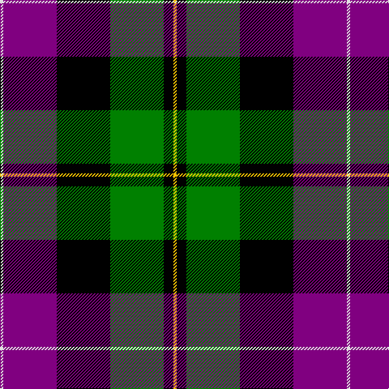

In pattern [WBKGKY](/patterns/wbkgky/).

This was sourced from weddslist.  It is a [6 stripes tartan](/stripes/stripes6/).

Original link http://www.weddslist.com/cgi-bin/tartans/pg.pl?source=sts

## Thread count
LN/4 P66 K66 G66 K12 Y/4

## Palette
Each colour and its ΔE from the base-6 reference it is a variant of.

| Colour | Shade | Base | ΔE (OKLab) |
|---|---|---|---|
| G | <code style="background-color:#008000;">#008000</code> `#008000` | G <code style="background-color:#006400;">#006400</code> | 0.09 |
| K | <code style="background-color:#000000;">#000000</code> `#000000` | K <code style="background-color:#000000;">#000000</code> | 0.00 |
| LN | <code style="background-color:#E0E0E0;">#E0E0E0</code> `#E0E0E0` | W <code style="background-color:#F4F4F0;">#F4F4F0</code> | 0.06 |
| P | <code style="background-color:#800080;">#800080</code> `#800080` | B <code style="background-color:#2C4084;">#2C4084</code> | 0.17 |
| Y | <code style="background-color:#F0C000;">#F0C000</code> `#F0C000` | Y <code style="background-color:#E8C000;">#E8C000</code> | 0.01 |

# Sample pattern

## Nearest tartans

The nearest existing variants by ΔTartan distance.

1. [MacRae, hunting](/setts/s9/g28k4g8r4g8k28b30k2w6-b800080-g006030-k000000-r900030-we0e0e0/) — ΔT 0.94
1. [MacWilliam](/setts/s6/r4g24k20ra2b32ra4-b304080-g008000-k000000-r806050-rac00000/) — ΔT 1.02
1. [United Distillers (Corporate)](/setts/s6/y4k28y2ka28y28ya4-k000000-ka101010-y948860-yae8c000/) — ΔT 1.02
1. [Wilson's, No 221](/setts/s6/b2ba28r4k28g28r2-b5480b0-ba304080-g008000-k000000-rc00000/) — ΔT 1.07
1. [Russell, or Mitchell or Hunter or Galbraith](/setts/s6/k4g24k24r2b24w4-b304080-g008000-k000000-rc00000-we0e0e0/) — ΔT 1.11
1. [MacCaskill](/setts/s7/k4r2g30k30b30y2k4-b304080-g008000-k000000-rc00000-yf0c000/) — ΔT 1.12
1. [MacPhail, hunting](/setts/s6/r4b46k28g32k4w4-b304080-g008000-k000000-rc00000-we0e0e0/) — ΔT 1.15
1. [Colquhoun](/setts/s7/b12k6b42k46w6g48r6-b800080-g008000-k000000-rc00000-we0e0e0/) — ΔT 1.22
1. [Regent](/setts/s7/b36k14g10r8g14k2y4-b800080-g008000-k000000-rc00000-yf0c000/) — ΔT 1.24
1. [MacNeil 5](/setts/s6/w4b48k48g48k20y4-b304080-g008000-k000000-we0e0e0-yf0c000/) — ΔT 1.25

## Neighbour map

Every grey dot is one of 15726 variants placed by the first two principal components of the ΔTartan feature space (44% of its variance). Red is this tartan; blue dots are its nearest — click one to open its page.

<svg viewBox="0 0 640 380" role="img" style="max-width:100%;height:auto;border:1px solid #e0e0e0;border-radius:4px;display:block" xmlns="http://www.w3.org/2000/svg"><image href="/nn/cloud.v1.png" width="640" height="380"/><a href="/setts/s9/g28k4g8r4g8k28b30k2w6-b800080-g006030-k000000-r900030-we0e0e0/"><circle cx="160.5" cy="153.2" r="4" fill="#3465a4"><title>MacRae, hunting</title></circle></a><a href="/setts/s6/r4g24k20ra2b32ra4-b304080-g008000-k000000-r806050-rac00000/"><circle cx="166.0" cy="177.6" r="4" fill="#3465a4"><title>MacWilliam</title></circle></a><a href="/setts/s6/y4k28y2ka28y28ya4-k000000-ka101010-y948860-yae8c000/"><circle cx="176.8" cy="193.0" r="4" fill="#3465a4"><title>United Distillers (Corporate)</title></circle></a><a href="/setts/s6/b2ba28r4k28g28r2-b5480b0-ba304080-g008000-k000000-rc00000/"><circle cx="137.1" cy="180.1" r="4" fill="#3465a4"><title>Wilson's, No 221</title></circle></a><a href="/setts/s6/k4g24k24r2b24w4-b304080-g008000-k000000-rc00000-we0e0e0/"><circle cx="132.3" cy="189.4" r="4" fill="#3465a4"><title>Russell, or Mitchell or Hunter or Galbraith</title></circle></a><a href="/setts/s7/k4r2g30k30b30y2k4-b304080-g008000-k000000-rc00000-yf0c000/"><circle cx="173.4" cy="165.8" r="4" fill="#3465a4"><title>MacCaskill</title></circle></a><a href="/setts/s6/r4b46k28g32k4w4-b304080-g008000-k000000-rc00000-we0e0e0/"><circle cx="162.8" cy="185.0" r="4" fill="#3465a4"><title>MacPhail, hunting</title></circle></a><a href="/setts/s7/b12k6b42k46w6g48r6-b800080-g008000-k000000-rc00000-we0e0e0/"><circle cx="118.0" cy="185.9" r="4" fill="#3465a4"><title>Colquhoun</title></circle></a><a href="/setts/s7/b36k14g10r8g14k2y4-b800080-g008000-k000000-rc00000-yf0c000/"><circle cx="183.1" cy="150.5" r="4" fill="#3465a4"><title>Regent</title></circle></a><a href="/setts/s6/w4b48k48g48k20y4-b304080-g008000-k000000-we0e0e0-yf0c000/"><circle cx="153.8" cy="197.7" r="4" fill="#3465a4"><title>MacNeil 5</title></circle></a><circle cx="166.6" cy="167.9" r="5" fill="#c00000"/></svg>

ID: /setts/s6/w4b66k66g66k12y4-b800080-g008000-k000000-we0e0e0-yf0c000/
