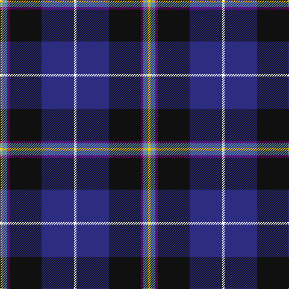

In pattern [WBKBBY](/stripes/wbkbby/).

This was sourced from tartans-authority.  It is a [6 stripe tartan](/stripes/stripes6/).

Original link http://www.tartansauthority.com/tartan-ferret/display/11049/

## Thread count
Y/4 B8 P4 K53 DB54 W/4

## Palette
Each colour and its ΔE from the base-6 reference it is a variant of.

| Colour | Shade | Base | ΔE (OKLab) |
|---|---|---|---|
| B | <code style="background-color:#5C8CA8;">#5C8CA8</code> `#5C8CA8` | B <code style="background-color:#2A418A;">#2A418A</code> | 0.23 |
| DB | <code style="background-color:#2C2C80;">#2C2C80</code> `#2C2C80` | B <code style="background-color:#2A418A;">#2A418A</code> | 0.06 |
| K | <code style="background-color:#101010;">#101010</code> `#101010` | K <code style="background-color:#000000;">#000000</code> | 0.17 |
| P | <code style="background-color:#780078;">#780078</code> `#780078` | B <code style="background-color:#2A418A;">#2A418A</code> | 0.17 |
| W | <code style="background-color:#FCFCFC;">#FCFCFC</code> `#FCFCFC` | W <code style="background-color:#F7F7F7;">#F7F7F7</code> | 0.01 |
| Y | <code style="background-color:#FCCC00;">#FCCC00</code> `#FCCC00` | Y <code style="background-color:#F2BF00;">#F2BF00</code> | 0.04 |

# Sample pattern

## Nearest tartans

The nearest existing variants by ΔTartan distance.

1. [Atlantic Police Academy (Corporate)](/setts/s6/k33ly4w3db33r2g2~x2/) — ΔT 0.45
1. [Italian National](/setts/s6/r3w2g5k35db40ly3~x2/) — ΔT 0.71
1. [Atlantic Police Academy](/setts/s6/k33ly4w3db33r2dg2~x2/) — ΔT 0.71
1. [Pipers' Trail, The](/setts/s6/w4dt54k53dp4b8lo4/) — ΔT 0.86
1. [LLoyd of Astargus Canadian Family Tartan Tartan Number: 5771. Earliest known date: 2001 The designer of this tartan is of Welsh & Scottish blood and sees this tartan as being appropriate for any Lloyds with Scottish blood. The 'Astargus' derives from Gaelic - 'Astar' being said to mean "travelling or making distance" and 'gus' meaning "until I come back" See products available Copyright © Blair Urquhart, Comrie, 2015](/setts/s6/r3db38k13w3o20ly2~x2/) — ΔT 1.02
1. [Scottish Italian](/setts/s8/b11db5g4w3r3k16db28b2~x2/) — ΔT 1.05
1. [Loch Long One Design (Corporate)](/setts/s6/lo4k28r2db22b8dy3~x2/) — ΔT 1.06
1. [US Forces (Thurso) Regimental Tartan Tartan Number: 549. Earliest known date: 1986 Originally listed as MacNeil, this sett was identified by Ken Dalgliesh, weaver in Selkirk, in 1999. See products available Copyright © Blair Urquhart, Comrie, 2015](/setts/s7/db35r2k16ly2t25w2t6~x2/) — ΔT 1.15
1. [Hatfield & Mize (Personal)](/setts/s6/dg10w2dt10lo5db35r6~x2/) — ΔT 1.16
1. [Ferster, James Carney](/setts/s6/t12dp35lr4w3k11k5~x2/) — ΔT 1.17

## Neighbour map

Every grey dot is one of 14299 variants placed by the first two principal components of the ΔTartan feature space (44% of its variance). Red is this tartan; blue dots are its nearest — click one to open its page.

<svg viewBox="0 0 640 380" role="img" style="max-width:100%;height:auto;border:1px solid #e0e0e0;border-radius:4px;display:block" xmlns="http://www.w3.org/2000/svg"><image href="/nn/cloud.v1.png" width="640" height="380"/><a href="/setts/s6/k33ly4w3db33r2g2~x2/"><circle cx="245.2" cy="148.5" r="4" fill="#3465a4"><title>Atlantic Police Academy (Corporate)</title></circle></a><a href="/setts/s6/r3w2g5k35db40ly3~x2/"><circle cx="260.7" cy="143.3" r="4" fill="#3465a4"><title>Italian National</title></circle></a><a href="/setts/s6/k33ly4w3db33r2dg2~x2/"><circle cx="239.9" cy="151.6" r="4" fill="#3465a4"><title>Atlantic Police Academy</title></circle></a><a href="/setts/s6/w4dt54k53dp4b8lo4/"><circle cx="245.8" cy="170.1" r="4" fill="#3465a4"><title>Pipers' Trail, The</title></circle></a><a href="/setts/s6/r3db38k13w3o20ly2~x2/"><circle cx="236.9" cy="145.6" r="4" fill="#3465a4"><title>LLoyd of Astargus Canadian Family Tartan Tartan Number: 5771. Earliest known date: 2001 The designer of this tartan is of Welsh &amp; Scottish blood and sees this tartan as being appropriate for any Lloyds with Scottish blood. The 'Astargus' derives from Gaelic - 'Astar' being said to mean &quot;travelling or making distance&quot; and 'gus' meaning &quot;until I come back&quot; See products available Copyright © Blair Urquhart, Comrie, 2015</title></circle></a><a href="/setts/s8/b11db5g4w3r3k16db28b2~x2/"><circle cx="208.4" cy="156.1" r="4" fill="#3465a4"><title>Scottish Italian</title></circle></a><a href="/setts/s6/lo4k28r2db22b8dy3~x2/"><circle cx="216.4" cy="177.8" r="4" fill="#3465a4"><title>Loch Long One Design (Corporate)</title></circle></a><a href="/setts/s7/db35r2k16ly2t25w2t6~x2/"><circle cx="198.9" cy="146.7" r="4" fill="#3465a4"><title>US Forces (Thurso) Regimental Tartan Tartan Number: 549. Earliest known date: 1986 Originally listed as MacNeil, this sett was identified by Ken Dalgliesh, weaver in Selkirk, in 1999. See products available Copyright © Blair Urquhart, Comrie, 2015</title></circle></a><a href="/setts/s6/dg10w2dt10lo5db35r6~x2/"><circle cx="254.4" cy="156.5" r="4" fill="#3465a4"><title>Hatfield &amp; Mize (Personal)</title></circle></a><a href="/setts/s6/t12dp35lr4w3k11k5~x2/"><circle cx="222.8" cy="167.1" r="4" fill="#3465a4"><title>Ferster, James Carney</title></circle></a><circle cx="232.7" cy="158.7" r="5" fill="#c00000"/></svg>

ID: /setts/s6/w4db54k53dp4t8ly4/
