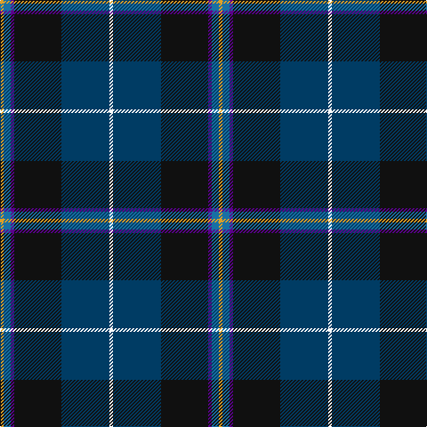

In pattern [WBKBBY](/stripes/wbkbby/).

This was sourced from register-of-tartans.  It is a [6 stripe tartan](/stripes/stripes6/).

Original link https://www.tartanregister.gov.uk/tartanDetails.aspx?ref=11049

## Register references

External register numbers recorded for this tartan.

- Scottish Register of Tartans: [11049](https://www.tartanregister.gov.uk/tartanDetails.aspx?ref=11049)

## Thread count
Y/4 B8 P4 K53 DB54 W/4

## Palette
Each colour and its ΔE from the base-6 reference it is a variant of.

| Colour | Shade | Base | ΔE (OKLab) |
|---|---|---|---|
| B | <code style="background-color:#1870A4;">#1870A4</code> `#1870A4` | B <code style="background-color:#2A418A;">#2A418A</code> | 0.13 |
| DB | <code style="background-color:#003C64;">#003C64</code> `#003C64` | B <code style="background-color:#2A418A;">#2A418A</code> | 0.08 |
| K | <code style="background-color:#101010;">#101010</code> `#101010` | K <code style="background-color:#000000;">#000000</code> | 0.17 |
| P | <code style="background-color:#5A008C;">#5A008C</code> `#5A008C` | B <code style="background-color:#2A418A;">#2A418A</code> | 0.13 |
| W | <code style="background-color:#FFFFFF;">#FFFFFF</code> `#FFFFFF` | W <code style="background-color:#F7F7F7;">#F7F7F7</code> | 0.02 |
| Y | <code style="background-color:#E0A126;">#E0A126</code> `#E0A126` | Y <code style="background-color:#F2BF00;">#F2BF00</code> | 0.08 |

# Sample pattern

## Nearest tartans

The nearest existing variants by ΔTartan distance.

1. [Pipers' Trail, The](/setts/s6/w4db54k53dp4t8ly4/) — ΔT 0.86
1. [Loch Long One Design (Corporate)](/setts/s6/lo4k28r2db22b8dy3~x2/) — ΔT 0.90
1. [Atlantic Police Academy (Corporate)](/setts/s6/k33ly4w3db33r2g2~x2/) — ΔT 0.90
1. [Canadian Centennial](/setts/s8/r3w6r2dg32db36k2db4lo2~x2/) — ΔT 0.97
1. [Atlantic Police Academy](/setts/s6/k33ly4w3db33r2dg2~x2/) — ΔT 0.99
1. [Italian National](/setts/s6/r3w2g5k35db40ly3~x2/) — ΔT 0.99
1. [Milne-Murtagh (2009)](/setts/s7/m5y2k30y26y2y2k4~x2/) — ΔT 1.11
1. [Heirloom Dark Alba (Fashion)](/setts/s9/k4lo2k34db10lr4db4dp4db23w3~x2/) — ΔT 1.11
1. [New England (Fashion)](/setts/s6/k2w1k12g5db11r1~x2/) — ΔT 1.16
1. [Scottish Italian](/setts/s8/b11db5g4w3r3k16db28b2~x2/) — ΔT 1.17

## Neighbour map

Every grey dot is one of 14299 variants placed by the first two principal components of the ΔTartan feature space (44% of its variance). Red is this tartan; blue dots are its nearest — click one to open its page.

<svg viewBox="0 0 640 380" role="img" style="max-width:100%;height:auto;border:1px solid #e0e0e0;border-radius:4px;display:block" xmlns="http://www.w3.org/2000/svg"><image href="/nn/cloud.v1.png" width="640" height="380"/><a href="/setts/s6/w4db54k53dp4t8ly4/"><circle cx="232.7" cy="158.7" r="4" fill="#3465a4"><title>Pipers' Trail, The</title></circle></a><a href="/setts/s6/lo4k28r2db22b8dy3~x2/"><circle cx="216.4" cy="177.8" r="4" fill="#3465a4"><title>Loch Long One Design (Corporate)</title></circle></a><a href="/setts/s6/k33ly4w3db33r2g2~x2/"><circle cx="245.2" cy="148.5" r="4" fill="#3465a4"><title>Atlantic Police Academy (Corporate)</title></circle></a><a href="/setts/s8/r3w6r2dg32db36k2db4lo2~x2/"><circle cx="263.7" cy="132.6" r="4" fill="#3465a4"><title>Canadian Centennial</title></circle></a><a href="/setts/s6/k33ly4w3db33r2dg2~x2/"><circle cx="239.9" cy="151.6" r="4" fill="#3465a4"><title>Atlantic Police Academy</title></circle></a><a href="/setts/s6/r3w2g5k35db40ly3~x2/"><circle cx="260.7" cy="143.3" r="4" fill="#3465a4"><title>Italian National</title></circle></a><a href="/setts/s7/m5y2k30y26y2y2k4~x2/"><circle cx="243.5" cy="148.3" r="4" fill="#3465a4"><title>Milne-Murtagh (2009)</title></circle></a><a href="/setts/s9/k4lo2k34db10lr4db4dp4db23w3~x2/"><circle cx="258.0" cy="145.9" r="4" fill="#3465a4"><title>Heirloom Dark Alba (Fashion)</title></circle></a><a href="/setts/s6/k2w1k12g5db11r1~x2/"><circle cx="238.4" cy="203.6" r="4" fill="#3465a4"><title>New England (Fashion)</title></circle></a><a href="/setts/s8/b11db5g4w3r3k16db28b2~x2/"><circle cx="208.4" cy="156.1" r="4" fill="#3465a4"><title>Scottish Italian</title></circle></a><circle cx="245.8" cy="170.1" r="5" fill="#c00000"/></svg>

ID: /setts/s6/w4dt54k53dp4b8lo4/
