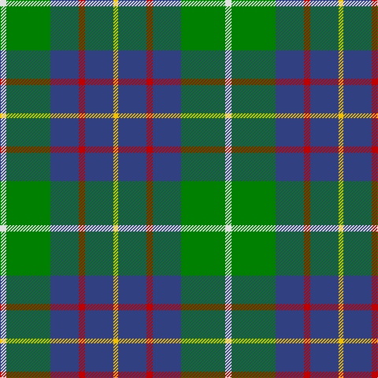

In pattern [WGBRBY](/patterns/wgbrby/).

This was sourced from weddslist.  It is a [6 stripes tartan](/stripes/stripes6/).

Original link http://www.weddslist.com/cgi-bin/tartans/pg.pl?source=sts

## Thread count
LN/8 G56 B36 R8 B36 Y/6

## Palette
Each colour and its ΔE from the base-6 reference it is a variant of.

| Colour | Shade | Base | ΔE (OKLab) |
|---|---|---|---|
| B | <code style="background-color:#304080;">#304080</code> `#304080` | B <code style="background-color:#2A418A;">#2A418A</code> | 0.02 |
| G | <code style="background-color:#008000;">#008000</code> `#008000` | G <code style="background-color:#006100;">#006100</code> | 0.10 |
| LN | <code style="background-color:#E0E0E0;">#E0E0E0</code> `#E0E0E0` | W <code style="background-color:#F7F7F7;">#F7F7F7</code> | 0.07 |
| R | <code style="background-color:#C00000;">#C00000</code> `#C00000` | R <code style="background-color:#CC0000;">#CC0000</code> | 0.03 |
| Y | <code style="background-color:#F0C000;">#F0C000</code> `#F0C000` | Y <code style="background-color:#F2BF00;">#F2BF00</code> | 0.00 |

# Sample pattern

## Nearest tartans

The nearest existing variants by ΔTartan distance.

1. [Inglis Family Tartan Tartan Number: 1798. Earliest known date: 1930-50 Inglis, or Ingles, tartan is a variation of the MacIntyre tartan recognised by Lord Lyon. The green stripe of the MacIntyre is replaced by yellow in the Inglis tartan. The pattern comes from the collection of the late James MacKinlay which he called MacIntyre or Inglis. MacKinlay collected samples of tartan between 1930 and 1950 but did not provide details of the origins of the specimens. The original MacIntyre tartan can be seen on a doublet at the Kingussie museum dated 1800. It was registered in the Public Register of All Arms and Bearings in 1955. See products available Copyright © Blair Urquhart, Comrie, 2015](/setts/s6/w4g28b18r4b18y3x2~b2c2c80-g006818-rc80000-we0e0e0-ye8c000/) — ΔT 0.72
1. [MacIntyre, Inglis](/setts/s6/w4g28b18r4b18y3x2~b2c2c80-g006818-rc80000-wf8f8f8-ye8c000/) — ΔT 0.76
1. [Turnbull, hunting](/setts/s5/r7y3g28b28w3x2~b304080-g008000-r800000-we0e0e0-yf0c000/) — ΔT 0.88
1. [Bahamas](/setts/s8/b8y2b22g6r2w10g12b3x2~b40647c-g004800-rc80000-wc8c8c8-y9c9c00/) — ΔT 0.93
1. [Douglas](/setts/s5/k1b1g8ba8w1x4~b5480b0-ba304080-g008000-k000000-we0e0e0/) — ΔT 0.95
1. [Turnbull Hunting (Name)](/setts/s5/r2y1g10b10w1x6~b2c2c80-g006818-rc80000-we0e0e0-ye8c000/) — ΔT 0.95
1. [Irving of Glentulchan](/setts/s6/r1g9b9k1b1w1x6~b304080-g008000-k000000-rc00000-we0e0e0/) — ΔT 0.97
1. [Irving of Bonshaw Tower](/setts/s6/r1g1k1g9b9w1x6~b304080-g008000-k000000-rc00000-we0e0e0/) — ΔT 1.00
1. [Alvis, of Lee](/setts/s5/b9w4g36ba36r4~b000050-ba5480b0-g008000-rc00000-we0e0e0/) — ΔT 1.02
1. [Inglis (Name)](/setts/s6/y4g24b10r3b12ya4x2~b1c0070-g006818-rc80000-yb8b8b8-yad09800/) — ΔT 1.02

## Neighbour map

Every grey dot is one of 15726 variants placed by the first two principal components of the ΔTartan feature space (44% of its variance). Red is this tartan; blue dots are its nearest — click one to open its page.

<svg viewBox="0 0 640 380" role="img" style="max-width:100%;height:auto;border:1px solid #e0e0e0;border-radius:4px;display:block" xmlns="http://www.w3.org/2000/svg"><image href="/nn/cloud.v1.png" width="640" height="380"/><a href="/setts/s6/w4g28b18r4b18y3x2~b2c2c80-g006818-rc80000-we0e0e0-ye8c000/"><circle cx="226.0" cy="208.0" r="4" fill="#3465a4"><title>Inglis Family Tartan Tartan Number: 1798. Earliest known date: 1930-50 Inglis, or Ingles, tartan is a variation of the MacIntyre tartan recognised by Lord Lyon. The green stripe of the MacIntyre is replaced by yellow in the Inglis tartan. The pattern comes from the collection of the late James MacKinlay which he called MacIntyre or Inglis. MacKinlay collected samples of tartan between 1930 and 1950 but did not provide details of the origins of the specimens. The original MacIntyre tartan can be seen on a doublet at the Kingussie museum dated 1800. It was registered in the Public Register of All Arms and Bearings in 1955. See products available Copyright © Blair Urquhart, Comrie, 2015</title></circle></a><a href="/setts/s6/w4g28b18r4b18y3x2~b2c2c80-g006818-rc80000-wf8f8f8-ye8c000/"><circle cx="221.0" cy="205.9" r="4" fill="#3465a4"><title>MacIntyre, Inglis</title></circle></a><a href="/setts/s5/r7y3g28b28w3x2~b304080-g008000-r800000-we0e0e0-yf0c000/"><circle cx="204.2" cy="206.9" r="4" fill="#3465a4"><title>Turnbull, hunting</title></circle></a><a href="/setts/s8/b8y2b22g6r2w10g12b3x2~b40647c-g004800-rc80000-wc8c8c8-y9c9c00/"><circle cx="246.8" cy="192.3" r="4" fill="#3465a4"><title>Bahamas</title></circle></a><a href="/setts/s5/k1b1g8ba8w1x4~b5480b0-ba304080-g008000-k000000-we0e0e0/"><circle cx="206.9" cy="210.0" r="4" fill="#3465a4"><title>Douglas</title></circle></a><a href="/setts/s5/r2y1g10b10w1x6~b2c2c80-g006818-rc80000-we0e0e0-ye8c000/"><circle cx="217.9" cy="201.2" r="4" fill="#3465a4"><title>Turnbull Hunting (Name)</title></circle></a><a href="/setts/s6/r1g9b9k1b1w1x6~b304080-g008000-k000000-rc00000-we0e0e0/"><circle cx="236.1" cy="188.9" r="4" fill="#3465a4"><title>Irving of Glentulchan</title></circle></a><a href="/setts/s6/r1g1k1g9b9w1x6~b304080-g008000-k000000-rc00000-we0e0e0/"><circle cx="235.1" cy="188.9" r="4" fill="#3465a4"><title>Irving of Bonshaw Tower</title></circle></a><a href="/setts/s5/b9w4g36ba36r4~b000050-ba5480b0-g008000-rc00000-we0e0e0/"><circle cx="200.2" cy="209.6" r="4" fill="#3465a4"><title>Alvis, of Lee</title></circle></a><a href="/setts/s6/y4g24b10r3b12ya4x2~b1c0070-g006818-rc80000-yb8b8b8-yad09800/"><circle cx="180.1" cy="208.1" r="4" fill="#3465a4"><title>Inglis (Name)</title></circle></a><circle cx="226.5" cy="207.8" r="5" fill="#c00000"/></svg>

ID: /setts/s6/w4g28b18r4b18y3x2~b304080-g008000-rc00000-we0e0e0-yf0c000/
