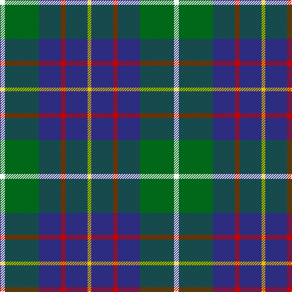

In pattern [WGBRBY](/stripes/wgbrby/).

This was sourced from register-of-tartans.  It is a [6 stripe tartan](/stripes/stripes6/).

Original link https://www.tartanregister.gov.uk/tartanDetails.aspx?ref=2487

## Also known as

This cloth is also recorded under:

- MacIntyre, Inglis

## Attestations

This cloth appears in 3 source records; the oldest owns this page.

- 01/01/2007 — MacIntyre, Inglis (register-of-tartans, [record](https://www.tartanregister.gov.uk/tartanDetails.aspx?ref=2487))
- undated — Inglis (weddslist, [record](http://www.weddslist.com/cgi-bin/tartans/pg.pl?source=sts))
- undated — Inglis Family Tartan Tartan Number: 1798. Earliest known date: 1930-50 Inglis, or Ingles, tartan is a variation of the MacIntyre tartan recognised by Lord Lyon. The green stripe of the MacIntyre is replaced by yellow in the Inglis tartan. The pattern comes from the collection of the late James MacKinlay which he called MacIntyre or Inglis. MacKinlay collected samples of tartan between 1930 and 1950 but did not provide details of the origins of the specimens. The original MacIntyre tartan can be seen on a doublet at the Kingussie museum dated 1800. It was registered in the Public Register of All Arms and Bearings in 1955. See products available Copyright © Blair Urquhart, Comrie, 2015 (house-of-tartan, [record](http://www.house-of-tartan.scotland.net/house/TartanViewjs.asp?colr=Def&tnam=1798))

## Register references

External register numbers recorded for this tartan.

- Scottish Register of Tartans: [2487](https://www.tartanregister.gov.uk/tartanDetails.aspx?ref=2487)
- Scottish Tartans Authority (ITI): 7114

## Thread count
W/8 G56 DB36 R8 DB36 Y/6

## Palette
Each colour and the base-6 reference it is a variant of.

| Colour | Shade | Base |
|---|---|---|
| DB | <code style="background-color:#2C2C80;">#2C2C80</code> `oklch(35.0% 0.138 276.6)` <small>#2C2C80</small> | B <code style="background-color:#2A418A;">#2A418A</code> |
| G | <code style="background-color:#006818;">#006818</code> `oklch(45.0% 0.142 145.0)` <small>#006818</small> | G <code style="background-color:#006100;">#006100</code> |
| R | <code style="background-color:#C80000;">#C80000</code> `oklch(52.3% 0.215 29.2)` <small>#C80000</small> | R <code style="background-color:#CC0000;">#CC0000</code> |
| W | <code style="background-color:#F8F8F8;">#F8F8F8</code> `oklch(97.9% 0.000 89.9)` <small>#F8F8F8</small> | W <code style="background-color:#F7F7F7;">#F7F7F7</code> |
| Y | <code style="background-color:#E8C000;">#E8C000</code> `oklch(81.9% 0.168 93.7)` <small>#E8C000</small> | Y <code style="background-color:#F2BF00;">#F2BF00</code> |

# Sample pattern

## Nearest tartans

The nearest existing variants by ΔTartan distance, with this tartan at the top so the swatches line up against it.

ΔTartan

Tartan

Sett

—

<a href="/ttd/edit/#slug=w4g28db18r4db18ly3~x2">MacIntyre, Inglis</a> <a class="nn-out" href="/setts/s6/w4g28db18r4db18ly3~x2/" title="open its dictionary page">↗</a>

0.72

<a href="/ttd/edit/#slug=lr4g24db10r3db12lo4~x2">Inglis (Name)</a> <a class="nn-out" href="/setts/s6/lr4g24db10r3db12lo4~x2/" title="open its dictionary page">↗</a>

0.89

<a href="/ttd/edit/#slug=r2ly1g10db10w1~x6">Turnbull Hunting (Name)</a> <a class="nn-out" href="/setts/s5/r2ly1g10db10w1~x6/" title="open its dictionary page">↗</a>

0.91

<a href="/ttd/edit/#slug=k2ly1g10db10w1~x6">Turnbull Hunting (1983) #2</a> <a class="nn-out" href="/setts/s5/k2ly1g10db10w1~x6/" title="open its dictionary page">↗</a>

0.93

<a href="/ttd/edit/#slug=db20k6lo4db3g20w2~x2">DeLoughery (Personal)</a> <a class="nn-out" href="/setts/s6/db20k6lo4db3g20w2~x2/" title="open its dictionary page">↗</a>

0.95

<a href="/ttd/edit/#slug=w3db28g26r3g26db26lb12db3lb3">Seaford House</a> <a class="nn-out" href="/setts/s9/w3db28g26r3g26db26lb12db3lb3/" title="open its dictionary page">↗</a>

0.98

<a href="/ttd/edit/#slug=db6ly2db22g7r2w11g11db3~x2">Bahamas District Tartan Tartan Number: 2089. Earliest known date: 1966 Designed by Gordon Rees of the Scottish Shop in Nassau, now owned by Colin and Beverley Honnes. It was intended to perpetuate the memory of early Scottish settlers in the Bahamas including Thompson, Sands, Forsythe, Munroe, Johnston, Russell, Christie, Roberts, Kelly, MacKinney, Saunders, Malcolm, Crawford, MacPherson, Clark and Rae. The tartan was formally approved by the Bahamas Government in 1966. See products available Copyright © Blair Urquhart, Comrie, 2015</a> <a class="nn-out" href="/setts/s8/db6ly2db22g7r2w11g11db3~x2/" title="open its dictionary page">↗</a>

1.03

<a href="/ttd/edit/#slug=r5db25w5db3g25db3~x2">Thayer USA (Name)</a> <a class="nn-out" href="/setts/s6/r5db25w5db3g25db3~x2/" title="open its dictionary page">↗</a>

1.05

<a href="/ttd/edit/#slug=r4db24w2g13db2k3~x4">Vance (Family Association)</a> <a class="nn-out" href="/setts/s6/r4db24w2g13db2k3~x4/" title="open its dictionary page">↗</a>

1.07

<a href="/ttd/edit/#slug=dg2k1dg12r4dg3db9lb2~x4">Lee (Personal)</a> <a class="nn-out" href="/setts/s7/dg2k1dg12r4dg3db9lb2~x4/" title="open its dictionary page">↗</a>

1.08

<a href="/ttd/edit/#slug=k1db1g8db8w1~x4">Douglas, Green (Wilsons)</a> <a class="nn-out" href="/setts/s5/k1db1g8db8w1~x4/" title="open its dictionary page">↗</a>

## Neighbour map

Every grey dot is one of 14299 variants placed by the first two principal components of the ΔTartan feature space (44% of its variance). Red is this tartan; blue dots are its nearest — click one to open its page.

<svg viewBox="0 0 640 380" role="img" style="max-width:100%;height:auto;border:1px solid #e0e0e0;border-radius:4px;display:block" xmlns="http://www.w3.org/2000/svg"><image href="/nn/cloud.v1.png" width="640" height="380"/><a href="/setts/s6/lr4g24db10r3db12lo4~x2/"><circle cx="183.4" cy="208.8" r="4" fill="#3465a4"><title>Inglis (Name)</title></circle></a><a href="/setts/s5/r2ly1g10db10w1~x6/"><circle cx="220.9" cy="202.5" r="4" fill="#3465a4"><title>Turnbull Hunting (Name)</title></circle></a><a href="/setts/s5/k2ly1g10db10w1~x6/"><circle cx="215.6" cy="204.5" r="4" fill="#3465a4"><title>Turnbull Hunting (1983) #2</title></circle></a><a href="/setts/s6/db20k6lo4db3g20w2~x2/"><circle cx="206.8" cy="203.1" r="4" fill="#3465a4"><title>DeLoughery (Personal)</title></circle></a><a href="/setts/s9/w3db28g26r3g26db26lb12db3lb3/"><circle cx="196.7" cy="189.2" r="4" fill="#3465a4"><title>Seaford House</title></circle></a><a href="/setts/s8/db6ly2db22g7r2w11g11db3~x2/"><circle cx="200.9" cy="174.4" r="4" fill="#3465a4"><title>Bahamas District Tartan Tartan Number: 2089. Earliest known date: 1966 Designed by Gordon Rees of the Scottish Shop in Nassau, now owned by Colin and Beverley Honnes. It was intended to perpetuate the memory of early Scottish settlers in the Bahamas including Thompson, Sands, Forsythe, Munroe, Johnston, Russell, Christie, Roberts, Kelly, MacKinney, Saunders, Malcolm, Crawford, MacPherson, Clark and Rae. The tartan was formally approved by the Bahamas Government in 1966. See products available Copyright © Blair Urquhart, Comrie, 2015</title></circle></a><a href="/setts/s6/r5db25w5db3g25db3~x2/"><circle cx="251.8" cy="215.9" r="4" fill="#3465a4"><title>Thayer USA (Name)</title></circle></a><a href="/setts/s6/r4db24w2g13db2k3~x4/"><circle cx="277.3" cy="178.6" r="4" fill="#3465a4"><title>Vance (Family Association)</title></circle></a><a href="/setts/s7/dg2k1dg12r4dg3db9lb2~x4/"><circle cx="248.5" cy="194.8" r="4" fill="#3465a4"><title>Lee (Personal)</title></circle></a><a href="/setts/s5/k1db1g8db8w1~x4/"><circle cx="219.2" cy="217.1" r="4" fill="#3465a4"><title>Douglas, Green (Wilsons)</title></circle></a><circle cx="224.0" cy="206.3" r="5" fill="#c00000"/></svg>

ID: /setts/s6/w4g28db18r4db18ly3~x2/
