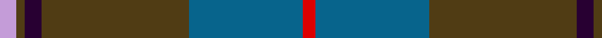
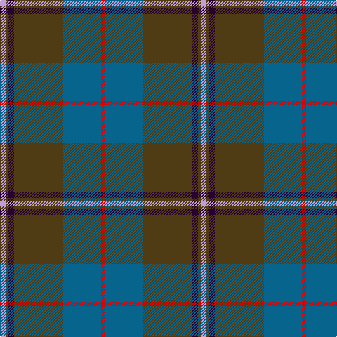

In pattern [RBGBGW](/patterns/rbgbgw/).

This was sourced from register-of-tartans.  It is a [6 stripes tartan](/stripes/stripes6/).

Original link https://www.tartanregister.gov.uk/tartanDetails.aspx?ref=906

## Thread count
LP/8 T4 DP8 T70 B54 R/6

## Palette
Each colour and its ΔE from the base-6 reference it is a variant of.

| Colour | Shade | Base | ΔE (OKLab) |
|---|---|---|---|
| B | <code style="background-color:#07648C;">#07648C</code> `#07648C` | B <code style="background-color:#2A418A;">#2A418A</code> | 0.10 |
| DP | <code style="background-color:#280032;">#280032</code> `#280032` | B <code style="background-color:#2A418A;">#2A418A</code> | 0.22 |
| LP | <code style="background-color:#C49CD8;">#C49CD8</code> `#C49CD8` | W <code style="background-color:#F7F7F7;">#F7F7F7</code> | 0.25 |
| R | <code style="background-color:#DC0000;">#DC0000</code> `#DC0000` | R <code style="background-color:#CC0000;">#CC0000</code> | 0.03 |
| T | <code style="background-color:#503C14;">#503C14</code> `#503C14` | G <code style="background-color:#006100;">#006100</code> | 0.14 |

# Sample pattern

## Nearest tartans

The nearest existing variants by ΔTartan distance.

1. [Bressuire (District)](/setts/s7/r1g4y1g3r4b15w1x4~b506878-g006818-r880000-we0e0e0-ybc8c00/) — ΔT 0.96
1. [Royal Deeside (District)](/setts/s6/r4g2b4g35ba27ra3x2~b1c1c50-ba2888c4-g746440-re87878-rac80000/) — ΔT 1.03
1. [Hardie (Name)](/setts/s6/r4g9w2g24b37ra3x2~b202044-g003820-rb468ac-rac80000-we0e0e0/) — ΔT 1.10
1. [Kilkenny, County (District)](/setts/s7/b4g27r2ba25y5g3r3x2~b480800-ba202060-g003820-rb84c00-ybc8c00/) — ΔT 1.16
1. [Scotch Mist](/setts/s8/b4r4b4k4b18k3ba38w3x2~b646464-ba444444-k101010-r8c8c8c-we0e0e0/) — ΔT 1.17
1. [Hebridean Granite Fashion Tartan Tartan Number: 6821. Earliest known date: 2005 For a new House of Edgar collection. Intended to emulate the gray morning suit perhaps. See products available Copyright © Blair Urquhart, Comrie, 2015](/setts/s8/r3y4r4b4r18b3ba36w3x2~b383838-ba484848-r888888-we0e0e0-yb0b0b0/) — ΔT 1.18
1. [Graeme Heckenberg Hunting](/setts/s7/b3g13y1r3y1b10ya1x2~b1f3d7a-g4d7326-r761a1a-y8397a7-yafaa706/) — ΔT 1.20
1. [Lawrie](/setts/s7/b6g2b1ga25ba16k2ba4x2~b700070-ba2c2c84-g784400-ga007040-k101010/) — ΔT 1.20
1. [Lawrie Clan Tartan Tartan Number: 3202. Earliest known date: 2000 One of a set of three similar designs for Laurie, Lawrie and Lowry, designed by Peter MacDonald for Iain Laurie. See products available Copyright © Blair Urquhart, Comrie, 2015](/setts/s7/b6r2b1g25ba16k2ba4x2~b440044-ba2c2c80-g006818-k101010-r945008/) — ΔT 1.21
1. [Laurie](/setts/s7/b6r2b1g25ba16k2ba4x2~b6c006c-ba28287c-g005c34-k101010-rc80000/) — ΔT 1.22

## Neighbour map

Every grey dot is one of 15726 variants placed by the first two principal components of the ΔTartan feature space (44% of its variance). Red is this tartan; blue dots are its nearest — click one to open its page.

<svg viewBox="0 0 640 380" role="img" style="max-width:100%;height:auto;border:1px solid #e0e0e0;border-radius:4px;display:block" xmlns="http://www.w3.org/2000/svg"><image href="/nn/cloud.v1.png" width="640" height="380"/><a href="/setts/s7/r1g4y1g3r4b15w1x4~b506878-g006818-r880000-we0e0e0-ybc8c00/"><circle cx="331.2" cy="176.1" r="4" fill="#3465a4"><title>Bressuire (District)</title></circle></a><a href="/setts/s6/r4g2b4g35ba27ra3x2~b1c1c50-ba2888c4-g746440-re87878-rac80000/"><circle cx="340.4" cy="179.7" r="4" fill="#3465a4"><title>Royal Deeside (District)</title></circle></a><a href="/setts/s6/r4g9w2g24b37ra3x2~b202044-g003820-rb468ac-rac80000-we0e0e0/"><circle cx="331.6" cy="193.4" r="4" fill="#3465a4"><title>Hardie (Name)</title></circle></a><a href="/setts/s7/b4g27r2ba25y5g3r3x2~b480800-ba202060-g003820-rb84c00-ybc8c00/"><circle cx="280.3" cy="187.4" r="4" fill="#3465a4"><title>Kilkenny, County (District)</title></circle></a><a href="/setts/s8/b4r4b4k4b18k3ba38w3x2~b646464-ba444444-k101010-r8c8c8c-we0e0e0/"><circle cx="328.3" cy="177.1" r="4" fill="#3465a4"><title>Scotch Mist</title></circle></a><a href="/setts/s8/r3y4r4b4r18b3ba36w3x2~b383838-ba484848-r888888-we0e0e0-yb0b0b0/"><circle cx="301.3" cy="167.1" r="4" fill="#3465a4"><title>Hebridean Granite Fashion Tartan Tartan Number: 6821. Earliest known date: 2005 For a new House of Edgar collection. Intended to emulate the gray morning suit perhaps. See products available Copyright © Blair Urquhart, Comrie, 2015</title></circle></a><a href="/setts/s7/b3g13y1r3y1b10ya1x2~b1f3d7a-g4d7326-r761a1a-y8397a7-yafaa706/"><circle cx="259.2" cy="184.4" r="4" fill="#3465a4"><title>Graeme Heckenberg Hunting</title></circle></a><a href="/setts/s7/b6g2b1ga25ba16k2ba4x2~b700070-ba2c2c84-g784400-ga007040-k101010/"><circle cx="308.3" cy="163.9" r="4" fill="#3465a4"><title>Lawrie</title></circle></a><a href="/setts/s7/b6r2b1g25ba16k2ba4x2~b440044-ba2c2c80-g006818-k101010-r945008/"><circle cx="301.9" cy="162.9" r="4" fill="#3465a4"><title>Lawrie Clan Tartan Tartan Number: 3202. Earliest known date: 2000 One of a set of three similar designs for Laurie, Lawrie and Lowry, designed by Peter MacDonald for Iain Laurie. See products available Copyright © Blair Urquhart, Comrie, 2015</title></circle></a><a href="/setts/s7/b6r2b1g25ba16k2ba4x2~b6c006c-ba28287c-g005c34-k101010-rc80000/"><circle cx="321.9" cy="169.3" r="4" fill="#3465a4"><title>Laurie</title></circle></a><circle cx="336.2" cy="181.9" r="5" fill="#c00000"/></svg>

ID: /setts/s6/w4g2b4g35ba27r3x2~b280032-ba07648c-g503c14-rdc0000-wc49cd8/
