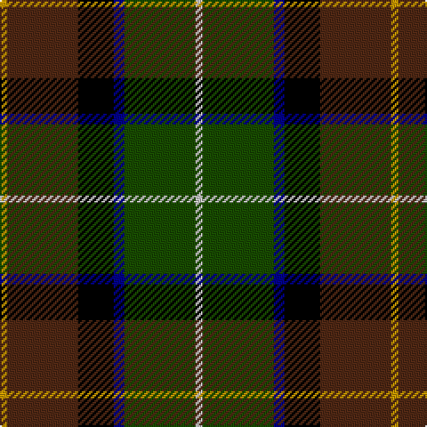

In pattern [WGBKBY](/patterns/wgbkby/).

This was sourced from tartans-authority.  It is a [6 stripes tartan](/stripes/stripes6/).

Original link http://www.tartansauthority.com/tartan-ferret/display/5658/

## Thread count
DY/4 T40 K20 DB6 G40 N/4

## Palette
Each colour and its ΔE from the base-6 reference it is a variant of.

| Colour | Shade | Base | ΔE (OKLab) |
|---|---|---|---|
| DB | <code style="background-color:#00008C;">#00008C</code> `#00008C` | B <code style="background-color:#2C4084;">#2C4084</code> | 0.13 |
| DY | <code style="background-color:#C89800;">#C89800</code> `#C89800` | Y <code style="background-color:#E8C000;">#E8C000</code> | 0.12 |
| G | <code style="background-color:#184C00;">#184C00</code> `#184C00` | G <code style="background-color:#006400;">#006400</code> | 0.08 |
| K | <code style="background-color:#000000;">#000000</code> `#000000` | K <code style="background-color:#000000;">#000000</code> | 0.00 |
| N | <code style="background-color:#C8C8C8;">#C8C8C8</code> `#C8C8C8` | W <code style="background-color:#F4F4F0;">#F4F4F0</code> | 0.13 |
| T | <code style="background-color:#502814;">#502814</code> `#502814` | B <code style="background-color:#2C4084;">#2C4084</code> | 0.19 |

# Sample pattern

## Nearest tartans

The nearest existing variants by ΔTartan distance.

1. [Royal Burgh of Peebles (District)](/setts/s7/r6g6b8g34k26ba52w6-b2c2c80-ba14283c-g006818-k101010-rc80000-wf8f8f8/) — ΔT 1.00
1. [Barbour Corporate Tartan Tartan Number: 2489. Earliest known date: 1998 For the linings of Barbour's famous wax jackets. Tartan designed by Kinloch Anderson of Edinburgh. See products available Copyright © Blair Urquhart, Comrie, 2015](/setts/s7/g8y4g42b22w4k40r6-b441800-g6c6044-k101010-rc80000-wfcfcfc-ye8c000/) — ΔT 1.05
1. [Bicentenary (Commemorative)](/setts/s9/b24k4y4k8ba8b16g32k4r8-b501414-ba00008c-g146400-k000000-r8c0000-yc88c00/) — ΔT 1.06
1. [Cornish Hunting District Tartan Tartan Number: 1568. Earliest known date: 1984 The Cornish Hunting tartan was first produced in 1984, and was marketed by the firm, Cornovi Creations, Cornwall. It is based on the Cornish National tartan designed by E.E. Morton-Nance, who regarded tartan as the heritage of all Celts, not Scots alone. (P Smith and G Teall, District Tartans, 1992) The hunting sett replaces the 'National' yellow with dark green and the azure with a darker shade of blue. Cornish Hunting is a registered design (No. 514267). See products available Copyright © Blair Urquhart, Comrie, 2015](/setts/s7/w10k52y4g48b14k6r6-b003c64-g003820-k101010-rc80000-we0e0e0-ye8c000/) — ΔT 1.06
1. [Dobson Name Tartan Tartan Number: 10943. Earliest known date: 2013 Designed by Kelly Dobson Matson for the personal use of the Dobson Family, Palm Bay, Florida, a family of bagpipers, who wish to wear their own tartan while they play. The colours are favoured colours chosen by the majority of the family. See products available Copyright © Blair Urquhart, Comrie, 2015](/setts/s6/g72y6ga10b36k20ka36-b1c1c50-g006838-ga503500-k101010-ka000000-ye4e068/) — ΔT 1.07
1. [Morris of Balgonie (Personal)](/setts/s6/w4b40r6k20g40y4-b5c005c-g006818-k101010-r880000-wf8f8f8-yd09800/) — ΔT 1.07
1. [Unidentified No 79](/setts/s6/r10g36y4k28b10k8-b3c82af-g005020-k101010-rdc0000-ye8c000/) — ΔT 1.09
1. [James (Personal)](/setts/s7/r8k24y4g48y4b24w8-b242470-g004828-k101010-rc80000-wb4bcc0-yb0b430/) — ΔT 1.10
1. [Sey (Name)](/setts/s8/r4k16y2k16g26b26ya2r4-b2c2c80-g006818-k101010-rc80000-ye8c000-yad87c00/) — ΔT 1.14
1. [McComb](/setts/s7/b6r4b36k12g36y4ga6-b304080-g003000-ga008000-k000000-rc00000-yf0c000/) — ΔT 1.20

## Neighbour map

Every grey dot is one of 15726 variants placed by the first two principal components of the ΔTartan feature space (44% of its variance). Red is this tartan; blue dots are its nearest — click one to open its page.

<svg viewBox="0 0 640 380" role="img" style="max-width:100%;height:auto;border:1px solid #e0e0e0;border-radius:4px;display:block" xmlns="http://www.w3.org/2000/svg"><image href="/nn/cloud.v1.png" width="640" height="380"/><a href="/setts/s7/r6g6b8g34k26ba52w6-b2c2c80-ba14283c-g006818-k101010-rc80000-wf8f8f8/"><circle cx="150.6" cy="186.1" r="4" fill="#3465a4"><title>Royal Burgh of Peebles (District)</title></circle></a><a href="/setts/s7/g8y4g42b22w4k40r6-b441800-g6c6044-k101010-rc80000-wfcfcfc-ye8c000/"><circle cx="172.7" cy="166.7" r="4" fill="#3465a4"><title>Barbour Corporate Tartan Tartan Number: 2489. Earliest known date: 1998 For the linings of Barbour's famous wax jackets. Tartan designed by Kinloch Anderson of Edinburgh. See products available Copyright © Blair Urquhart, Comrie, 2015</title></circle></a><a href="/setts/s9/b24k4y4k8ba8b16g32k4r8-b501414-ba00008c-g146400-k000000-r8c0000-yc88c00/"><circle cx="135.2" cy="178.3" r="4" fill="#3465a4"><title>Bicentenary (Commemorative)</title></circle></a><a href="/setts/s7/w10k52y4g48b14k6r6-b003c64-g003820-k101010-rc80000-we0e0e0-ye8c000/"><circle cx="191.3" cy="160.1" r="4" fill="#3465a4"><title>Cornish Hunting District Tartan Tartan Number: 1568. Earliest known date: 1984 The Cornish Hunting tartan was first produced in 1984, and was marketed by the firm, Cornovi Creations, Cornwall. It is based on the Cornish National tartan designed by E.E. Morton-Nance, who regarded tartan as the heritage of all Celts, not Scots alone. (P Smith and G Teall, District Tartans, 1992) The hunting sett replaces the 'National' yellow with dark green and the azure with a darker shade of blue. Cornish Hunting is a registered design (No. 514267). See products available Copyright © Blair Urquhart, Comrie, 2015</title></circle></a><a href="/setts/s6/g72y6ga10b36k20ka36-b1c1c50-g006838-ga503500-k101010-ka000000-ye4e068/"><circle cx="143.9" cy="187.3" r="4" fill="#3465a4"><title>Dobson Name Tartan Tartan Number: 10943. Earliest known date: 2013 Designed by Kelly Dobson Matson for the personal use of the Dobson Family, Palm Bay, Florida, a family of bagpipers, who wish to wear their own tartan while they play. The colours are favoured colours chosen by the majority of the family. See products available Copyright © Blair Urquhart, Comrie, 2015</title></circle></a><a href="/setts/s6/w4b40r6k20g40y4-b5c005c-g006818-k101010-r880000-wf8f8f8-yd09800/"><circle cx="147.7" cy="176.9" r="4" fill="#3465a4"><title>Morris of Balgonie (Personal)</title></circle></a><a href="/setts/s6/r10g36y4k28b10k8-b3c82af-g005020-k101010-rdc0000-ye8c000/"><circle cx="167.7" cy="210.7" r="4" fill="#3465a4"><title>Unidentified No 79</title></circle></a><a href="/setts/s7/r8k24y4g48y4b24w8-b242470-g004828-k101010-rc80000-wb4bcc0-yb0b430/"><circle cx="158.7" cy="166.4" r="4" fill="#3465a4"><title>James (Personal)</title></circle></a><a href="/setts/s8/r4k16y2k16g26b26ya2r4-b2c2c80-g006818-k101010-rc80000-ye8c000-yad87c00/"><circle cx="142.9" cy="165.5" r="4" fill="#3465a4"><title>Sey (Name)</title></circle></a><a href="/setts/s7/b6r4b36k12g36y4ga6-b304080-g003000-ga008000-k000000-rc00000-yf0c000/"><circle cx="172.3" cy="178.2" r="4" fill="#3465a4"><title>McComb</title></circle></a><circle cx="153.6" cy="186.5" r="5" fill="#c00000"/></svg>

ID: /setts/s6/w4g40b6k20ba40y4-b00008c-ba502814-g184c00-k000000-wc8c8c8-yc89800/
