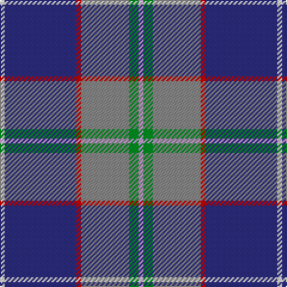

In pattern [WBRRGW](/patterns/wbrrgw/).

This was sourced from tartans-authority.  It is a [6 stripes tartan](/stripes/stripes6/).

Original link http://www.tartansauthority.com/tartan-ferret/display/10127/

## Thread count
LN/4 DB60 R4 N40 G8 LP/4

## Palette
Each colour and its ΔE from the base-6 reference it is a variant of.

| Colour | Shade | Base | ΔE (OKLab) |
|---|---|---|---|
| DB | <code style="background-color:#2C2C80;">#2C2C80</code> `#2C2C80` | B <code style="background-color:#2C4084;">#2C4084</code> | 0.05 |
| G | <code style="background-color:#009020;">#009020</code> `#009020` | G <code style="background-color:#006400;">#006400</code> | 0.14 |
| LN | <code style="background-color:#E0E0E0;">#E0E0E0</code> `#E0E0E0` | W <code style="background-color:#F4F4F0;">#F4F4F0</code> | 0.06 |
| LP | <code style="background-color:#C49CD8;">#C49CD8</code> `#C49CD8` | W <code style="background-color:#F4F4F0;">#F4F4F0</code> | 0.24 |
| N | <code style="background-color:#888888;">#888888</code> `#888888` | R <code style="background-color:#C80000;">#C80000</code> | 0.24 |
| R | <code style="background-color:#C80000;">#C80000</code> `#C80000` | R <code style="background-color:#C80000;">#C80000</code> | 0.00 |

# Sample pattern

## Nearest tartans

The nearest existing variants by ΔTartan distance.

1. [Shearer (2016)](/setts/s6/k8b8ba64r8bb34w4-b646464-ba003c64-bb788cb4-k000000-rc8002c-wfcfcfc/) — ΔT 0.74
1. [Los Angeles](/setts/s8/y8b48ba10g4b6k10ba66r4-b2c2c80-ba6098b8-g289c18-k101010-rc80000-ye8c000/) — ΔT 0.87
1. [Blue Ridge Highlands Heritage](/setts/s8/b54ba18w6g12ba66w6bb6y4-b5c8ca8-ba2c2c80-bb680028-g00643c-wa8ace8-ye8c000/) — ΔT 0.95
1. [Margach, William (Personal)](/setts/s6/r8k6b36ra6ba68w6-b1474b4-ba003c64-k101010-ra8088c-rac8002c-we0e0e0/) — ΔT 1.02
1. [Wrigglesworth (Name)](/setts/s7/b60ba20w20b10r6y6g6-b2c2c80-ba1474b4-g289c18-ra00048-wc0c0c0-ye8c000/) — ΔT 1.05
1. [Heirloom Blue Alba (Fashion)](/setts/s9/b8y4b68ba20ya8ba8bb8ba46w6-b5c8ca8-ba202060-bb780078-we0e0e0-ybc8c00-yaa0a0a0/) — ΔT 1.06
1. [Pride of the Nation (Fashion)](/setts/s8/b12ba6b50bb39bc12bd6bc6w4-b5c8ca8-ba2c2c80-bb1c1c50-bc9050d8-bd780078-we0e0e0/) — ΔT 1.08
1. [Gamblin Thompson (Personal)](/setts/s6/b8g52r8k24ba92w4-b2888c4-ba2c2c80-g408060-k101010-rc80000-wfcfcfc/) — ΔT 1.08
1. [Vipont Family Tartan Tartan Number: 1479. Earliest known date: 1983 This count comes from a sample at the Scottish Tartans Society, in the MacGregor Hastie collection. He in turn procured it from J.Wright of Edinburgh. A contradictory note in the files says, "It was apparently designed and woven by them (J.Wright) for the family of Vipont c.1930. It is rarely if ever used today." The Scottish Viponts are an ancient family, who formerly possessed lands in Aberdour, Fife. See products available Copyright © Blair Urquhart, Comrie, 2015](/setts/s7/r8g28k6w6g24b72wa8-b2c2c80-g006818-k101010-rc80000-wc49cd8-wae0e0e0/) — ΔT 1.13
1. [Oren Peterson](/setts/s6/r4g8b40ra4ba60w4-b778899-ba000080-g006400-rd02090-raff0000-wffffff/) — ΔT 1.18

## Neighbour map

Every grey dot is one of 15726 variants placed by the first two principal components of the ΔTartan feature space (44% of its variance). Red is this tartan; blue dots are its nearest — click one to open its page.

<svg viewBox="0 0 640 380" role="img" style="max-width:100%;height:auto;border:1px solid #e0e0e0;border-radius:4px;display:block" xmlns="http://www.w3.org/2000/svg"><image href="/nn/cloud.v1.png" width="640" height="380"/><a href="/setts/s6/k8b8ba64r8bb34w4-b646464-ba003c64-bb788cb4-k000000-rc8002c-wfcfcfc/"><circle cx="245.0" cy="147.9" r="4" fill="#3465a4"><title>Shearer (2016)</title></circle></a><a href="/setts/s8/y8b48ba10g4b6k10ba66r4-b2c2c80-ba6098b8-g289c18-k101010-rc80000-ye8c000/"><circle cx="246.2" cy="125.8" r="4" fill="#3465a4"><title>Los Angeles</title></circle></a><a href="/setts/s8/b54ba18w6g12ba66w6bb6y4-b5c8ca8-ba2c2c80-bb680028-g00643c-wa8ace8-ye8c000/"><circle cx="258.4" cy="141.5" r="4" fill="#3465a4"><title>Blue Ridge Highlands Heritage</title></circle></a><a href="/setts/s6/r8k6b36ra6ba68w6-b1474b4-ba003c64-k101010-ra8088c-rac8002c-we0e0e0/"><circle cx="271.3" cy="170.9" r="4" fill="#3465a4"><title>Margach, William (Personal)</title></circle></a><a href="/setts/s7/b60ba20w20b10r6y6g6-b2c2c80-ba1474b4-g289c18-ra00048-wc0c0c0-ye8c000/"><circle cx="234.6" cy="157.7" r="4" fill="#3465a4"><title>Wrigglesworth (Name)</title></circle></a><a href="/setts/s9/b8y4b68ba20ya8ba8bb8ba46w6-b5c8ca8-ba202060-bb780078-we0e0e0-ybc8c00-yaa0a0a0/"><circle cx="232.6" cy="127.2" r="4" fill="#3465a4"><title>Heirloom Blue Alba (Fashion)</title></circle></a><a href="/setts/s8/b12ba6b50bb39bc12bd6bc6w4-b5c8ca8-ba2c2c80-bb1c1c50-bc9050d8-bd780078-we0e0e0/"><circle cx="212.4" cy="149.7" r="4" fill="#3465a4"><title>Pride of the Nation (Fashion)</title></circle></a><a href="/setts/s6/b8g52r8k24ba92w4-b2888c4-ba2c2c80-g408060-k101010-rc80000-wfcfcfc/"><circle cx="263.4" cy="144.9" r="4" fill="#3465a4"><title>Gamblin Thompson (Personal)</title></circle></a><a href="/setts/s7/r8g28k6w6g24b72wa8-b2c2c80-g006818-k101010-rc80000-wc49cd8-wae0e0e0/"><circle cx="225.6" cy="155.5" r="4" fill="#3465a4"><title>Vipont Family Tartan Tartan Number: 1479. Earliest known date: 1983 This count comes from a sample at the Scottish Tartans Society, in the MacGregor Hastie collection. He in turn procured it from J.Wright of Edinburgh. A contradictory note in the files says, &quot;It was apparently designed and woven by them (J.Wright) for the family of Vipont c.1930. It is rarely if ever used today.&quot; The Scottish Viponts are an ancient family, who formerly possessed lands in Aberdour, Fife. See products available Copyright © Blair Urquhart, Comrie, 2015</title></circle></a><a href="/setts/s6/r4g8b40ra4ba60w4-b778899-ba000080-g006400-rd02090-raff0000-wffffff/"><circle cx="241.2" cy="142.1" r="4" fill="#3465a4"><title>Oren Peterson</title></circle></a><circle cx="265.8" cy="147.1" r="5" fill="#c00000"/></svg>

ID: /setts/s6/w4g8r40ra4b60wa4-b2c2c80-g009020-r888888-rac80000-wc49cd8-wae0e0e0/
