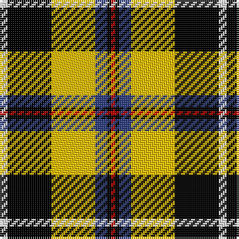

In pattern [RKBYKW](/patterns/rkbykw/).

This was sourced from weddslist.  It is a [6 stripes tartan](/stripes/stripes6/).

Original link http://www.weddslist.com/cgi-bin/tartans/pg.pl?source=sts

## Thread count
LN/4 K22 Y22 B6 K2 R/2

## Palette
Each colour and its ΔE from the base-6 reference it is a variant of.

| Colour | Shade | Base | ΔE (OKLab) |
|---|---|---|---|
| B | <code style="background-color:#304080;">#304080</code> `#304080` | B <code style="background-color:#2A418A;">#2A418A</code> | 0.02 |
| K | <code style="background-color:#000000;">#000000</code> `#000000` | K <code style="background-color:#000000;">#000000</code> | 0.00 |
| LN | <code style="background-color:#E0E0E0;">#E0E0E0</code> `#E0E0E0` | W <code style="background-color:#F7F7F7;">#F7F7F7</code> | 0.07 |
| R | <code style="background-color:#C00000;">#C00000</code> `#C00000` | R <code style="background-color:#CC0000;">#CC0000</code> | 0.03 |
| Y | <code style="background-color:#F0C000;">#F0C000</code> `#F0C000` | Y <code style="background-color:#F2BF00;">#F2BF00</code> | 0.00 |

# Sample pattern

## Nearest tartans

The nearest existing variants by ΔTartan distance.

1. [Cornish, National](/setts/s6/w10k52y52b14k6r6-b5480b0-k000000-rc00000-we0e0e0-yf0c000/) — ΔT 0.41
1. [Cornish National (District)](/setts/s6/w10k52y52b14k6r6-b4c809c-k000000-rc80000-wfcfcfc-ybc8c00/) — ΔT 0.52
1. [Cornish National #2](/setts/s6/w4k22y22b6k2r2-b2c4084-k101010-rdc0000-we0e0e0-ye8c000/) — ΔT 0.65
1. [Cornish National Small Set Tartan Tartan Number: 7651. Earliest known date: See products available Copyright © Blair Urquhart, Comrie, 2015](/setts/s6/w4k22y22b6k2r2-b5c8ca8-k101010-rc80000-we0e0e0-ye8c000/) — ΔT 0.85
1. [Cornish National District Tartan Tartan Number: 1567. Earliest known date: 1963 The ancient kingdom of Cornwall is remembered in this tartan, designed by the Cornish poet, E.E. Morton-Nance. He regarded tartan as the "heritage of all Celts" and extold brave Cornishmen to wear the kilt of black and saffron, "Tints blazoned by her ancient Kings". There is also a Cornish Hunting tartan of more recent origin based on this sett. See products available Copyright © Blair Urquhart, Comrie, 2015](/setts/s6/w10k52y52b14k6r6-b5c8ca8-k101010-rc80000-we0e0e0-ye8c000/) — ΔT 0.91
1. [Garvock (2015)](/setts/s8/g56b6g6k20r4k20r40y8-b2888c4-g006818-k000000-rdc0000-yffe600/) — ΔT 1.03
1. [MacLachlan W](/setts/s7/r24w2y3g16k16w2y3-g004c00-k000000-rc80000-wd0d0d0-yffff00/) — ΔT 1.19
1. [Hackett (Personal)](/setts/s7/k40w8r8g40w10g4ga4-g006818-ga289c18-k101010-rc80000-wfcfcfc/) — ΔT 1.20
1. [Unnamed No 5](/setts/s8/k20y4g22r22w2r2w2k18-g008000-k000000-rc00000-we0e0e0-yf0c000/) — ΔT 1.21
1. [Black & White Golf (Corporate)](/setts/s7/y18k64g12w40y6w18k10-g006818-k101010-we8ccb8-ybc8c00/) — ΔT 1.25

## Neighbour map

Every grey dot is one of 15726 variants placed by the first two principal components of the ΔTartan feature space (44% of its variance). Red is this tartan; blue dots are its nearest — click one to open its page.

<svg viewBox="0 0 640 380" role="img" style="max-width:100%;height:auto;border:1px solid #e0e0e0;border-radius:4px;display:block" xmlns="http://www.w3.org/2000/svg"><image href="/nn/cloud.v1.png" width="640" height="380"/><a href="/setts/s6/w10k52y52b14k6r6-b5480b0-k000000-rc00000-we0e0e0-yf0c000/"><circle cx="153.9" cy="171.9" r="4" fill="#3465a4"><title>Cornish, National</title></circle></a><a href="/setts/s6/w10k52y52b14k6r6-b4c809c-k000000-rc80000-wfcfcfc-ybc8c00/"><circle cx="160.0" cy="176.3" r="4" fill="#3465a4"><title>Cornish National (District)</title></circle></a><a href="/setts/s6/w4k22y22b6k2r2-b2c4084-k101010-rdc0000-we0e0e0-ye8c000/"><circle cx="172.2" cy="161.2" r="4" fill="#3465a4"><title>Cornish National #2</title></circle></a><a href="/setts/s6/w4k22y22b6k2r2-b5c8ca8-k101010-rc80000-we0e0e0-ye8c000/"><circle cx="171.6" cy="160.4" r="4" fill="#3465a4"><title>Cornish National Small Set Tartan Tartan Number: 7651. Earliest known date: See products available Copyright © Blair Urquhart, Comrie, 2015</title></circle></a><a href="/setts/s6/w10k52y52b14k6r6-b5c8ca8-k101010-rc80000-we0e0e0-ye8c000/"><circle cx="158.7" cy="171.4" r="4" fill="#3465a4"><title>Cornish National District Tartan Tartan Number: 1567. Earliest known date: 1963 The ancient kingdom of Cornwall is remembered in this tartan, designed by the Cornish poet, E.E. Morton-Nance. He regarded tartan as the &quot;heritage of all Celts&quot; and extold brave Cornishmen to wear the kilt of black and saffron, &quot;Tints blazoned by her ancient Kings&quot;. There is also a Cornish Hunting tartan of more recent origin based on this sett. See products available Copyright © Blair Urquhart, Comrie, 2015</title></circle></a><a href="/setts/s8/g56b6g6k20r4k20r40y8-b2888c4-g006818-k000000-rdc0000-yffe600/"><circle cx="161.0" cy="149.8" r="4" fill="#3465a4"><title>Garvock (2015)</title></circle></a><a href="/setts/s7/r24w2y3g16k16w2y3-g004c00-k000000-rc80000-wd0d0d0-yffff00/"><circle cx="137.6" cy="151.8" r="4" fill="#3465a4"><title>MacLachlan W</title></circle></a><a href="/setts/s7/k40w8r8g40w10g4ga4-g006818-ga289c18-k101010-rc80000-wfcfcfc/"><circle cx="149.8" cy="166.4" r="4" fill="#3465a4"><title>Hackett (Personal)</title></circle></a><a href="/setts/s8/k20y4g22r22w2r2w2k18-g008000-k000000-rc00000-we0e0e0-yf0c000/"><circle cx="153.3" cy="166.8" r="4" fill="#3465a4"><title>Unnamed No 5</title></circle></a><a href="/setts/s7/y18k64g12w40y6w18k10-g006818-k101010-we8ccb8-ybc8c00/"><circle cx="188.5" cy="181.9" r="4" fill="#3465a4"><title>Black &amp; White Golf (Corporate)</title></circle></a><circle cx="168.0" cy="161.9" r="5" fill="#c00000"/></svg>

ID: /setts/s6/w4k22y22b6k2r2-b304080-k000000-rc00000-we0e0e0-yf0c000/
