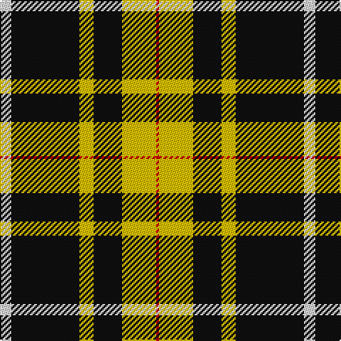

In pattern [RYKYKW](/stripes/rykykw/).

This was sourced from register-of-tartans.  It is a [6 stripe tartan](/stripes/stripes6/).

Original link https://www.tartanregister.gov.uk/tartanDetails.aspx?ref=2133

## Also known as

This cloth is also recorded under:

- Livingston F. C.

## Attestations

This cloth appears in 2 source records; the oldest owns this page.

- 01/01/2001 — Livingston Football Club (2001) (register-of-tartans, [record](https://www.tartanregister.gov.uk/tartanDetails.aspx?ref=2133))
- Oct. 2001 — Livingston F. C. (2001) (Sports) (tartans-authority, [record](http://www.tartansauthority.com/tartan-ferret/display/3986/))

## Register references

External register numbers recorded for this tartan.

- Scottish Register of Tartans: [2133](https://www.tartanregister.gov.uk/tartanDetails.aspx?ref=2133)
- Scottish Tartans Authority (ITI): 3986
- Scottish Tartans World Register: 2856

## Thread count
LN/8 K48 Y10 K20 Y24 R/2

## Palette
Each colour and its ΔE from the base-6 reference it is a variant of.

| Colour | Shade | Base | ΔE (OKLab) |
|---|---|---|---|
| K | <code style="background-color:#101010;">#101010</code> `#101010` | K <code style="background-color:#000000;">#000000</code> | 0.17 |
| LN | <code style="background-color:#E0E0E0;">#E0E0E0</code> `#E0E0E0` | W <code style="background-color:#F7F7F7;">#F7F7F7</code> | 0.07 |
| R | <code style="background-color:#C80000;">#C80000</code> `#C80000` | R <code style="background-color:#CC0000;">#CC0000</code> | 0.01 |
| Y | <code style="background-color:#E8C000;">#E8C000</code> `#E8C000` | Y <code style="background-color:#F2BF00;">#F2BF00</code> | 0.02 |

# Sample pattern

## Nearest tartans

The nearest existing variants by ΔTartan distance.

1. [Entrepreneurial Spark](/setts/s8/k14lo3w8lo4k6w9k31g1~x2/) — ΔT 1.28
1. [MacPherson Dress](/setts/s7/lr3r1lr30k20lr3k9ly1~x2/) — ΔT 1.52
1. [MacPherson Dress](/setts/s7/lr3r1lr30k20lr3k9ly1/) — ΔT 1.52
1. [Cardiff City Football Club (Corp)](/setts/s9/k4lo24k13lo2k4lo3k1lo3t2~x2/) — ΔT 1.52
1. [Princess Margaret Rose](/setts/s6/dg32r12dg6r6k2w3~x2/) — ΔT 1.53
1. [St. Piran Cornish Flag](/setts/s8/w5k20w10k1r2~x2/) — ΔT 1.54
1. [Cornish Flag (District)](/setts/s5/w5k20w10k1r2~x2/) — ΔT 1.56
1. [George Heriots](/setts/s5/w3k35o24k1ly3~x2/) — ΔT 1.57
1. [MacPherson Dress](/setts/s7/lb3r1lb30k20lb3k9ly1/) — ΔT 1.59
1. [MacLeod of Lewis (Vestiarium Scoticum)](/setts/s5/k8ly1k8ly12r1~x4/) — ΔT 1.60

## Neighbour map

Every grey dot is one of 14299 variants placed by the first two principal components of the ΔTartan feature space (44% of its variance). Red is this tartan; blue dots are its nearest — click one to open its page.

<svg viewBox="0 0 640 380" role="img" style="max-width:100%;height:auto;border:1px solid #e0e0e0;border-radius:4px;display:block" xmlns="http://www.w3.org/2000/svg"><image href="/nn/cloud.v1.png" width="640" height="380"/><a href="/setts/s8/k14lo3w8lo4k6w9k31g1~x2/"><circle cx="379.9" cy="138.6" r="4" fill="#3465a4"><title>Entrepreneurial Spark</title></circle></a><a href="/setts/s7/lr3r1lr30k20lr3k9ly1~x2/"><circle cx="329.3" cy="131.5" r="4" fill="#3465a4"><title>MacPherson Dress</title></circle></a><a href="/setts/s7/lr3r1lr30k20lr3k9ly1/"><circle cx="329.3" cy="131.5" r="4" fill="#3465a4"><title>MacPherson Dress</title></circle></a><a href="/setts/s9/k4lo24k13lo2k4lo3k1lo3t2~x2/"><circle cx="335.5" cy="130.5" r="4" fill="#3465a4"><title>Cardiff City Football Club (Corp)</title></circle></a><a href="/setts/s6/dg32r12dg6r6k2w3~x2/"><circle cx="372.9" cy="180.7" r="4" fill="#3465a4"><title>Princess Margaret Rose</title></circle></a><a href="/setts/s8/w5k20w10k1r2~x2/"><circle cx="344.7" cy="170.9" r="4" fill="#3465a4"><title>St. Piran Cornish Flag</title></circle></a><a href="/setts/s5/w5k20w10k1r2~x2/"><circle cx="325.2" cy="181.5" r="4" fill="#3465a4"><title>Cornish Flag (District)</title></circle></a><a href="/setts/s5/w3k35o24k1ly3~x2/"><circle cx="343.2" cy="150.5" r="4" fill="#3465a4"><title>George Heriots</title></circle></a><a href="/setts/s7/lb3r1lb30k20lb3k9ly1/"><circle cx="322.7" cy="125.3" r="4" fill="#3465a4"><title>MacPherson Dress</title></circle></a><a href="/setts/s5/k8ly1k8ly12r1~x4/"><circle cx="297.0" cy="219.8" r="4" fill="#3465a4"><title>MacLeod of Lewis (Vestiarium Scoticum)</title></circle></a><circle cx="325.9" cy="165.4" r="5" fill="#c00000"/></svg>

ID: /setts/s6/w4k24ly5k10ly12r1~x2/
