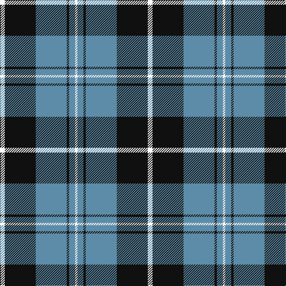

In pattern [WBKBKW](/stripes/wbkbkw/).

This was sourced from tartans-authority.  It is a [6 stripe tartan](/stripes/stripes6/).

Original link http://www.tartansauthority.com/tartan-ferret/display/8970/

## Thread count
W/8 K52 B52 K4 B10 W/4

## Palette
Each colour and the base-6 reference it is a variant of.

| Colour | Shade | Base |
|---|---|---|
| B | <code style="background-color:#5C8CA8;">#5C8CA8</code> `oklch(61.7% 0.067 235.0)` <small>#5C8CA8</small> | B <code style="background-color:#2A418A;">#2A418A</code> |
| K | <code style="background-color:#101010;">#101010</code> `oklch(17.3% 0.000 89.9)` <small>#101010</small> | K <code style="background-color:#000000;">#000000</code> |
| W | <code style="background-color:#FCFCFC;">#FCFCFC</code> `oklch(99.1% 0.000 89.9)` <small>#FCFCFC</small> | W <code style="background-color:#F7F7F7;">#F7F7F7</code> |

# Sample pattern

## Nearest tartans

The nearest existing variants by ΔTartan distance.

1. [Stutterheim (Corporate)](/setts/s6/k4ly18db44k3ly10k4/) — ΔT 0.87
1. [Nowell/Noel 1951 (Name)](/setts/s8/lr3k24lr6k8w4k8lr35k2~x2/) — ΔT 1.06
1. [MacMugen](/setts/s6/k3lr16k4lr3k12w2~x3/) — ΔT 1.17
1. [Martin's Own](/setts/s8/k10t1k2t1k4t10g1t2~x4/) — ΔT 1.21
1. [Flynn](/setts/s6/o58k22o8k17r5k14~x2/) — ΔT 1.27
1. [Glen Coe #2](/setts/s8/k37w9k3g9w3~x2/) — ΔT 1.28
1. [Ikelman No 1](/setts/s6/w8k16w2db2w1k1~x4/) — ΔT 1.30
1. [Glasgow Warriors](/setts/s7/k16w30lb36k10lb10k83lb6/) — ΔT 1.31
1. [Laksaa (Manx)](/setts/s8/n22k2n2k2n2k16w16k3~x2/) — ΔT 1.32
1. [West Point Military Academy (Mil.)](/setts/s8/k10o1k2o1k4o10ly1o2~x4/) — ΔT 1.34

## Neighbour map

Every grey dot is one of 14299 variants placed by the first two principal components of the ΔTartan feature space (44% of its variance). Red is this tartan; blue dots are its nearest — click one to open its page.

<svg viewBox="0 0 640 380" role="img" style="max-width:100%;height:auto;border:1px solid #e0e0e0;border-radius:4px;display:block" xmlns="http://www.w3.org/2000/svg"><image href="/nn/cloud.v1.png" width="640" height="380"/><a href="/setts/s6/k4ly18db44k3ly10k4/"><circle cx="298.4" cy="176.7" r="4" fill="#3465a4"><title>Stutterheim (Corporate)</title></circle></a><a href="/setts/s8/lr3k24lr6k8w4k8lr35k2~x2/"><circle cx="305.1" cy="169.2" r="4" fill="#3465a4"><title>Nowell/Noel 1951 (Name)</title></circle></a><a href="/setts/s6/k3lr16k4lr3k12w2~x3/"><circle cx="251.6" cy="220.9" r="4" fill="#3465a4"><title>MacMugen</title></circle></a><a href="/setts/s8/k10t1k2t1k4t10g1t2~x4/"><circle cx="310.1" cy="208.0" r="4" fill="#3465a4"><title>Martin's Own</title></circle></a><a href="/setts/s6/o58k22o8k17r5k14~x2/"><circle cx="321.4" cy="214.7" r="4" fill="#3465a4"><title>Flynn</title></circle></a><a href="/setts/s8/k37w9k3g9w3~x2/"><circle cx="266.6" cy="174.9" r="4" fill="#3465a4"><title>Glen Coe #2</title></circle></a><a href="/setts/s6/w8k16w2db2w1k1~x4/"><circle cx="325.8" cy="175.5" r="4" fill="#3465a4"><title>Ikelman No 1</title></circle></a><a href="/setts/s7/k16w30lb36k10lb10k83lb6/"><circle cx="291.1" cy="186.0" r="4" fill="#3465a4"><title>Glasgow Warriors</title></circle></a><a href="/setts/s8/n22k2n2k2n2k16w16k3~x2/"><circle cx="215.8" cy="182.5" r="4" fill="#3465a4"><title>Laksaa (Manx)</title></circle></a><a href="/setts/s8/k10o1k2o1k4o10ly1o2~x4/"><circle cx="309.6" cy="202.1" r="4" fill="#3465a4"><title>West Point Military Academy (Mil.)</title></circle></a><circle cx="281.2" cy="193.7" r="5" fill="#c00000"/></svg>

ID: /setts/s6/w4k26t26k2t5w2~x2/
