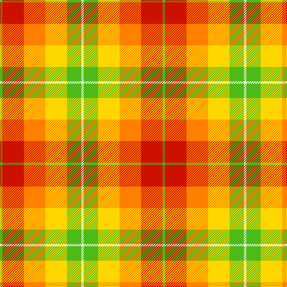

In pattern [WYYYRY](/patterns/wyyyry/).

This was sourced from register-of-tartans.  It is a [6 stripes tartan](/stripes/stripes6/).

Original link https://www.tartanregister.gov.uk/tartanDetails.aspx?ref=10237

## Thread count
G/4 R36 O36 Y36 G24 W/4

## Palette
Each colour and its ΔE from the base-6 reference it is a variant of.

| Colour | Shade | Base | ΔE (OKLab) |
|---|---|---|---|
| G | <code style="background-color:#4CBB17;">#4CBB17</code> `#4CBB17` | Y <code style="background-color:#E8C000;">#E8C000</code> | 0.19 |
| O | <code style="background-color:#FF8000;">#FF8000</code> `#FF8000` | Y <code style="background-color:#E8C000;">#E8C000</code> | 0.15 |
| R | <code style="background-color:#CC1100;">#CC1100</code> `#CC1100` | R <code style="background-color:#C80000;">#C80000</code> | 0.01 |
| W | <code style="background-color:#FFFFFF;">#FFFFFF</code> `#FFFFFF` | W <code style="background-color:#F4F4F0;">#F4F4F0</code> | 0.03 |
| Y | <code style="background-color:#FFD700;">#FFD700</code> `#FFD700` | Y <code style="background-color:#E8C000;">#E8C000</code> | 0.07 |

# Sample pattern

ID: /setts/s6/w4y24ya36yb36r36y4-rcc1100-wffffff-y4cbb17-yaffd700-ybff8000/
