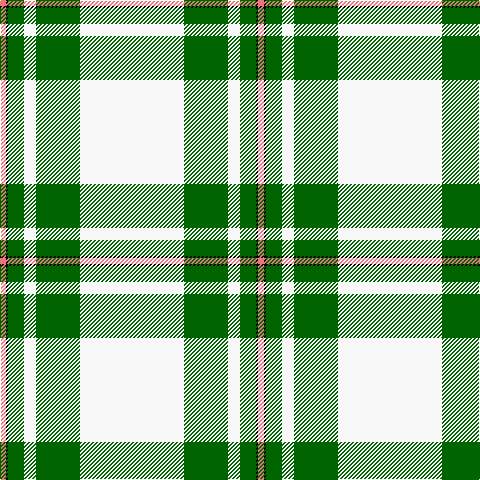

In pattern [RKGWGW](/stripes/rkgwgw/).

This was sourced from tartans-authority.  It is a [6 stripe tartan](/stripes/stripes6/).

Original link http://www.tartansauthority.com/tartan-ferret/display/6533/

## Also known as

This cloth is also recorded under:

- MacGregor

## Thread count
W/104 G44 W12 G16 K2 LR/6

## Palette
Each colour and the base-6 reference it is a variant of.

| Colour | Shade | Base |
|---|---|---|
| G | <code style="background-color:#006400;">#006400</code> `oklch(43.6% 0.148 142.5)` <small>#006400</small> | G <code style="background-color:#006100;">#006100</code> |
| K | <code style="background-color:#000000;">#000000</code> `oklch(0.0% 0.000 0.0)` <small>#000000</small> | K <code style="background-color:#000000;">#000000</code> |
| LR | <code style="background-color:#E87878;">#E87878</code> `oklch(70.0% 0.139 21.2)` <small>#E87878</small> | R <code style="background-color:#CC0000;">#CC0000</code> |
| W | <code style="background-color:#F8F8F8;">#F8F8F8</code> `oklch(97.9% 0.000 89.9)` <small>#F8F8F8</small> | W <code style="background-color:#F7F7F7;">#F7F7F7</code> |

# Sample pattern

## Nearest tartans

The nearest existing variants by ΔTartan distance.

1. [MacGregor Dress Green (Dance)](/setts/s6/w52dg22w6dg8k1r3~x2/) — ΔT 0.34
1. [Westfalia Dress (Corporate)](/setts/s6/w44dg18w6dg11dt1o4~x2/) — ΔT 0.65
1. [MacGregor, Green](/setts/s6/w47g20w6g8k1r3~x2/) — ΔT 0.66
1. [Skye, Green (Dance)](/setts/s6/n4w2n1w36g21ly4~x2/) — ΔT 1.34
1. [Westfalia (Corporate)](/setts/s6/dg44w18dg6w11dt1o4~x2/) — ΔT 1.57
1. [Summer Spirit (Fashion)](/setts/s8/r2w2k2w28k8w9k1ly2~x2/) — ΔT 1.66
1. [Young, Christina](/setts/s6/w54k7r7lo6ly4r1~x2/) — ΔT 1.71
1. [MacGregor Dress Burgundy (Dance)](/setts/s6/w52r22w6r8k1r3~x2/) — ΔT 1.92
1. [Unidentified Arisaid](/setts/s9/w216k8dg24g24w4k4r45w8r12/) — ΔT 1.96
1. [Unidentified, Blanket](/setts/s8/w50k1r12w1g12r13w1r2~x2/) — ΔT 2.01

## Neighbour map

Every grey dot is one of 14299 variants placed by the first two principal components of the ΔTartan feature space (44% of its variance). Red is this tartan; blue dots are its nearest — click one to open its page.

<svg viewBox="0 0 640 380" role="img" style="max-width:100%;height:auto;border:1px solid #e0e0e0;border-radius:4px;display:block" xmlns="http://www.w3.org/2000/svg"><image href="/nn/cloud.v1.png" width="640" height="380"/><a href="/setts/s6/w52dg22w6dg8k1r3~x2/"><circle cx="384.9" cy="100.6" r="4" fill="#3465a4"><title>MacGregor Dress Green (Dance)</title></circle></a><a href="/setts/s6/w44dg18w6dg11dt1o4~x2/"><circle cx="359.3" cy="115.6" r="4" fill="#3465a4"><title>Westfalia Dress (Corporate)</title></circle></a><a href="/setts/s6/w47g20w6g8k1r3~x2/"><circle cx="396.5" cy="116.2" r="4" fill="#3465a4"><title>MacGregor, Green</title></circle></a><a href="/setts/s6/n4w2n1w36g21ly4~x2/"><circle cx="336.9" cy="121.0" r="4" fill="#3465a4"><title>Skye, Green (Dance)</title></circle></a><a href="/setts/s6/dg44w18dg6w11dt1o4~x2/"><circle cx="362.7" cy="127.4" r="4" fill="#3465a4"><title>Westfalia (Corporate)</title></circle></a><a href="/setts/s8/r2w2k2w28k8w9k1ly2~x2/"><circle cx="414.3" cy="97.1" r="4" fill="#3465a4"><title>Summer Spirit (Fashion)</title></circle></a><a href="/setts/s6/w54k7r7lo6ly4r1~x2/"><circle cx="416.1" cy="72.1" r="4" fill="#3465a4"><title>Young, Christina</title></circle></a><a href="/setts/s6/w52r22w6r8k1r3~x2/"><circle cx="396.3" cy="91.4" r="4" fill="#3465a4"><title>MacGregor Dress Burgundy (Dance)</title></circle></a><a href="/setts/s9/w216k8dg24g24w4k4r45w8r12/"><circle cx="396.9" cy="42.8" r="4" fill="#3465a4"><title>Unidentified Arisaid</title></circle></a><a href="/setts/s8/w50k1r12w1g12r13w1r2~x2/"><circle cx="364.0" cy="76.7" r="4" fill="#3465a4"><title>Unidentified, Blanket</title></circle></a><circle cx="388.7" cy="102.3" r="5" fill="#c00000"/></svg>

ID: /setts/s6/w52g22w6g8k1r3~x2/
