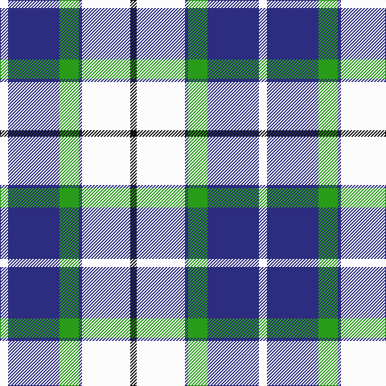

In pattern [KWBGBW](/stripes/kwbgbw/).

This was sourced from tartans-authority.  It is a [6 stripe tartan](/stripes/stripes6/).

Original link http://www.tartansauthority.com/tartan-ferret/display/8693/

## Thread count
W/10 DB64 G24 DB4 W60 K/8

## Palette
Each colour and its ΔE from the base-6 reference it is a variant of.

| Colour | Shade | Base | ΔE (OKLab) |
|---|---|---|---|
| DB | <code style="background-color:#2C2C80;">#2C2C80</code> `#2C2C80` | B <code style="background-color:#2A418A;">#2A418A</code> | 0.06 |
| G | <code style="background-color:#289C18;">#289C18</code> `#289C18` | G <code style="background-color:#006100;">#006100</code> | 0.19 |
| K | <code style="background-color:#101010;">#101010</code> `#101010` | K <code style="background-color:#000000;">#000000</code> | 0.17 |
| W | <code style="background-color:#FCFCFC;">#FCFCFC</code> `#FCFCFC` | W <code style="background-color:#F7F7F7;">#F7F7F7</code> | 0.01 |

# Sample pattern

## Nearest tartans

The nearest existing variants by ΔTartan distance.

1. [Wallace Blue Dress (Dance)](/setts/s5/g2w29t12db29t2~x2/) — ΔT 1.03
1. [Ferguson, dress](/setts/s7/t34db24w18r3w18g2w3~x2/) — ΔT 1.16
1. [Children's Wish Foundation of Canada, The](/setts/s8/ly5k2w16k5t29k2ly5k2~x2/) — ΔT 1.17
1. [Manx Dress](/setts/s6/g4w28dp8ly2db17g4~x2/) — ΔT 1.18
1. [Ailsa, Royal Blue (Dance)](/setts/s6/db8t3db28w32dt3w4~x2/) — ΔT 1.22
1. [Manx, dress](/setts/s6/g4w28p8ly2db17g4~x2/) — ΔT 1.22
1. [Conquergood (Name)](/setts/s8/k4t2w11t5o5w2k1t2~x2/) — ΔT 1.24
1. [Ferguson Dress](/setts/s7/t17k12w9m2w9g1w2~x4/) — ΔT 1.24
1. [(1) Abercrombie](/setts/s9/b27w2b14k14lg4k4lg4k4lg27/) — ΔT 1.29
1. [St. Andrews Dress, Earl of (Danc](/setts/s7/w28t19db19w4db2p2db7~x2/) — ΔT 1.32

## Neighbour map

Every grey dot is one of 14299 variants placed by the first two principal components of the ΔTartan feature space (44% of its variance). Red is this tartan; blue dots are its nearest — click one to open its page.

<svg viewBox="0 0 640 380" role="img" style="max-width:100%;height:auto;border:1px solid #e0e0e0;border-radius:4px;display:block" xmlns="http://www.w3.org/2000/svg"><image href="/nn/cloud.v1.png" width="640" height="380"/><a href="/setts/s5/g2w29t12db29t2~x2/"><circle cx="185.3" cy="178.6" r="4" fill="#3465a4"><title>Wallace Blue Dress (Dance)</title></circle></a><a href="/setts/s7/t34db24w18r3w18g2w3~x2/"><circle cx="159.1" cy="149.7" r="4" fill="#3465a4"><title>Ferguson, dress</title></circle></a><a href="/setts/s8/ly5k2w16k5t29k2ly5k2~x2/"><circle cx="192.1" cy="135.7" r="4" fill="#3465a4"><title>Children's Wish Foundation of Canada, The</title></circle></a><a href="/setts/s6/g4w28dp8ly2db17g4~x2/"><circle cx="181.6" cy="150.5" r="4" fill="#3465a4"><title>Manx Dress</title></circle></a><a href="/setts/s6/db8t3db28w32dt3w4~x2/"><circle cx="243.3" cy="175.5" r="4" fill="#3465a4"><title>Ailsa, Royal Blue (Dance)</title></circle></a><a href="/setts/s6/g4w28p8ly2db17g4~x2/"><circle cx="184.6" cy="151.6" r="4" fill="#3465a4"><title>Manx, dress</title></circle></a><a href="/setts/s8/k4t2w11t5o5w2k1t2~x2/"><circle cx="159.7" cy="178.1" r="4" fill="#3465a4"><title>Conquergood (Name)</title></circle></a><a href="/setts/s7/t17k12w9m2w9g1w2~x4/"><circle cx="155.9" cy="150.6" r="4" fill="#3465a4"><title>Ferguson Dress</title></circle></a><a href="/setts/s9/b27w2b14k14lg4k4lg4k4lg27/"><circle cx="184.6" cy="159.4" r="4" fill="#3465a4"><title>(1) Abercrombie</title></circle></a><a href="/setts/s7/w28t19db19w4db2p2db7~x2/"><circle cx="169.8" cy="155.5" r="4" fill="#3465a4"><title>St. Andrews Dress, Earl of (Danc</title></circle></a><circle cx="197.9" cy="161.8" r="5" fill="#c00000"/></svg>

ID: /setts/s6/w5db32g12db2w30k4~x2/
