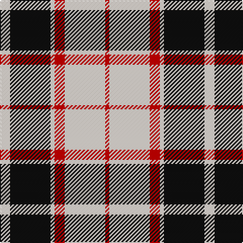

In pattern [RWRWKW](/patterns/rwrwkw/).

This was sourced from house-of-tartan.  It is a [6 stripes tartan](/stripes/stripes6/).

Original link http://www.house-of-tartan.scotland.net/house/TartanViewjs.asp?colr=Def&tnam=8248

## Thread count
LY/10 K40 LY4 R10 LY40 R/4

## Palette
Each colour and its ΔE from the base-6 reference it is a variant of.

| Colour | Shade | Base | ΔE (OKLab) |
|---|---|---|---|
| K | <code style="background-color:#101010;">#101010</code> `#101010` | K <code style="background-color:#000000;">#000000</code> | 0.17 |
| LY | <code style="background-color:#F8E8D8;">#F8E8D8</code> `#F8E8D8` | W <code style="background-color:#F7F7F7;">#F7F7F7</code> | 0.05 |
| R | <code style="background-color:#C80000;">#C80000</code> `#C80000` | R <code style="background-color:#CC0000;">#CC0000</code> | 0.01 |

# Sample pattern

## Nearest tartans

The nearest existing variants by ΔTartan distance.

1. [Blackberry (Fashion)](/setts/s7/r8y6k11y6k11y30r3~k101010-ra80000-yc8bc9c~x2/) — ΔT 0.89
1. [MacPherson Dress (1951)](/setts/s7/w3b3w30k20w3k9y3~b940094-k101010-we0e0e0-ye8c000~x2/) — ΔT 1.21
1. [Burberry (Genuine)](/setts/s5/k3w3k3y10r1~k101010-rc80000-wf8f4d0-yb8a47c~x6/) — ΔT 1.23
1. [Rui (Personal)](/setts/s6/r1w12k1wa2k5r1~k000000-rc80000-wc8c8c8-wafcfcfc~x4/) — ΔT 1.23
1. [Forbes Dress (Clans Originaux)](/setts/s7/w6b3w20k2w3k25w3~b1474b4-k101010-wfcfcfc~x2/) — ΔT 1.25
1. [Brodie (WCWM)](/setts/s6/r2w30k15y2k15r2~k101010-rc80000-wf0ecd4-ybc8c00~x2/) — ΔT 1.26
1. [Braes High School Falkirk](/setts/s5/w5r5w5k15r2~k101010-rc80000-wffffff~x2/) — ΔT 1.27
1. [(6) Burberry](/setts/s5/k3w3k3y10r1~k000000-rc80000-wf8f4d0-yb8a47c~x6/) — ΔT 1.30
1. [Rocket Dog (Fashion)](/setts/s7/k9r9k25w30k5w5r7~k101010-rc80000-wf0e4cc/) — ΔT 1.31
1. [Stutterheim](/setts/s6/k4y18b44k3y10k4~b565c76-k101010-yecdc8e/) — ΔT 1.32

## Neighbour map

Every grey dot is one of 15726 variants placed by the first two principal components of the ΔTartan feature space (44% of its variance). Red is this tartan; blue dots are its nearest — click one to open its page.

<svg viewBox="0 0 640 380" role="img" style="max-width:100%;height:auto;border:1px solid #e0e0e0;border-radius:4px;display:block" xmlns="http://www.w3.org/2000/svg"><image href="/nn/cloud.v1.png" width="640" height="380"/><a href="/setts/s7/r8y6k11y6k11y30r3~k101010-ra80000-yc8bc9c~x2/"><circle cx="276.1" cy="204.9" r="4" fill="#3465a4"><title>Blackberry (Fashion)</title></circle></a><a href="/setts/s7/w3b3w30k20w3k9y3~b940094-k101010-we0e0e0-ye8c000~x2/"><circle cx="245.3" cy="170.0" r="4" fill="#3465a4"><title>MacPherson Dress (1951)</title></circle></a><a href="/setts/s5/k3w3k3y10r1~k101010-rc80000-wf8f4d0-yb8a47c~x6/"><circle cx="221.9" cy="200.5" r="4" fill="#3465a4"><title>Burberry (Genuine)</title></circle></a><a href="/setts/s6/r1w12k1wa2k5r1~k000000-rc80000-wc8c8c8-wafcfcfc~x4/"><circle cx="258.7" cy="159.2" r="4" fill="#3465a4"><title>Rui (Personal)</title></circle></a><a href="/setts/s7/w6b3w20k2w3k25w3~b1474b4-k101010-wfcfcfc~x2/"><circle cx="279.7" cy="177.2" r="4" fill="#3465a4"><title>Forbes Dress (Clans Originaux)</title></circle></a><a href="/setts/s6/r2w30k15y2k15r2~k101010-rc80000-wf0ecd4-ybc8c00~x2/"><circle cx="240.7" cy="165.6" r="4" fill="#3465a4"><title>Brodie (WCWM)</title></circle></a><a href="/setts/s5/w5r5w5k15r2~k101010-rc80000-wffffff~x2/"><circle cx="206.8" cy="231.5" r="4" fill="#3465a4"><title>Braes High School Falkirk</title></circle></a><a href="/setts/s5/k3w3k3y10r1~k000000-rc80000-wf8f4d0-yb8a47c~x6/"><circle cx="213.1" cy="199.6" r="4" fill="#3465a4"><title>(6) Burberry</title></circle></a><a href="/setts/s7/k9r9k25w30k5w5r7~k101010-rc80000-wf0e4cc/"><circle cx="187.0" cy="221.0" r="4" fill="#3465a4"><title>Rocket Dog (Fashion)</title></circle></a><a href="/setts/s6/k4y18b44k3y10k4~b565c76-k101010-yecdc8e/"><circle cx="303.8" cy="182.6" r="4" fill="#3465a4"><title>Stutterheim</title></circle></a><circle cx="249.2" cy="195.5" r="5" fill="#c00000"/></svg>

ID: /setts/s6/w5k20w2r5w20r2~k101010-rc80000-wf8e8d8~x2/
