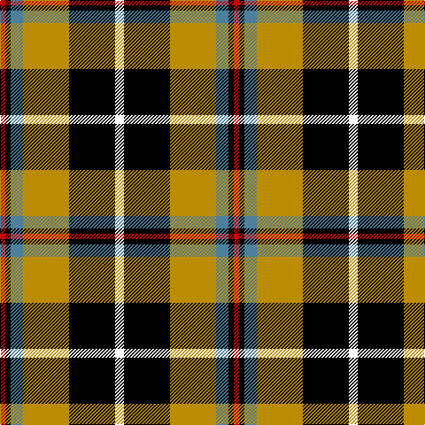

This page is one **sett** — a single exact thread-count. It belongs to the [tartan](/tartans/w5k26dy26b7k3r3/)
(the same proportion at any scale), whose colour order is pattern [RKBYKW](/stripes/rkbykw/).

Sourced from tartans-authority.  It is a [6 stripe tartan](/stripes/stripes6/).

Original link http://www.tartansauthority.com/tartan-ferret/display/1567/

## Thread count
W/10 K52 DY52 B14 K6 R/6

## Palette
Each colour and the base-6 reference it is a variant of.

| Colour | Shade | Base |
|---|---|---|
| B | <code style="background-color:#4C809C;">#4C809C</code> `oklch(57.5% 0.070 233.4)` <small>#4C809C</small> | B <code style="background-color:#2A418A;">#2A418A</code> |
| DY | <code style="background-color:#BC8C00;">#BC8C00</code> `oklch(66.8% 0.137 84.1)` <small>#BC8C00</small> | Y <code style="background-color:#F2BF00;">#F2BF00</code> |
| K | <code style="background-color:#000000;">#000000</code> `oklch(0.0% 0.000 0.0)` <small>#000000</small> | K <code style="background-color:#000000;">#000000</code> |
| R | <code style="background-color:#C80000;">#C80000</code> `oklch(52.3% 0.215 29.2)` <small>#C80000</small> | R <code style="background-color:#CC0000;">#CC0000</code> |
| W | <code style="background-color:#FCFCFC;">#FCFCFC</code> `oklch(99.1% 0.000 89.9)` <small>#FCFCFC</small> | W <code style="background-color:#F7F7F7;">#F7F7F7</code> |

# Sample pattern

## Nearest tartans

The nearest existing variants by ΔTartan distance, with this tartan at the top so the swatches line up against it.

ΔTartan

Tartan

Sett

—

<a href="/ttd/edit/#slug=w5k26lo26t7k3r3~x2">Cornish National (District)</a> <a class="nn-out" href="/setts/s6/w5k26lo26t7k3r3~x2/" title="open its dictionary page">↗</a>

0.52

<a href="/ttd/edit/#slug=w5k26ly26t7k3r3~x2">Cornish, National</a> <a class="nn-out" href="/setts/s6/w5k26ly26t7k3r3~x2/" title="open its dictionary page">↗</a>

1.00

<a href="/ttd/edit/#slug=w2k11ly11db3k1r1~x2">Cornish National #2</a> <a class="nn-out" href="/setts/s6/w2k11ly11db3k1r1~x2/" title="open its dictionary page">↗</a>

1.01

<a href="/ttd/edit/#slug=k10ly2g11r11w1r1w1k9~x2">Unnamed No 5</a> <a class="nn-out" href="/setts/s8/k10ly2g11r11w1r1w1k9~x2/" title="open its dictionary page">↗</a>

1.14

<a href="/ttd/edit/#slug=g28t3g3k10r2k10r20ly4~x2">Garvock (2015)</a> <a class="nn-out" href="/setts/s8/g28t3g3k10r2k10r20ly4~x2/" title="open its dictionary page">↗</a>

1.14

<a href="/ttd/edit/#slug=k3lb7lo26k26w5k26lo26lb7k3r3~x2">Cornish National</a> <a class="nn-out" href="/setts/s10/k3lb7lo26k26w5k26lo26lb7k3r3~x2/" title="open its dictionary page">↗</a>

1.19

<a href="/ttd/edit/#slug=k3ly18g6r17k31g3~x2">MacMillan Variant (Unidentified)</a> <a class="nn-out" href="/setts/s6/k3ly18g6r17k31g3~x2/" title="open its dictionary page">↗</a>

1.20

<a href="/ttd/edit/#slug=w2k11ly11t3k1r1~x2">Cornish National Small Set Tartan Tartan Number: 7651. Earliest known date: See products available Copyright © Blair Urquhart, Comrie, 2015</a> <a class="nn-out" href="/setts/s6/w2k11ly11t3k1r1~x2/" title="open its dictionary page">↗</a>

1.22

<a href="/ttd/edit/#slug=k10ly2dg11r11w1r1w1k9~x2">Unidentified No 5</a> <a class="nn-out" href="/setts/s8/k10ly2dg11r11w1r1w1k9~x2/" title="open its dictionary page">↗</a>

1.25

<a href="/ttd/edit/#slug=r24lb2ly3dg16k16lb2ly3">MacLachlan W</a> <a class="nn-out" href="/setts/s7/r24lb2ly3dg16k16lb2ly3/" title="open its dictionary page">↗</a>

1.26

<a href="/ttd/edit/#slug=k3ly18dg6r17k31dg3~x2">MacMillan Varient (Unidentified)</a> <a class="nn-out" href="/setts/s6/k3ly18dg6r17k31dg3~x2/" title="open its dictionary page">↗</a>

## Neighbour map

Every grey dot is one of 14299 variants placed by the first two principal components of the ΔTartan feature space (44% of its variance). Red is this tartan; blue dots are its nearest — click one to open its page.

<svg viewBox="0 0 640 380" role="img" style="max-width:100%;height:auto;border:1px solid #e0e0e0;border-radius:4px;display:block" xmlns="http://www.w3.org/2000/svg"><image href="/nn/cloud.v1.png" width="640" height="380"/><a href="/setts/s6/w5k26ly26t7k3r3~x2/"><circle cx="156.0" cy="169.2" r="4" fill="#3465a4"><title>Cornish, National</title></circle></a><a href="/setts/s6/w2k11ly11db3k1r1~x2/"><circle cx="174.5" cy="158.9" r="4" fill="#3465a4"><title>Cornish National #2</title></circle></a><a href="/setts/s8/k10ly2g11r11w1r1w1k9~x2/"><circle cx="156.1" cy="165.6" r="4" fill="#3465a4"><title>Unnamed No 5</title></circle></a><a href="/setts/s8/g28t3g3k10r2k10r20ly4~x2/"><circle cx="164.1" cy="148.9" r="4" fill="#3465a4"><title>Garvock (2015)</title></circle></a><a href="/setts/s10/k3lb7lo26k26w5k26lo26lb7k3r3~x2/"><circle cx="165.5" cy="160.7" r="4" fill="#3465a4"><title>Cornish National</title></circle></a><a href="/setts/s6/k3ly18g6r17k31g3~x2/"><circle cx="180.0" cy="190.4" r="4" fill="#3465a4"><title>MacMillan Variant (Unidentified)</title></circle></a><a href="/setts/s6/w2k11ly11t3k1r1~x2/"><circle cx="173.7" cy="158.0" r="4" fill="#3465a4"><title>Cornish National Small Set Tartan Tartan Number: 7651. Earliest known date: See products available Copyright © Blair Urquhart, Comrie, 2015</title></circle></a><a href="/setts/s8/k10ly2dg11r11w1r1w1k9~x2/"><circle cx="174.2" cy="169.9" r="4" fill="#3465a4"><title>Unidentified No 5</title></circle></a><a href="/setts/s7/r24lb2ly3dg16k16lb2ly3/"><circle cx="140.1" cy="149.7" r="4" fill="#3465a4"><title>MacLachlan W</title></circle></a><a href="/setts/s6/k3ly18dg6r17k31dg3~x2/"><circle cx="189.6" cy="190.8" r="4" fill="#3465a4"><title>MacMillan Varient (Unidentified)</title></circle></a><circle cx="162.4" cy="174.2" r="5" fill="#c00000"/></svg>

ID: /setts/s6/w5k26lo26t7k3r3~x2/
